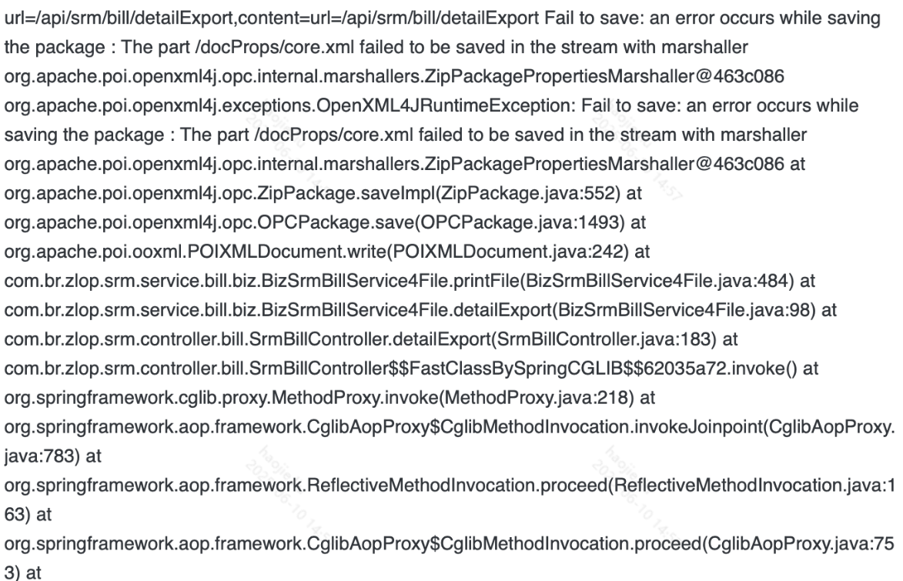
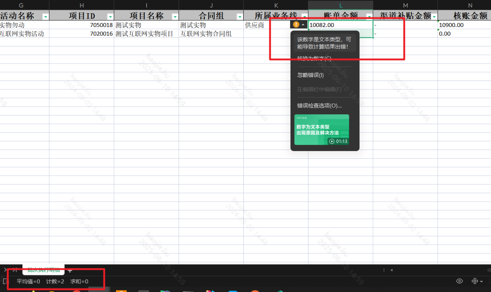

# EasyExcel

### **1、afterCellDispose方法的使用**

参考：[链接](https://blog.51cto.com/u_16099203/7560863)

该方法是在单个单元格渲染出来以后最后调用的方法，如果有特殊处理可重写此方法，目前经过测试对于传入实体类渲染的sheet和传入可变表头数量的list两种的渲染方式是不一样的，如果是前者需要注意如下图的提示


### **2、自动换行注解：**

```
@ContentStyle(wrapped = BooleanEnum.TRUE)
```

### **3、当你没有使用afterCellDispose时如何快速指定单元格的格式、保留位数等**

参考：[链接](https://blog.csdn.net/ruantiao3440/article/details/126704369)

### **4、格式转换**

例如：当想要从某个类型转化成货币，必须要从数值转化成货币，或者从通用转化成货币

### **5、导出时流还没传输完成就关闭当前页签时的报错**




### **6、`filedCacheLocation方法`**

`这个方法可以指定表头的缓存策略，总共有一下三种策略`

在3.0.x中，默认是memory且无法修改；当在3.3.x以后可以被指定且默认是THREAD_LOCAL

```java
public enum CacheLocationEnum {
    /**
     * 缓存将存储在 中 ThreadLocal，并在 excel 读写完成后被清除。
     */
    THREAD_LOCAL,
 
    /**
     * 除非应用程序停止，否则不会清除缓存。
     */
    MEMORY,
 
    /**
     * 没有缓存。它可能会损失一些性能。
     */
    NONE;
}
```

如上所述，在3.0.x中，默认是memory且无法修改，这就会导致如果是配合前端指定导出某几列，再配合个性化的配置如下，但是由于没有配置这个参数，默认是memory，那么被ExcelProperty注解修饰的对象，输出可能还是全量字段，那么没有被选择的列，在结果excel中就是**空列**

```java
//传入了需要哪几列，和原本的初始化配置
public static CallerExcelExportCustomize getCustomizeExcelExport(String[] customerTitles, AbstractExcelExportCustomize excelExportCustomize) {
    String[] dsTitlesFromConfig = excelExportCustomize.getDsTitles();
 
    String[] headersFromConfig = excelExportCustomize.getHeaders();
    String[] finalHeaders = new String[customerTitles.length];
    int[] finalFormat = new int[customerTitles.length];
    int[] dsFormat = excelExportCustomize.getDsFormat();
    int[] widths = excelExportCustomize.getWidths();
    int[] finalWidths = new int[customerTitles.length];
    for (int i = 0; i < customerTitles.length; ++i) {
        int index = ArrayUtils.indexOf(dsTitlesFromConfig, customerTitles[i]);
        if (index != -1) {
            finalHeaders[i] = headersFromConfig[index];
            finalFormat[i] = dsFormat[index];
            finalWidths[i] = widths[index];
        }
    }
    CallerExcelExportCustomize callerExcelExportCustomize = new CallerExcelExportCustomize();
    callerExcelExportCustomize.setDsTitles(customerTitles);
    callerExcelExportCustomize.setHeaders(finalHeaders);
    callerExcelExportCustomize.setDsFormat(finalFormat);
    callerExcelExportCustomize.setWidths(finalWidths);
    return callerExcelExportCustomize;
}
```

### **7、ExcelProperty注解与.class方式设置表头时默认字段的index属性**

在一般的导出中，给ExcelProperty注解实际上不会设置index属性，或者value属性也不会设置，但是对于前者如果不设置，就存在一个默认值的问题，如果不做个性化设置全量字段导出，则是Bean对象标注的顺序从1开始，同时由于class对象在Spring中是单例的，那么当别的线程导出时肯定也会用这个对象，如果这时没有对已经设置过的字段重新赋值索引，那么当只导出假设1、3、5，这三个字段，那么新顺序肯定是1、2、3，但是原来被设置为2的压根没有被重新设置，此时就会出现两个2和两个3了，就会报如下错误；所以为了能够正常导出，可以在每次设置导出的顺序前，把所有被注解标注的字段的index属性全部设置成-1，然后重新赋值即可

> 在服务器首次初始化后使用到该功能，以主动把这个注解index设置的值为准，例如导出全量，按顺序默认为1。。；如果不导出全量，则会把导出的字段按顺序设置1。。，其余字段不会初始化——不主动设置，则easyExcel会默认给“-1”，而全量的顺序则是注解读取的顺序
> 

```java
com.alibaba.excel.exception.ExcelCommonException: The index of 'verifyTimes' and 'verifyPercentDouble' must be inconsistent at com.alibaba.excel.util.ClassUtils.declaredOneField(ClassUtils.java:489) at com.alibaba.excel.util.ClassUtils.doDeclaredFields(ClassUtils.java:319) at com.alibaba.excel.util.ClassUtils.lambda$declaredFields$6(ClassUtils.java:289) at java.util.HashMap.computeIfAbsent(HashMap.java:1127) at com.alibaba.excel.util.ClassUtils.declaredFields(ClassUtils.java:288) at com.alibaba.excel.metadata.property.ExcelHeadProperty.initColumnProperties(ExcelHeadProperty.java:109) at com.alibaba.excel.metadata.property.ExcelHeadProperty.(ExcelHeadProperty.java:77) at com.alibaba.excel.write.property.ExcelWriteHeadProperty.(ExcelWriteHeadProperty.java:49) at com.alibaba.excel.write.metadata.holder.AbstractWriteHolder.(AbstractWriteHolder.java:222) at com.alibaba.excel.write.metadata.holder.WriteWorkbookHolder.(WriteWorkbookHolder.java:168) at com.alibaba.excel.context.WriteContextImpl.initCurrentWorkbookHolder(WriteContextImpl.java:107) at com.alibaba.excel.context.WriteContextImpl.(WriteContextImpl.java:90) at com.alibaba.excel.write.ExcelBuilderImpl.(ExcelBuilderImpl.java:36) at com.alibaba.excel.ExcelWriter.(ExcelWriter.java:39) at com.alibaba.excel.write.builder.ExcelWriterBuilder.build(ExcelWriterBuilder.java:133) at com.br.zlop.activity.service.dataValue.wx.StockService.buildExcelExportFile(StockService.java:523) at com.br.zlop.activity.service.dataValue.wx.StockService.doExport(StockService.java:506) at com.br.zlop.activity.service.dataValue.wx.StockService$$FastClassBySpringCGLIB$$490133d7.invoke() at org.springframework.cglib.proxy.MethodProxy.invoke(MethodProxy.java:218) at org.springframework.aop.framework.CglibAopProxy$CglibMethodInvocation.invokeJoinpoint(CglibAopProxy.java:783) at org.springframework.aop.framework.ReflectiveMethodInvocation.proceed(ReflectiveMethodInvocation.java:163) at org.springframework.aop.framework.CglibAopProxy$CglibMethodInvocation.proceed(CglibAopProxy.java:753) at org.springframework.aop.aspectj.MethodInvocationProceedingJoinPoint.proceed(MethodInvocationProceedingJoinPoint.java:89) at com.br.zlop.common.conponent.aop.FileExportLimitAspect.lambda$around$1(FileExportLimitAspect.java:150) at java.util.concurrent.ThreadPoolExecutor.runWorker(ThreadPoolExecutor.java:1149) at java.util.concurrent.ThreadPoolExecutor$Worker.run(ThreadPoolExecutor.java:624) at java.lang.Thread.run(Thread.java:748)
```

### **8、如果在read阶段就发生类型转换错误就会直接报错**

### **9、EasyExcel检测文件的类型时只采用文件后缀名**

通过观察源码发现，对于未加密的Excel，只采用后缀名的识别方式，而对于xlsx通过后缀名修改成xls的方式，但是文件头还是属于xlsx，就会让EasyExcel调用处理xls的逻辑，到最终的poi会在校验一遍，发现其实是xlsx就会报错了

easyExcel识别文件类型方法：com.alibaba.excel.support.ExcelTypeEnum#valueOf(com.alibaba.excel.read.metadata.ReadWorkbook)

poi识别文件类型方法：org.apache.poi.poifs.storage.HeaderBlock#HeaderBlock(byte[])

org.apache.poi.poifs.filesystem.OfficeXmlFileException: The supplied data appears to be in the Office 2007+ XML. You are calling the part of POI that deals with OLE2 Office Documents. You need to call a different part of POI to process this data (eg XSSF instead of HSSF)

### **10、当需要对某个字段做定制化导出展示的方式**

这时一般有几种方式：

- converter与@ExcelProperty注解

> 注意：这种方式下要注意对于某个字段如果在数据库查询出来就是null，那么在excel调用convertToExcelData时会直接跳过这个为null的字段，所以局限性很大
> 

```java
@ExcelProperty(value = "账单金额", converter = BigDecimalStringConverter.class)
@ColumnWidth(20)
private BigDecimal batchBillAmount;
 
//具体实现
public class BigDecimalStringConverter implements Converter<BigDecimal> {
    private static final String DEFAULT_VALUE = "-";
 
    @Override
    public Class<BigDecimal> supportJavaTypeKey() {
        return BigDecimal.class;
    }
 
    @Override
    public CellDataTypeEnum supportExcelTypeKey() {
        return CellDataTypeEnum.STRING;
    }
 
    @Override
    public WriteCellData<String> convertToExcelData(BigDecimal value, ExcelContentProperty contentProperty, GlobalConfiguration globalConfiguration) {
        if (value == null) {
            return new WriteCellData<>(DEFAULT_VALUE);
        }
        return new WriteCellData<>(value.toString());
    }
}
 
 
WriteSheet sheet = EasyExcel.writerSheet(0, "批次执行明细").head(BillBatchEachDayExportVo.class).registerConverter(new  BigDecimalStringConverter()).build();
```

---

- afterCellDispose的方式，上文有介绍过

> 但是当如下图处理时，如果导出的字段本身是数字类型，例如bigdecimal、long等，会报错转换错误；同时如果将这些数字类型转化成字符串导出，对于excel这一列又失去了汇总功能
> 



```java
if(!isHead){
            /* 获取当前单元格的类型 */
            switch (cell.getCellType()){
                /* 当为String类型是判断是否为null或者"",是的话统一设置成指定值 */
                case CellType.NUMERIC:
                    String stringCellValue = cell.getStringCellValue();
                    if(null == stringCellValue || "".equals(stringCellValue)){
                        cell.setCellValue("-");
                    }
                    break;
            }
        }
 
WriteSheet sheet = EasyExcel.writerSheet(0, "批次执行明细").head(BillBatchEachDayExportVo.class).registerWriteHandler(new xxx).build();
```

---