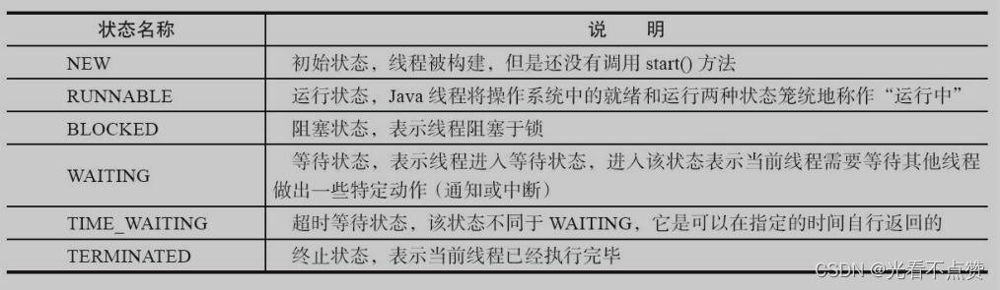
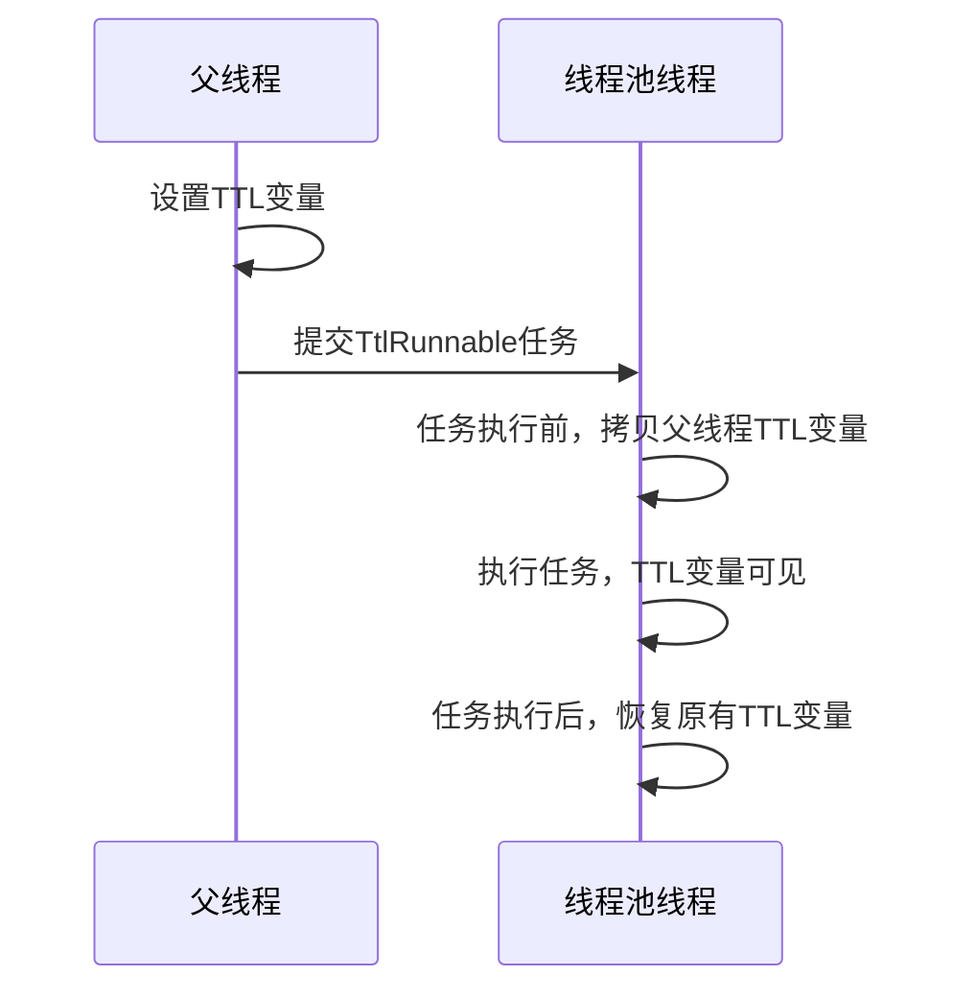

# Java多并发（三）| 线程间的通信（ThreadLoacl详解）

type: Post
status: Published
date: 2022/07/08
summary: 现代操作系统在运行一个程序时，会为其创建一个进程。例如，启动一个Java程序，操作 系统就会创建一个Java进程。现代操作系统调度的最小单元是线程，也叫轻量级进程（Light Weight Process），在一个进程里可以创建多个线程，这些线程都拥有各自的计数器、堆栈和局 部变量等属性，并且能够访问共享的内存变量。处理器在这些线程上高速切换，让使用者感觉 到这些线程在同时执行。
tags: Java
category: 技术栈

## 1.线程及多线程

### 1.1 概述

- 什么是线程

> 现代操作系统在运行一个程序时，会为其创建一个进程。例如，启动一个Java程序，操作 系统就会创建一个Java进程。现代操作系统调度的最小单元是线程，也叫轻量级进程（Light Weight Process），在一个进程里可以创建多个线程，**这些线程都拥有各自的计数器、堆栈和局 部变量等属性，并且能够访问共享的内存变量**。处理器在这些线程上高速切换，让使用者感觉 到这些线程在同时执行。
> 
- 为什么使用多线程
    1. `更多的处理器核心`：多线程能够充分发挥多核心的资源提升
    2. `更快的响应时间`：对于数据一致性不强的操作派发给其他线程处理（当然也可以使用消息队列）如生成订单快照或发送邮件等，提高用户体验
    3. `更好的编程模型`
- 线程的优先级

> 在Java中线程优先级可以通过setProperty（1～10）来设置，不过不同级别的线程差别很小很小，所以程序的正确性不能依靠优先级的不同
> 

### 1.2 线程状态

- 线程的状态

> Java将操作系统中的运行和就绪两个状态合并称为运行状态。阻塞状态是线程 阻塞在进入`synchronized`关键字修饰的方法或代码块（获取锁）时的状态，但是阻塞在 `java.concurrent`包中Lock接口的线程状态却是等待状态，因为`java.concurrent`包中Lock接口对于 阻塞的实现均使用了`LockSupport`类中的相关方法
> 
> 
> 
> 
- 线程状态转换图

> 对于线程本身调用join方法，本身是让一个线程进行插队，直到插队线程执行完主线程继续执行，这个线程就是调用者本身，在join方法中主线程会调用wait方法等待当前线程，所以当前线程在执行完后需要调用以下notify方法，通知方法都是JVM内部帮我们实现的，所以并没有显式的调用notify
> 


==Runnable==：Running和Ready的合并

> 由上图可以看到`Running和Ready的合并为Runnable`，这时因为在现在操作系统对于时间片的分配都应用**抢占式轮转调度**，这个时间分片非常小，当线程被分配这个时间片，一瞬间时间片没了就要被切换下来放入调度队列的末端等待再次调用即回到Ready状态，所以区分这两个状态没有意义
> 

==几个方法的比较==：

> • `Thread.sleep(long millis)`：一定是当前线程调用此方法，当前线程进入阻塞，但不释放对象锁，millis后线程自动苏醒进入可运行状态。作用：给其它线程执行机会的最佳方式。
• `Thread.yield()`：一定是当前线程调用此方法，当前线程放弃获取的cpu时间片，由运行状态变会可运行状态，让OS再次选择线程。作用：让相同优先级的线程轮流执行，但并不保证一定会轮流执行。实际中无法保证yield()达到让步目的，因为让步的线程还有可能被线程调度程序再次选中。Thread.yield()不会导致阻塞。
•  `t.join()/t.join(long millis)`：当前线程里调用其它线程1的join方法，当前线程阻塞，但不释放对象锁，直到线程1执行完毕或者millis时间到，当前线程进入可运行状态。
• `obj.wait()`：当前线程调用对象的wait()方法，当前线程释放对象锁，进入等待队列。依靠notify()/notifyAll()唤醒或者wait(long timeout)timeout时间到自动唤醒。
• `obj.notify()`：唤醒在此对象监视器上等待的单个线程，选择是任意性的。notifyAll()唤醒在此对象监视器上等待的所有线程。
> 
- Daemon（守护）线程

> Daemon线程是一种支持性线程，作用是程序后台调度以及支持性工作，所以当JVM中不存在不是Daemon线程的线程（即不存在了用户线程）**JVM就会立即退出，所以构建这个线程时，不能依靠finally块中内容来确保执行关闭或清理资源的逻辑**
> 

### 1.3 启动、终止和中断线程

- 概述

> **启动线程就不多说了。有个细节就是为线程命名，出问题好找，可以使用第三方线程工厂或者自己定义一个线程工厂，来为其初始化名字等**
> 

==初始化线程==：

> 对于构造线程在thread中的init方法的过程其实是对父线程的各种信息的复制，并为其分配一个线程ID
> 

```java
private void init(ThreadGroup g, Runnable target, String name, long stackSize, AccessControlContext acc) {
        if (name == null) {
            throw new NullPointerException("name cannot be null");
        }// 当前线程就是该线程的父线程
        Thread parent = currentThread();
        this.group = g;
        // 将daemon、priority属性设置为父线程的对应属性
        this.daemon = parent.isDaemon();
        this.priority = parent.getPriority();
        this.name = name.toCharArray();
        this.target = target;
        setPriority(priority);
        // 将父线程的InheritableThreadLocal复制过来
        if (parent.inheritableThreadLocals != null)
            this.inheritableThreadLocals=ThreadLocal.createInheritedMap(parent. inheritableThreadLocals);
        // 分配一个线程ID
        tid = nextThreadID();
    }
```

==开启线程的四种方式==：

> 前两种方法不能获取线程的运算结果，可以处理异常
> 
1. 继承Thread

```java
public static class Threado1 extends Threadi
	@Override
	public void run() {
		xxx;
	}
}
new Threado1().start();
```

1. 实现Runnable接口

```java
public static class Runable01 implements Runnable{
	@override
	public void run(){
		xxx;
	}
}
new Thread(new Runnable01).start();

//也可以用函数式编程快速启动
new Thread(()->{xxxx;}).start();
```

1. 实现Callable接口+FutureTask（**可以拿到返回结果，可以处理异常**）

```java
public static class Callable01 implements Callable<Integer>{
	@Override
	public Integer cal1() throws Exception {
		System.out.println(“当前线程:"+Thread.currentThread().getId());
		int i = 10 / 2;
		System.out.println("运行结果:"+i);
		return i;
	}
}
//可以使用future的get方法得到任务的返回值
new Thread(new FutureTask<>(new Callable01())).start();
```

1. 线程池（以后的章节会详解）

==四种方式的对比==：

- 概述

> 通过继承Thread类、实现Runnable接口、实现Callable接口都可以实现多线程,不过实现Runnable接口与实现Callable接口的方式基本相同，只是Callable接口里定义的方法有返回值，可以声明抛出异常而已。因此可以将实现Runnable接口和实现Callable接口归为一种方式。
> 
- 采用实现Runnable、Callable接口的方式创建多线程的优缺点:

> • 线程类只是实现了Runnable接口或Callable接口，还可以继承其他类。
• 在这种方式下，多个线程可以共享同一个target对象，所以非常适合多个相同线程来处理同一份资源的情况，从而可以将CPU、代码和数据分开，形成清晰的模型，较好地体现了面向对象的思想。
• **劣势是**：编程稍稍复杂，如果需要访问当前线程，则必须使用
> 
- Thread.currentThread()方法。采用继承Thread类的方式创建多线程的优缺点:

> • 劣势是，因为线程类已经继承了Thread类，所以不能再继承其他父类。
• 优势是，编写简单，如果需要访问当前线程，则无须使用Thread.currentThread()方法，直接使用this即可获得当前线程。
> 
- 总结

> 鉴于上面分析，因此一般推荐采用实现Runnable接口、Callable接口的方式来创建多线程。
> 

==理解中断==：

> **中断可以理解为一个标识位属性，表示一个运行中的线程是否被其他线程进行中断，可以通过Thread.interrupted()来检查自身，不过有些情况会让结果发生变化：例如当抛出InterruptedException异常时`（当线程被 sleep() 休眠时，如果被中断，这会就抛出这个异常）`，JVM就会将这个标识位给清空，进而显示false，或者线程已经处于终结状态，即使该线程被中断过还是会显示false。可以利用中断来进行友好安全的终止线程**
> 
- 过期的suspend、resume、stop方法

> 这三个方法都能完成线程的暂停、恢复和终止工作，非常人性化但都过期了，因为就拿suspend举例，调用后并不会释放已经占有的资源例如锁，直接占用着资源进入睡眠，会容易引起死锁；同样stop终结一个线程并不会保证资源被正常释放
> 

## 2.线程间的通信

### 2.1 线程同步的方式

==volatile关键字的通信==：

- 概述

> volatile关键字的通信体现在，用此关键字修饰的变量在进行修改时，可以让其他线程感知到，因为对变量的修改和访问都需要以共享内存为准
> 

==synchronized的通信（同步方法、代码块）==：

- 概述

> 这个关键字可以修饰方法或者以同步块的形式来使用，确保某个时刻的某个方法或同步块只有一个线程，保证其可见性和排他性，使用反编译指令（javap -v）查看源指令，会看到有监视器的进入与退出对应获取锁和释放锁。当多个线程争抢获取锁时，获取到的线程执行对应代码，获取失败的线程会被阻塞（变成阻塞态）在同步块或方法的入口处；**即可以总结为任意线程对object的访问，首先要获取对应的监视器，如果获取失败则进入`同步队列`，状态变为阻塞态，当object的前驱即获取到锁的线程释放了锁，则唤醒阻塞在同步队列中的数据，然后重新获取监视器**
> 


==Lock接口的各种锁==：
==原子变量==：

### 2.2 线程间通信的方式

### 1. 等待/通知机制（wait()、notify()、notifyAll()）

- 概述

> **为了解决线程间信息得知的及时性和降低开销**
> 
> 
> **`锁的粒度`：一个锁可以保护的共享数据的数量大小称为锁的粒度。锁保护共享数据量大，称该锁的粒度粗，否则就称该锁的粒度细。锁的粒度过粗会导致线程在申请锁时会进行不必要的等待.锁的粒度过细会增加锁调度的开销.**
> 


- 机制具体含义

> 等待/通知机制，是指一个线程A调用了对象O的`wait()`方法进入等待状态（进入等待状态），而另一个线程B 调用了对象O的`notify()`或者`notifyAll()`方法，线程A收到通知后从对象O的`wait()`方法返回，进而 执行后续操作。上述两个线程通过对象O来完成交互，而对象上的`wait()`和`notify/notifyAll()`的 关系就如同开关信号一样，用来完成等待方和通知方之间的交互工作。
> 
- 相关代码演示

```java
public class WaitNotify {
    static boolean flag = true;
    static Object lock = new Object();

    public static void main(String[] args) throws Exception {
        Thread waitThread = new Thread(new Wait(), "WaitThread");
        waitThread.start();
        TimeUnit.SECONDS.sleep(1);
        Thread notifyThread = new Thread(new Notify(), "NotifyThread");
        notifyThread.start();
    }

    static class Wait implements Runnable {
        public void run() {
            // 加锁，拥有lock的Monitor
            synchronized (lock) {
                // 当条件不满足时，继续wait，同时释放了lock的锁
                while (flag) {
                    try {
                        System.out.println(Thread.currentThread() + " flag is true. wait @ "
                                + new SimpleDateFormat("HH:mm:ss").format(new Date()));
                        lock.wait();
                    } catch (InterruptedException e) {

                    }
                }// 条件满足时，完成工作
                System.out.println(Thread.currentThread() + " flag is false. running @ "
                        + new SimpleDateFormat("HH:mm:ss").format(new Date()));
        }
    }
}

    static class Notify implements Runnable {
        public void run() {
            // 加锁，拥有lock的Monitor
             synchronized (lock) {
                 // 获取lock的锁，然后进行通知，通知时不会释放lock的锁，
                 // 直到当前线程释放了lock后，WaitThread才能从wait方法中返回
                 System.out.println(Thread.currentThread() + " hold lock. notify @ "
                         + new SimpleDateFormat("HH:mm:ss").format(new Date()));
                 lock.notifyAll();
                 flag = false;
                 SleepUtils.second(5);
             }
             // 再次加锁
            synchronized (lock) {
                 System.out.println(Thread.currentThread() + " hold lock again. sleep @ "
                         + new SimpleDateFormat("HH:mm:ss").format(new Date()));
                 SleepUtils.second(5);
             }
        }
    }
}
```

- 结果分析
1. 使用`wait()、notify()和notifyAll()`时需要先对调用对象加锁。
2. 调用`wait()`方法后，线程状态由`RUNNING变为WAITING`，并将当前线程放置到对象的 **等待队列**。
3. `notify()或notifyAll()`方法调用后，**等待线程依旧不会从wait()返回，需要调用notify()或 notifAll()的线程释放锁之后，等待线程才有机会从wait()返回。**
4. notify()方法将等待队列中的一个等待线程从等待队列中移到同步队列中，而notifyAll() 方法则是将等待队列中所有的线程全部移到同步队列，被移动的线程状态由`WAITING变为 BLOCKED`。
5. **从wait()方法返回的前提是获得了调用对象的锁。**


- 调用过程图示

> `WaitThread`首先获取了对象的锁，然后调用对象的`wait()`方法，从而放弃了锁 并进入了对象的等待队列`等待队列`中，进入等待状态。由于WaitThread释放了对象的锁，`NotifyThread`随后获取了对象的锁，并调用对象的`notify()`方法，将`WaitThread`从`等待队列`移到 `同步队列`中，此时`WaitThread`的状态由等待状态变为阻塞状态。`NotifyThread`释放了锁之后， `WaitThread`再次获取到锁并从`wait()`方法返回继续执行。
> 


==细节：等待队列和同步队列的线程被notify通知后的行为==：

- 前言

> • 当一个线程进入同步区域之前获取锁失败会直接进入同步队列，状态变为`Blocked`状态
• 而当一个线程进入同步区域之后，**主动**的去调用wait方法后，会释放锁让出CPU，并加入等待队列，状态变为`waitting或time_wait`状态
> 
- 一个线程的在同步区域执行完后，进行释放锁的操作

> 该操作会唤醒同步队列中的线程，使其重新尝试对锁的获取。失败继续在同步队列中
> 
- 一个进入同步区域的线程执行notify或notifyAll方法唤醒对象线程

> 在同步队列和等待队列都会被唤醒，被唤醒的线程会先去尝试争抢线程，失败以后都会加入到同步队列，原先在等待队列的线程状态会从wait变为blocked
> 
- 关于更加细节的线程转换可以看这个
[引流](https://blog.csdn.net/weixin_48922154/article/details/115442593?spm=1001.2014.3001.5502)

### 2. 管道输入\输出流

- 概述

> 管道输入/输出流和普通的文件输入/输出流或者网络输入/输出流不同之处在于，它主要 用于线程之间的数据传输，而传输的媒介为内存。
> 

### 3.Thread.join()的使用

- 概述

> **如果一个线程A执行了thread.join()语句，其含义是：当前线程A等待thread线程终止之后才 从thread.join()返回**。线程Thread除了提供join()方法之外，还提供了join(long millis)和join(long millis,int nanos)两个具备超时特性的方法。这两个超时方法表示，如果线程thread在给定的超时 时间里没有终止，那么将会从该超时方法中返回。
> 
- 代码演示

```java
public class Join {
    public static void main(String[] args) throws Exception {
        Thread previous = Thread.currentThread();
        for (int i = 0; i < 10; i++) {
            //每个线程拥有前一个线程的引用，需要等待前一个线程终止，才能从等待中返回
            Thread thread = new Thread(new Domino(previous), String.valueOf(i));
            thread.start();
            previous = thread;
        }
        TimeUnit.SECONDS.sleep(5);
        System.out.println(Thread.currentThread().getName() + " terminate.");
    }

    static class Domino implements Runnable {
        private Thread thread;

        public Domino(Thread thread) {
            this.thread = thread;
        }

        public void run() {
            try {
                thread.join();
            } catch (InterruptedException e) {
            }
            System.out.println(Thread.currentThread().getName() + " terminate.");
        }
    }
}
```

- 结果及解释

> 从图中可以看，每个线程终止的前提是前驱线程的终止，每个线程等待前驱线程终止后才从join方法返回，
> 
> 
> **即0线程等待主线程完成，1线程等待0线程完成以此往复**
> 
> **会调用线程自身的notifyAll()方法（这个自身的notifyAll方法卸载JVM底层的thread.cpp中以lock.notifyAll的形式唤醒），会通知所有等待在该线程对象上的线 程。可以看到join()方法的逻辑结构与4.3.3节中描述的等待/通知经典范式一致，即加锁、循环 和处理逻辑3个步骤。**
> 
> 
> 


### 4. ThreadLocal（线程变量）的使用

- 概述

> ThreadLocal解决的是每个线程绑定自己的值，如果在一个公共线程中存放用户信息会导致用户信息的紊乱，所以我们需要每个登录的用户的信息都存放在自己的线程中，从而避免线程安全问题，ThreadLocal是Thread的一个字段，初始值为null，当调用get、set方法时会被初始化得到，内部存放的结构是hashmap即ThreadLocalMap，key是当前线程，value就是set进行的对象；**每一个线程都有一个ThreadLocalMap，里面可以存放当前线程的不同的ThreadLocal**
> 
- 设置初始值

> ThreadLocaL初始值，定义ThreadLocal类的子类,在子类中重写initialVaLue()方法指定初始值,再第一次调用get()方法不会返回null
> 

```java
public static final ThreadLocal<ThreadLocalTest> local = ThreadLocal.withInitial(ThreadLocalTest::new);

public static final ThreadLocal<ThreadLocalTest> local = new ThreadLocal<>();
```

- ThreadLocal 内存泄露问题

> 在map中存储的key为弱引用，而value为强引用，所以在每次GC时会导致key为null，而value还在的情况，此时就发生了内存泄漏，ThreadLocal为了解决此问题，**会每次在调用 set()、get()、remove() 方法的时候，会清理掉 key 为 null 的记录。使用完 ThreadLocal方法后 最好手动调用remove()方法**
> 

> 但请思考，当在执行get方法的时候GC了，key会为null吗，会简单，你都要get了此时肯定是强引用，不会GC掉的
> 
- set方法


- ThreadLocalMap的hash算法

> 该map底层存储节点的是数组，也就是说我们通过哈希函数把索引得到就好，**通过底层计算hashcode的方法threadLocalHashCode，来得到hashcode，这个code值是根据ThreadLocal中有一个属性为HASH_INCREMENT = 0x61c88647得到的，每次新加入的节点都会使下个节点使用的这个常量增加0x61c88647，来使散列的更均匀，再跟长度-1与运算，可以说是很多hash类容器确定索引的办法了**，这个增量我们称为斐波那契数即黄金分割线
> 

```java
int i = key.threadLocalHashCode & (len-1);
```

- hash冲突

> 前面我们说到底层实现只是一个数组结构，那么发生冲突就不能使用拉链法了，而是使用开放地址法，沿途向后寻找直到找到entry为null的来放下，根据遇到的节点分为好几种情况
> 
> - 根据hash值找到的entry为空
> - entry不为空，但是key一致直接替换
> - entry不为空，key不一致，向后寻找直到entry为null放下或找到key一致的替换
> - entry不为空，key不一致，向后需找到entry不为nulll，但key为null过期的，此时会触发一个清理方法replaceStaleEntry，从这个key为null的位置（变量staleSlot：表示开启检测的位置）**向前**遍历来清理key为null的entry直到碰到entry为null的就停止遍历，将变量slotToExpunge更新为null的前一个索引值，或者向前遍历遇到了key为null的过期同样会把slotToExpunge设置为这个过去的索引位置；然后接着同样以staleSlot为起点，**向后开始遍历如果找到key一致的将进行替换，并将此位置的entry与staleSlot的entry进行替换，然后从slotToExpunge开始向后进行清理工作**
> - **如果向后遍历直到找到entry为null的也没有找到key一致的，则会直接创建一个新节点去替换staleSlot位置的过去节点**
- 清理方法replaceStaleEntry详解

> 该清理方法会有两种清理方式：探测式清理和启发式清理。分别对应两个方法expungeStaleEntry和cleanSomeSlots
> 
> - 探测式清理：会从staleSlot的位置向后开始清理，遇到过期的清理，遇到未过期的但偏移值改变过（就是被移动过）重新rehash放置，位置不为空则向后寻找到空的放置，这个行为就是使散列再均匀
> - 启发式清理：
> 
> 
> 


- 扩容机制步骤

> 我们上面说到如果执行完启发式清理工作后，未清理到任何数据，且当前散列数组中Entry的数量已经达到了列表的扩容阈值(len*2/3)，就开始执行rehash()逻辑
> 
> - 首先会触发探测式清理
> - 清理完后的size跟阈值threshold 去比较`size >= threshold * 3/4`，如果满足则去触发扩容resize方法，注意rehash的阈值是`size >= threshold`
> - 扩容为当前的2倍，然后同样进行原数组的迁移（`k.threadLocalHashCode & (newLen - 1);`），然后更新阈值
- get方法

> 就是先通过key选出对应的索引位置然后去找，有以下几种情况
> 
> - 对应索引位置的key与get的key一致返回
> - 不一致，这时就会触发向后找，如果遇到key为null的过期，同样会执行清理方法，清理完继续向后找
- InheritableThreadLocal

> 我们使用ThreadLocal的时候，在异步场景下是无法给子线程共享父线程中创建的线程副本数据的。内部原理就是将父线程中的数据拷贝到子线程中去
> 

```java
public class InheritableThreadLocalDemo {
    public static void main(String[] args) {
        ThreadLocal<String> ThreadLocal = new ThreadLocal<>();
        ThreadLocal<String> inheritableThreadLocal = new InheritableThreadLocal<>();
        ThreadLocal.set("父类数据:threadLocal");
        inheritableThreadLocal.set("父类数据:inheritableThreadLocal");

        new Thread(new Runnable() {
            @Override
            public void run() {
                System.out.println("子线程获取父类ThreadLocal数据：" + ThreadLocal.get());
                System.out.println("子线程获取父类inheritableThreadLocal数据：" + inheritableThreadLocal.get());
            }
        }).start();
    }
}
```

### 5.InheritableThreadLocal

**实现原理**

- 维护一份“全局的TransmittableThreadLocal变量快照”，在任务提交时记录父线程的ThreadLocal值。
- 包装Runnable/Callable：用TtlRunnable、TtlCallable等包装原始任务。
- 任务执行前：将父线程的ThreadLocal快照“拷贝”到当前线程（线程池线程）。
- 任务执行后：恢复线程池线程原有的ThreadLocal值，避免污染其他任务。

**实现细节**

1. 变量快照：TTL会在任务提交时，遍历所有TransmittableThreadLocal实例，保存当前线程的值到一个Map中。
2. 任务包装：通过TtlRunnable.get(runnable)或TtlCallable.get(callable)，生成一个增强版任务。这个增强任务在run()或call()方法执行前，先设置ThreadLocal变量，执行后再恢复。
3. 线程池适配：TTL提供了TtlExecutors等工具类，自动包装线程池提交的所有任务，保证上下文传递。



**出现的意义**
ThreadLocal 和 TransmittableThreadLocal（TTL）都是用于线程隔离变量的工具，但TTL 是为了解决 ThreadLocal 在线程池等异步场景下“父子线程变量无法自动传递”的问题。

1. ThreadLocal 的局限

> ThreadLocal 只能保证当前线程内变量隔离。
> 
1. TransmittableThreadLocal 解决的问题

> • TTL 能让父线程的 ThreadLocal 变量在提交到线程池的任务中自动传递和恢复，即使线程池线程被复用也能保证上下文一致。
• 典型场景：分布式追踪、用户上下文、日志traceId、租户信息等上下文传递。
• 新建线程时，InheritableThreadLocal 可以让子线程继承父线程的变量。但线程池（TtlExecutors应运而生）复用线程时，线程不是新建的，InheritableThreadLocal 也无法自动传递父线程的变量，导致上下文丢失。
> 
1. 具体例子，场景：线程池中传递 traceId
ThreadLocal 无法传递的情况

```java
public static ThreadLocal<String> traceId = new ThreadLocal<>();

public static void main(String[] args) {
    ExecutorService pool = Executors.newFixedThreadPool(1);
    traceId.set("abc123"); // 主线程设置traceId

    pool.submit(() -> {
        // 线程池线程复用，traceId.get() 结果为 null
        System.out.println("traceId in pool: " + traceId.get());
    });
}
```

输出

> 线程池线程复用，traceId 没有自动传递：traceId in pool: null
> 

TransmittableThreadLocal 正确传递

```java
import com.alibaba.ttl.TransmittableThreadLocal;
import com.alibaba.ttl.TtlRunnable;

public static TransmittableThreadLocal<String> traceId = new TransmittableThreadLocal<>();

public static void main(String[] args) {
    ExecutorService pool = Executors.newFixedThreadPool(1);
    traceId.set("abc123"); // 主线程设置traceId

    pool.submit(TtlRunnable.get(() -> {
        // 线程池线程复用，traceId.get() 能正确获取
        System.out.println("traceId in pool: " + traceId.get());
    }));
}
```

输出

> TTL 通过包装Runnable/Callable，自动传递了父线程的上下文：traceId in pool: abc123
> 
1. 总结

> • ThreadLocal 无法在线程池等复用线程场景下自动传递上下文。
• TransmittableThreadLocal 通过增强和包装任务，解决了线程池上下文丢失问题，适合分布式追踪、用户上下文等场景。
>