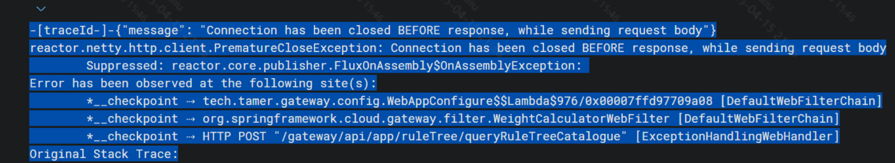
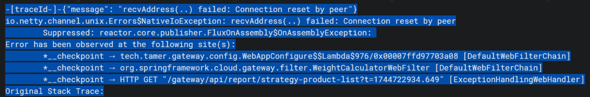
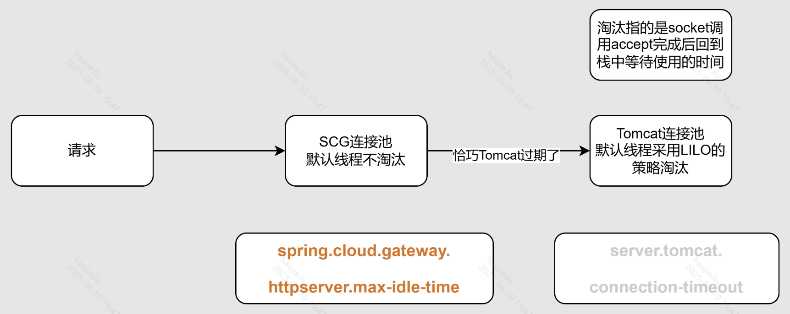

# Spring及Java编码相关

## [**JDK各种分支下载**](https://www.injdk.cn/)

### **循环依赖的解决方案**

### **1、主动声明并注入ApplicationContext**

注意：被生成的类不需要再进行注入了

```java
@Resource
private ApplicationContext context;
 
AccSendBillService accSendBillService = this.context.getBean(AccSendBillService.class);
```

---

### **2、javax包等各种下各种校验注解：@Validated 、@Valid**

这些除了在controller中入参中进行配置，还要在全局异常处理中进行特定异常的捕获

```java
if (e instanceof MethodArgumentNotValidException) {
    MethodArgumentNotValidException exception = (MethodArgumentNotValidException)e;            return this.buildValidResult(exception.getBindingResult());
}
 
private ResponseResult<Object> buildValidResult(BindingResult result) {
    StringBuilder stringBuilder = new StringBuilder();
    if (result.hasErrors()) {
        List<ObjectError> errors = result.getAllErrors();
        for (ObjectError error : errors) {
            FieldError fieldError = (FieldError)error;
            log.warn("Bad Request Parameters: dto entity [{}],field [{}],message [{}]", fieldError.getObjectName(),
                fieldError.getField(), fieldError.getDefaultMessage());
            stringBuilder.append(fieldError.getDefaultMessage()).append(CommonConsts.SYMBOL_COMMA);
        }
    }
    return ResultUtils.error(ResultEnums.PARAM_ERROR.getCode(),
        stringBuilder.substring(0, stringBuilder.lastIndexOf(CommonConsts.SYMBOL_COMMA)));
}
```

### **3、spring事务主动监听**

这个方法中就是为了避免方法结束事务没提交就释放锁了，这是其他线程就会掉到锁，但是上一个还没释放，这是就会造成异常数据；同时也可以解决大事务中多个save后需要save后的主键缺失问题，这时就不需要把需要主键的代码移动到另外的service让其自动提交，而是使用下面的则可实现

```java
if(TransactionSynchronizationManager.isActualTransactionActive()){
    TransactionSynchronizationManager.registerSynchronization(new TransactionSynchronization() {
        @Override
        public void afterCompletion(int status) {
            log.info("生成账单-释放锁，lockKey={}", lockKey);
            MakeBill4AccBillService.this.distributedLock.unlock(lockKey);
        }
    });
}
```

---

### **4、@SpringQueryMap无法解析参数对象父类的问题**

该注解内部会使用原生feign中的QueryMap来解析，这个map使用的编码器在低版本下本身就不会解析父类参数，所以有两种解决方案：

- 使queryMap选择BeanQueryMapEncoder 就行了

```java
//然后使用上面自定义的配置，如果想让它全局生效，就在 Spring boot 启动类上。
@EnableFeignClients(defaultConfiguration = FeignClientCustomizerConfig.class)
@SpringBootApplication
public class TestApplication {
    public static void main(String[] args) {
    }
 
		//如果只想让它在单个 FeignClient 上生效，就加上 configuration 属性。
		@FeignClient(value = "xxx", configuration = FeignClientCustomizerConfig.class)
		@RequestMapping("/xxx")
		@Service
		public interface XxxFeignClient {
		}
}
```

---

- 升级feign的版本

### **5、异步异常捕获**

下面这两段代码的线程池其实可以提出来，而不是每次新建

**第一版本，异常覆盖**

```java
**List<Integer> pushBizTypeList = this.zlPushService.getPushBizTypeList(reportType);
ExecutorService executorService = Executors.newFixedThreadPool(pushBizTypeList.size());
CountDownLatch countDownLatch = new CountDownLatch(pushBizTypeList.size());
AtomicReference<Exception> exception = new AtomicReference<>();
    for (Integer bizType : pushBizTypeList) {
        executorService.execute(() -> {
            try {
            } catch (Exception e) {
                log.error("detailV2异常", e);
                exception.set(e);
            } finally {
                countDownLatch.countDown();
            }
 
            }
        });
     }
countDownLatch.await();
if (exception.get() != null) {
    throw exception.get();
}**
```

**future改写，异常不覆盖**

```java
List<Integer> pushBizTypeList = this.zlPushService.getPushBizTypeList(reportType);
List<CompletableFuture<Void>> futures = new ArrayList<>();
List<Exception> exceptions = Collections.synchronizedList(new ArrayList<>());
 
for (Integer bizType : pushBizTypeList) {
    CompletableFuture<Void> future = CompletableFuture.runAsync(() -> {
        try {
            // 你的代码
        } catch (Exception e) {
            log.error("detailV2异常", e);
            exceptions.add(e);
        }
    });
    futures.add(future);
}
 
CompletableFuture<Void> combinedFuture = CompletableFuture.allOf(futures.toArray(new CompletableFuture[0]));
 
combinedFuture.join();
 
if (!exceptions.isEmpty()) {
    Exception firstException = exceptions.get(0);
    for (int i = 1; i < exceptions.size(); i++) {
        firstException.addSuppressed(exceptions.get(i));
    }
    throw firstException;
}
```

### **6、CompletableFuture中get和getNow的区别**

`CompletableFuture`中的`get`和`getNow`方法都是用来获取异步计算的结果，但它们的行为有一些不同：

1. **get**：这个方法会阻塞当前线程，直到异步计算完成并返回结果。如果异步计算还没有完成，这个方法会一直等待。如果异步计算抛出了异常，这个方法会抛出一个`ExecutionException`，你可以通过`ExecutionException.getCause`方法获取原始的异常。
2. **getNow**：这个方法不会阻塞，它会立即返回结果。如果异步计算已经完成，这个方法会返回计算的结果；如果异步计算还没有完成，这个方法会返回一个默认的值（这个值是作为参数传递给`getNow`方法的）。如果异步计算抛出了异常，这个方法不会抛出异常，而是返回默认的值。

总的来说，如果你需要等待异步计算完成并获取结果，你应该使用`get`方法；如果你不想阻塞当前线程，你可以使用`getNow`方法，但你需要提供一个默认的值，以防异步计算还没有完成。

### **7、new String()以及String.valueOf()的问题**

当传入valueOf的值是基本类型构成的数组时由于valueOf底层是对应类型的toString，而基本类型的数组为引用类型没有toString，这是会返回转换完成后的内容地址

`new String(byte[])`和`String.valueOf(byte[])`在处理字节数组时的行为是不同的。

`new String(byte[])`会将字节数组转换为一个新的字符串。它使用平台的默认字符集将字节解码为字符。例如：

```java

byte[] bytes = {72, 101, 108, 108, 111};  // ASCII values for "Hello"
String str = new String(bytes);
```

---

在这个例子中，`str`现在是一个新的字符串对象，其值为`"Hello"`。

然而，`String.valueOf(byte[])`并不会将字节数组转换为字符串。相反，它会将字节数组的对象引用转换为字符串。例如：

```java
byte[] bytes = {72, 101, 108, 108, 111};  // ASCII values for "Hello"
String str = String.valueOf(bytes);
```

---

在这个例子中，`str`现在是一个新的字符串对象，但其值是字节数组的对象引用，类似于`"[B@15db9742"`。

所以，如果你想将字节数组转换为表示其内容的字符串，你应该使用`new String(byte[])`。如果你想得到字节数组的对象引用的字符串表示，你应该使用`String.valueOf(byte[])`。

### **8、@Async与ThreadPoolTaskExecutor**

前提：当你重写了ThreadPoolTaskExecutor，返回了一个自定义的spring线程池；当使用@Async注解时默认也使用的是这个线程池

```java

@Bean
public ThreadPoolTaskExecutor threadPoolExecutor() {
    ThreadPoolTaskExecutor threadPoolTaskExecutor = new ThreadPoolTaskExecutor();
    threadPoolTaskExecutor.setCorePoolSize(20);
    threadPoolTaskExecutor.setMaxPoolSize(20);
    threadPoolTaskExecutor.setKeepAliveSeconds(100);
    threadPoolTaskExecutor.setQueueCapacity(10000);
    threadPoolTaskExecutor.setThreadNamePrefix("makeBill-");
    threadPoolTaskExecutor.setRejectedExecutionHandler(new ThreadPoolExecutor.CallerRunsPolicy());
    return threadPoolTaskExecutor;
}
```

---

上述说的其实很平常，但是如果使用线程池后，又在线程中创建当前线程池的另一个线程，同时拒绝策略是`CallerRunsPolicy`的策略是：不会抛弃任务，也不会抛出异常，而是将某些任务回退到调用者，从而降低新任务的流量。换句话说，如果线程池的所有线程都在工作，且等待队列已满，那么新提交的任务将由调用线程自己来执行。这种策略提供了一种简单的反馈控制机制，能够减缓新任务的提交速度。

场景：当核心线程数和最大线程数都是20个时，占用线程的任务都存在内部再创建当前线程池的线程逻辑，外层几乎一瞬间全部打满了20个线程，同时每个外层线程的内部分裂线程由于没有线程数了，所以就会一直等待，但是外层20个线程又在CompletableFuture.allOf(array).join();同样也在等待，所以加入到队列中待执行的任务数量是980+240

```java
public class ThreadExecutorTest {
    static ThreadPoolExecutor MAKE_BILL =
            new ThreadPoolExecutor(20, 20, 100, TimeUnit.SECONDS, new ArrayBlockingQueue<>(10000),
                    new NamedThreadFactory("doMakeBill-", false), new ThreadPoolExecutor.CallerRunsPolicy());
 
 
    @Test
    public void test() throws InterruptedException {
        //循环执行任务，线程内再创建线程
        for (int i = 0; i < 1000; i++) {
            //模拟使用@Async注解
            MAKE_BILL.execute(() -> {
                System.out.println(Thread.currentThread().getName());
                List<String> monthList = Lists.newArrayList("202201", "202202", "202203", "202204", "202205", "202206", "202207", "202208", "202209"
                        , "202210", "202211", "202212");
                CompletableFuture<?>[] array = monthList.stream().map(month -> CompletableFuture.runAsync(() -> {
                    System.out.println(month);
                }, MAKE_BILL)).toArray(CompletableFuture[]::new);
                CompletableFuture.allOf(array).join();
            });
//            Thread.sleep(1000);
        }
        System.out.println("主线程结束");
        try {
            //模拟主线程执行CallerRunsPolicy策略，对于调用者就是一直等待
            //同时模拟上帝视角，当阻塞队列被打满，实际上调用使用到这个线程池的逻辑，在接口返回的时间来看会一直loading返回不出来
            MAKE_BILL.awaitTermination(Long.MAX_VALUE, TimeUnit.NANOSECONDS);
        } catch (InterruptedException e) {
            e.printStackTrace();
        }
    }
}
```

### **9、单例类、对象与ThreadLocal**

在spring中不做额外配置下，多数对象都是单例的，那么透传在系统上下文就要注意多个线程下的线程安全问题，但是如果直接上锁的话，上下文的范围就很难判断，加的少怕锁不住，加的多怕效率慢，所就可以在对象需要被修改的前一行进行加锁并设置进threadLocal，同时要注意local中的内容释放问题；

> 在使用easyExcel的.class方式导出时，并且对其class上的注解属性如果进行了编辑，那么在并发多个线程的场景下就有可能会发生导出两个相同的文件，但是需要的字段不一样或者顺序不一样，就有可能相互污染，对于此就需要加锁，同时不能配合threadlocal用
> 

注意：前面说的放在local中是对象，但如果放进去的class，那么拷贝方式则是浅拷贝，即还是引用原先的单例class！！！

### **10、AopContext.currentProxy()和`Transactional`**

`AopContext.currentProxy()` 是 Spring AOP 提供的一个方法，用于获取当前代理对象。这个方法在处理事务或者需要在同一个类中调用其他被 AOP 代理的方法时非常有用。

在 Spring 中，当一个方法被 AOP 代理（例如被 `@Transactional` 注解）时，如果你在同一个类中直接调用这个方法，那么这个方法的 AOP 代理将不会被触发。这是因为你是直接调用的这个方法，而不是通过代理调用的。

例如，假设你有一个类 `MyService`，它有两个方法 `methodA` 和 `methodB`，`methodA` 调用 `methodB`，`methodB` 被 `@Transactional` 注解：

```java
@Service
public class MyService {
 
    public void methodA() {
        methodB();
    }
 
    @Transactional
    public void methodB() {
        // do something
    }
}
```

在这个例子中，如果你调用 `methodA`，那么 `methodB` 的事务代理将不会被触发，因为你是直接调用的 `methodB`，而不是通过代理调用的。

为了解决这个问题，你可以使用 `AopContext.currentProxy()` 来获取当前的代理对象，然后通过这个代理对象来调用 `methodB`：

```java
@Service
public class MyService {
 
    public void methodA() {
        ((MyService) AopContext.currentProxy()).methodB();
    }
 
    @Transactional
    public void methodB() {
        // do something
    }
}
```

这样，当你调用 `methodA` 时，`methodB` 的事务代理就会被正确触发。

### **11、ThreadPoolTaskExecutor与JDK自带的一些区别**

由于前者是spring下面提供的，那么在初始化后在JVM生命周期内存在一个spring管理的单例线程池，**这时如果在你的方法中使用了shutdown，这是正在执行的异步任务会被直接终止并且报错，后续如果在调用test01方法，异步的逻辑不会执行，同样也不会报错了，因为线程池已经被关闭了，所以对于spring进行管理的线程池，在大多数情况下不需要考虑要不要关闭**

```java
@Configuration
public class ThreadPoolConfig {
    @Bean
    public ThreadPoolTaskExecutor contractGroupAmountEachDayTaskExecutor() {
        ThreadPoolTaskExecutor executor = new ThreadPoolTaskExecutor();
        executor.setCorePoolSize(10); // 设置核心线程数为5
        executor.setMaxPoolSize(10); // 设置最大线程数也为5
        executor.setQueueCapacity(Integer.MAX_VALUE); // 使用无界队列
        executor.setRejectedExecutionHandler(new ThreadPoolExecutor.CallerRunsPolicy()); // 设置拒绝策略为CallerRunsPolicy
        executor.setThreadFactory(new LogTraceThreadFactory("contractGroupAmountEachDay-"));
        executor.initialize(); // 初始化线程池
        return executor;
    }
}
 
public class test{
    @Resource
    private ThreadPoolTaskExecutor contractGroupAmountEachDayTaskExecutor;
 
    public void test01(){
        CompletableFuture.runAsync(() ->
                log.info("xxx"), this.contractGroupAmountEachDayTaskExecutor));
        this.contractGroupAmountEachDayTaskExecutor.shutdown();
    }
}
```


### **12、前端参数接收date时使用springboot记得格式化Date类**

> 后续查询到这个注解只是能帮我们将日期字符串转化为Date类型，但实际上并不受pattern字段的影响，这时就可以使用SimpleDateFormat去主动进行约束，这些情况比较适用于这些数据是通过Url传参或者form-data这两种；当如果前端使用到Json进行传递信息，那么就可以使用@JsonFormat进行格式化和约束
> 

```java
@DateTimeFormat(pattern = "yyyy-MM-dd")
private Date createTime;
@DateTimeFormat(pattern = "yyyy-MM-dd")
private Date updateTime;
  
@JsonFormat(timezone = "GMT+8", pattern = "yyyy-MM-dd HH:mm:ss")
private Date createTime;
@JsonFormat(timezone = "GMT+8", pattern = "yyyy-MM-dd HH:mm:ss")
private Date updateTime;
```

### **13、spring中配置文件的优先级**

回顾配置文件的优先级

> 项目根目录下的 config 文件夹中项目根目录下classpath 下的 config 文件夹中classpath 下
> 
> 
> 这四个位置的加载优先级依次为 1 > 2 > 3 > 4，如果这 4 个位置中都有 application.yml 或 application.properties 文件，那么加载的优先级从 1 到 4 依次降低。SpringBoot 将按照这个优先级查找配置信息，并加载到 Spring 环境中
> 
> 
> 

### **14、TLAB和PLAB的区别**

> 首先明确栈上分配的原理时进行逃逸分析，目的就是让对象更快的被访问到；因此TLAB应运而生，在每个线程的内存空间中独立申请一个空间来存放这些无法逃逸的对象，同时也要时刻牢记这一部分的大小是算在JVM中的，所以一般设置的太小，适合存放小对象，与Eden区对应；而PLAB同样也是缓存，但是存放的对象是对应Survivor区或者是老年代的；
> 

### **15、@Primary注解的作用**

`@Primary`注解在Spring框架中使用，主要用于标识当存在多个同类型的bean时，哪一个bean应该被优先考虑。在自动装配（autowiring）时，如果Spring容器中存在多个相同类型的bean，而又需要通过类型自动装配一个bean，Spring将会选择标有`@Primary`注解的bean进行装配。

使用`@Primary`注解可以帮助解决自动装配时的歧义问题，确保当有多个候选bean可供选择时，Spring容器能够知道优先选择哪一个。

示例：

```java
//这个例子是要访问相同类型的Bean，需要用名字@Qualifier来区分他们
@Configuration
public class PrimaryConfig {
  
   @Bean
   @Qualifier("zhangSanEmployee")
   public Employee zhangSanEmployee() {
       return new Employee("张三");
   }
  
   @Bean
   @Qualifier("liSiEmployee")
   public Employee liSiEmployee() {
       return new Employee("李四");
   }
}
//这样就可以提高李四的优先级了
@Configuration
public class PrimaryConfig {
  
    @Bean
    public Employee zhangSanEmployee() {
        return new Employee("张三");
    }
  
    @Bean
    @Primary
    public Employee liSiEmployee() {
        return new Employee("李四");
    }
}
//接口被实现也同理
public interface Manager {
    String getManagerName();
}
  
@Component
public class DepartmentManager implements Manager {
    @Override
    public String getManagerName() {
        return "Department manager";
    }
}
  
@Component
@Primary
public class GeneralManager implements Manager {
    @Override
    public String getManagerName() {
        return "General manager";
    }
}
```

### **16、查询时参数是[]**

页面输入英文格式的中括号 [] 或者其中一个字符，请求变成400或request error了

核心原因：是因为符号有了二义性。[具体原因](https://www.cnblogs.com/yushixin1024/p/16358216.html)


```java
Error parsing HTTP request header
 Note: further occurrences of HTTP request parsing errors will be logged at DEBUG level.
java.lang.IllegalArgumentException: Invalid character found in the request target [/api/crm/contractGroup/list?pageSize=10&pageNo=1&statisticsDate=2024-06-21&isUseBeforeYesterday=false&keyword=[] ]. The valid characters are defined in RFC 7230 and RFC 3986
    at org.apache.coyote.http11.Http11InputBuffer.parseRequestLine(Http11InputBuffer.java:494)
    at org.apache.coyote.http11.Http11Processor.service(Http11Processor.java:269)
    at org.apache.coyote.AbstractProcessorLight.process(AbstractProcessorLight.java:65)
    at org.apache.coyote.AbstractProtocol$ConnectionHandler.process(AbstractProtocol.java:895)
    at org.apache.tomcat.util.net.NioEndpoint$SocketProcessor.doRun(NioEndpoint.java:1732)
    at org.apache.tomcat.util.net.SocketProcessorBase.run(SocketProcessorBase.java:49)
    at org.apache.tomcat.util.threads.ThreadPoolExecutor.runWorker(ThreadPoolExecutor.java:1191)
    at org.apache.tomcat.util.threads.ThreadPoolExecutor$Worker.run(ThreadPoolExecutor.java:659)
    at org.apache.tomcat.util.threads.TaskThread$WrappingRunnable.run(TaskThread.java:61)
    at java.lang.Thread.run(Thread.java:750)
```

### **17、@Autowired和@Resource的区别**

`@Autowired`和`@Resource`都是Spring框架提供的注解，用于实现依赖注入（DI），但它们在注入方式和来源上有所不同。

### **@Autowired**

- **来源**：`@Autowired`是Spring框架的注解。
- **注入方式**：默认按类型（Type）进行自动装配。如果找到多个相同类型的bean，则会根据属性名称（Name）作为bean的id进行匹配。
- **可选性**：可以设置`required`属性为`false`，表示如果没有找到匹配的bean也不会报错，只是该属性不会被设置（默认为`true`）。
- **使用位置**：可以用在构造器、属性字段、setter方法上。

### **@Resource**

- **来源**：`@Resource`是由JDK提供，来自于`javax.annotation.Resource`，Spring支持该注解实现依赖注入。
- **注入方式**：默认按名称（Name）进行装配。如果没有指定名称，那么会按照字段名称或setter方法名称进行匹配。如果没有找到匹配的名称，则会按类型（Type）进行匹配。
- **可选性**：`@Resource`没有`required`属性，如果没有找到匹配的bean，将会抛出异常。
- **使用位置**：可以用在字段或setter方法上。

### **主要区别**

1. **来源不同**：`@Autowired`是Spring的注解，而`@Resource`是JDK的注解。
2. **默认注入方式不同**：`@Autowired`默认按类型装配，`@Resource`默认按名称装配。
3. **可选性处理**：`@Autowired`可以通过`required`属性设置不是必须的依赖，`@Resource`没有这样的属性，找不到对应bean时会抛出异常。
4. 指定名称的方式

```java
@Component
public class PaymentService {
    @Autowired
    @Qualifier("client")
    private Client client;
  
    // ...
}
@Component
public class PaymentService {
    @Resource(name = "client")
    private Client client;
  
    // ...
}
```

### **选择建议**

- 如果你完全在Spring环境下工作，推荐使用`@Autowired`，因为它更加灵活，特别是配合`@Qualifier`注解使用时，可以更精确地控制bean的选择。
- 如果你希望你的应用尽可能地与Spring解耦，或者需要按名称进行注入，那么`@Resource`可能是更好的选择。

### **18、@Bean的destroyMethod属性**

@Bean(destroyMethod = "close")是一个Spring注解，用于指定在销毁Bean时调用的方法。具体来说，它表示在销毁Bean时调用名为"close"的方法。这个方法通常用于释放Bean所持有的资源，例如关闭数据库连接、释放文件句柄等。

在Spring容器销毁Bean时，会自动调用这个方法，以确保Bean所持有的资源能够被正确地释放。需要注意的是，@Bean(destroyMethod = "close")只有在Bean的作用域为singleton或者prototype时才有效。对于其他作用域（如request、session等），Spring容器会在适当的时候自动销毁Bean，不需要使用@Bean(destroyMethod = "close")来指定销毁方法。

总的来说，@Bean(destroyMethod = "close")是一个非常有用的注解，可以帮助我们在销毁Bean时自动释放资源，避免资源泄漏和内存泄漏等问题。

```java
@Configuration
public class AppConfig {
    @Bean(destroyMethod = "cleanup")
    public ExampleBean exampleBean() {
        return new ExampleBean();
    }
}
 
public class ExampleBean {
    public void cleanup() {
        // 在这里执行清理操作，比如关闭文件流、数据库连接等
        System.out.println("Cleaning up resources...");
    }
}
```

---

### **19、Mapping中的consumes属性**

RequestMapping注解的consumes属性：

@RequestMapping 注解的 consumes 属性用于指定处理请求的方法（@RequestMapping 注解所标注的方法）可以接受的请求内容类型（Content-Type）。如果请求的 Content-Type 不在 consumes 属性指定的列表中，则该请求不会被该方法处理。consumes 属性的值可以是一个字符串数组，每个字符串表示一个 Content-Type。

例如，consumes = "application/json" 表示该方法只能处理 Content-Type 为 application/json 的请求。如果有多个 Content-Type，可以使用逗号分隔，例如 consumes = {"application/json", "application/xml"}。

> 下面是一个使用 consumes 属性的例子：在这个例子中，@PostMapping 注解的 consumes 属性指定为 application/json，表示该方法只能处理 Content-Type 为 application/json 的 POST 请求。如果请求的 Content-Type 不是 application/json，则该请求不会被该方法处理。
> 

```java
@RestController
@RequestMapping("/api")
public class MyController {
    @PostMapping(value = "/users", consumes = "application/json")
    public ResponseEntity<User> createUser(@RequestBody User user) {
        // 处理创建用户的请求
    }
}
```

### **20、TransactionSynchronization的afterCommit和afterCompletion的区别和用法**

`TransactionSynchronization`接口在Spring框架中用于事务同步回调，提供了多个在事务生命周期不同阶段执行的方法，其中`afterCommit`和`afterCompletion`是两个常用的方法，它们在事务提交后执行，但用途和执行时机有所不同。

### **afterCommit**

- **用途**：`afterCommit`方法在事务成功提交后执行。这个方法通常用于执行那些只有在事务完全成功提交后才安全执行的后续操作，比如发送消息通知、完成某些业务逻辑等。
- **执行时机**：仅在事务成功提交后调用。

### **afterCompletion**

- **用途**：`afterCompletion`方法在事务完成后执行，无论事务是成功提交还是回滚。这个方法用于执行清理工作，比如资源释放、状态重置等。它提供了一个状态参数，指示事务是提交还是回滚，允许你根据事务的最终状态执行不同的逻辑。
- **执行时机**：在事务提交或回滚后调用。

### **使用示例**

假设你需要在事务成功提交后发送一个消息，并且无论事务成功还是失败，都需要执行一些清理工作。

```java
public class MyService {
 
    public void myTransactionalMethod() {
        // 业务逻辑...
 
        TransactionSynchronizationManager.registerSynchronization(new TransactionSynchronizationAdapter() {
            @Override
            public void afterCommit() {
                // 事务成功提交后，发送消息
                sendMessage();
            }
 
            @Override
            public void afterCompletion(int status) {
                // 事务完成后，无论成功还是失败，都执行清理工作
                cleanup();
            }
        });
    }
 
    private void sendMessage() {
        // 发送消息逻辑
    }
 
    private void cleanup() {
        // 清理逻辑
    }
}
```

在这个示例中，`afterCommit`用于发送消息，确保只有在事务成功提交后才执行。而`afterCompletion`用于执行清理工作，不管事务是提交成功还是失败。这样可以确保资源被适当管理，同时根据事务的结果执行相应的业务逻辑。

### **21、@indexed注解**

在Spring框架中，`@Indexed`注解主要用于标记一个类，以便在运行时通过Spring的扫描机制自动检测。这个注解使得被标记的类能够被Spring容器快速定位和加载，特别是在使用Spring的组件扫描功能时，`@Indexed`可以提高检索性能。

### **作用**

- **性能优化**：当Spring应用启动时，它会扫描指定的包来查找标记有特定注解的类（如`@Component`, `@Service`, `@Repository`, `@Controller`等）。`@Indexed`注解可以帮助Spring更快地定位这些类，从而加快启动时间。
- **标记作用**：虽然`@Indexed`本身不提供额外的功能，但它可以作为一个标记，用于指示一个类是由Spring管理的一个组件。

### **用法**

你可以将`@Indexed`注解添加到类定义上，与其他Spring组件注解（如`@Component`）一起使用，或者单独使用在那些需要被Spring容器管理但不属于标准组件类别的类上。

```java
import org.springframework.stereotype.Indexed;
 
@Indexed
public class MyCustomClass {
    // 类的定义
}
 
//或者与其他注解一起使用：
import org.springframework.stereotype.Component;
import org.springframework.stereotype.Indexed;
 
@Indexed
@Component
public class MyService {
    // 服务的定义
}
```

---

### **注意事项**

- `@Indexed`注解主要影响Spring的启动性能，对于运行时性能影响不大。
- 在大型项目中，合理使用`@Indexed`可以显著减少Spring应用的启动时间。
- 默认情况下，Spring已经对`@Component`及其衍生注解（`@Service`, `@Repository`, `@Controller`等）进行了索引处理，因此在这些注解的类上通常不需要显式添加`@Indexed`。
- `@Indexed`更多的是用于那些自定义的注解，或者在特定情况下，需要显式告知Spring进行快速定位的类。

### **22、证书校验与lambda**

`.withValidator(response -> true);` 这种用法通过一个 Lambda 表达式设置了一个验证器，这个验证器对于所有的响应都返回 `true`，意味着它实际上不进行任何验证。这在某些测试场景中可能有用，但在生产环境中通常不推荐这样做，因为它可能会导致安全问题。

```java
public interface Validator {
    boolean validate(CloseableHttpResponse response) throws IOException;
}
 
public WechatPayHttpClientBuilder withValidator(Validator validator) {
    this.validator = validator;
    return this;
}
 
@Override
public final boolean validate(CloseableHttpResponse response) throws IOException {
    try {
        validateParameters(response);
 
        String message = buildMessage(response);
        String serial = response.getFirstHeader(WECHAT_PAY_SERIAL).getValue();
        String signature = response.getFirstHeader(WECHAT_PAY_SIGNATURE).getValue();
 
        if (!verifier.verify(serial, message.getBytes(StandardCharsets.UTF_8), signature)) {
            throw verifyFail("serial=[%s] message=[%s] sign=[%s], request-id=[%s]",
                    serial, message, signature, response.getFirstHeader(REQUEST_ID).getValue());
        }
    } catch (IllegalArgumentException e) {
        log.warn(e.getMessage());
        return false;
    }
 
    return true;
}
//可以使用lambda的方式去让其不进行验签
WechatPayHttpClientBuilder builder = WechatPayHttpClientBuilder.create()
                .withMerchant(mchConfig.getMchId(), mchConfig.getMchSerialNumber(), privateKey)
                .withValidator(response -> true);
```

---

### **23、@AliasFor注解**

在 Spring 框架中，`@AliasFor` 注解用于定义注解属性之间的别名关系。它允许你在自定义注解中指定某个属性是另一个属性的别名，从而提供更灵活和简洁的配置方式。

### **主要用途**

1. **属性别名**：允许一个注解属性作为另一个属性的别名。
2. **元注解属性别名**：允许在元注解（meta-annotation）中定义属性别名。

### **示例**

### **属性别名**

假设你有一个自定义注解 `MyAnnotation`，其中 `value` 和 `name` 属性是互为别名：

在这个示例中，`value` 和 `name` 属性互为别名，你可以使用其中任何一个属性来设置值：

```java
import org.springframework.core.annotation.AliasFor;
import java.lang.annotation.Retention;
import java.lang.annotation.RetentionPolicy;
 
@Retention(RetentionPolicy.RUNTIME)
public @interface MyAnnotation {
 
    @AliasFor("name")
    String value() default "";
 
    @AliasFor("value")
    String name() default "";
}
 
@MyAnnotation("testValue") // 等同于 @MyAnnotation(name = "testValue")
public class MyClass {
    // ...
}
```

### **元注解属性别名**

你还可以在元注解中使用 `@AliasFor` 来定义属性别名。例如，假设你有一个自定义注解 `MetaAnnotation`，它是 `@Component` 的元注解：

在这个示例中，`MetaAnnotation` 的 `name` 属性是 `@Component` 注解的 `value` 属性的别名：

```java
import org.springframework.core.annotation.AliasFor;
import org.springframework.stereotype.Component;
import java.lang.annotation.Retention;
import java.lang.annotation.RetentionPolicy;
 
@Retention(RetentionPolicy.RUNTIME)
@Component
public @interface MetaAnnotation {
 
    @AliasFor(annotation = Component.class, attribute = "value")
    String name() default "";
}
 
@MetaAnnotation(name = "myComponent") // 等同于 @Component("myComponent")
public class MyComponent {
    // ...
}
```

### **总结**

`@AliasFor` 注解在 Spring 中用于定义注解属性之间的别名关系，提供了更灵活和简洁的配置方式。它可以用于同一注解中的属性别名，也可以用于元注解中的属性别名。通过使用 `@AliasFor`，你可以简化注解的使用，提高代码的可读性和可维护性。

### **@ConditionalOnMissingBean、@ConditionalOnMissingClass、@Bean**

[参考链接](https://cloud.tencent.com/developer/article/1449288)

背景：A项目注入redis时使用的是@Bean，B项目使用ConditionalOnMissingBean来注入redis达成JAR包为A提供服务，这是就会在A项目使用redis时报错找不到redis的bean

原因：Bean和ConditionalOnMissingBean这两者在spring的注入对象优先级是最低的，两个都是最低，那么B在给自己组件注入redis时，由于ConditionalOnMissingBean这个注解是a项目有时不执行，没有的时候执行，A这时由于是@Bean不一定有，同时B本身也会在A没有注入的前提下会自己注入redis，但是注入redis的方法同样是被@Bean修饰的，那么B很大可能拿不到这个Bean，就会注入进去null

解决方案：

1. 自己编排顺序
2. 使用ConditionalOnMissingClass

### 

### **24、spring cloud gateway中的spring.cloud.gateway.httpserver.max-idle-time参数与tomcat中的server.tomcat.connection-timeout参数之间的冲突问题**

现象





原因分析：

SCG与tomcat是存在请求连接的交互的，SCG负责请求的分发，那么他接收请求也会有一个类似于tomcat的连接池



解决方案：

[tomcat超时时间的默认位置](https://www.cnblogs.com/wftop1/p/15788665.html)

[解决方案1](https://www.cnblogs.com/wftop1/p/15789238.html)

[解决方案2](https://www.cnblogs.com/xd502djj/p/14668385.html)

第1步、加入JVM参数：

- Dreactor.netty.pool.leasingStrategy=lifo

将获取连接策略由默认的FIFO变更为LIFO，因为LIFO能够确保获取的连接最大概率是最近刚被用过的，也就是热点连接始终是热点连接，而始终用不到的连接就可以被回收掉，LRU的思想。

```java
JAVA_OPTS=" -Xms4G -Xmx4G -XX:ZAllocationSpikeTolerance=2 -XX:MetaspaceSize=256M -XX:MaxMetaspaceSize=256M -XX:ConcGCThreads=4 -XX:-ZUncommit -XX:+UseZGC -XX:+AlwaysPreTouch -XX:-ResizePLAB -XX:+ParallelRefProcEnabled -XX:+ExplicitGCInvokesConcurrent -Dreactor.netty.pool.leasingStrategy=lifo --add-opens java.base/java.lang=ALL-UNNAMED --add-opens java.base/java.io=ALL-UNNAMED --add-opens java.base/java.math=ALL-UNNAMED --add-opens java.base/java.net=ALL-UNNAMED --add-opens java.base/java.nio=ALL-UNNAMED --add-opens java.base/java.security=ALL-UNNAMED --add-opens java.base/java.text=ALL-UNNAMED --add-opens java.base/java.time=ALL-UNNAMED --add-opens java.base/java.util=ALL-UNNAMED --add-opens java.base/jdk.internal.access=ALL-UNNAMED --add-opens java.base/jdk.internal.misc=ALL-UNNAMED --add-opens java.base/java.lang.reflect=ALL-UNNAMED"
```

---

第2步、SCG新增配置：

是设置空闲请求在空闲多久后会被回收，这样也就可以避免拿到旧连接刚好在请求途中被强行close了，这个时间的设置只要确保比你后端服务的connectTimeout小就行了，这样能够确保SCG回收请求在后端服务回收请求之前，就可以避免掉这个问题。

```java
spring:    
  cloud:
    gateway:
      httpserver:
        max-initial-line-length: 65536
        max-header-size: 65536
        max-chunk-size: 2097152  # 2MB
      httpclient:
        pool:
          max-idle-time: 30 # less than org.apache.coyote.http11.Constants.DEFAULT_CONNECTION_TIMEOUT
```

---

### 25.spring中controller接口被private修饰，注入的类为空，但接口能调通

分解为两个问题：

1. private修饰的接口为什么会调通而不是404：因为被RequestMapping系列的注解修饰了，所以会在psring中进行注册
2. private修饰的接口为什么调用注入的对象为空：被private修饰的方法无法被动态代理类代理，那么这个方法就不受spring管理了，自然无法调用被spring管理的其他类

### 26、接口响应某个字段时，不用指定响应对象的特定字段，只需要有你想要这个字段对应的get方法就能进行反序列化响应

可以关注下面的createTime、updateTime、createCn、updateCn

```java
@Data
@SuperBuilder
@NoArgsConstructor
@AllArgsConstructor
public class BaseVO implements Serializable {
    private final static String NORM_DATETIME_FORMATTER = "yyyy-MM-dd HH:mm:ss";
    private final static DateTimeFormatter DATE_TIME_FORMATTER = DateTimeFormatter.ofPattern(NORM_DATETIME_FORMATTER);
    @Serial
    private static final long serialVersionUID = 917229549609130941L;

    private Long id;

    /**
     * beijing create_time
     */
    private Long createTimeUtc;

    /**
     * beijing updateTime
     */
    private Long updateTimeUtc;

    /**
     * 0：official 1：test
     */
    private Integer isTest;

    /**
     * 0：no 1：yes
     */
    private int isDeleted;

    private String createEn;

    private String createCn;

    private String updateEn;

    private String updateCn;

    private String timeZone;

    private String tenantCode;
    private String organizeCode;
    private String organizeName;

    private LocalDateTime createTime;
    private LocalDateTime updateTime;

    public String getCreateTime() {
        if (StringUtils.isBlank(this.timeZone)) {
            this.timeZone = CurrentUser.getTimeZone();
        }
        if (Objects.nonNull(this.createTimeUtc) && StringUtils.isNotBlank(this.timeZone)) {
            return LocalDateTime.ofInstant(Instant.ofEpochSecond(this.createTimeUtc / 1000), ZoneId.of(this.timeZone))
                .format(DATE_TIME_FORMATTER);
        } else {
            return "-";
        }
    }

    public String getUpdateTime() {
        if (StringUtils.isBlank(this.timeZone)) {
            this.timeZone = CurrentUser.getTimeZone();
        }
        if (Objects.nonNull(this.updateTimeUtc) && StringUtils.isNotBlank(this.timeZone)) {
            return LocalDateTime.ofInstant(Instant.ofEpochSecond(this.updateTimeUtc / 1000), ZoneId.of(this.timeZone))
                .format(DATE_TIME_FORMATTER);
        } else {
            return "-";
        }
    }

    public void setCreateTime(Object createTime) {
        if (StringUtils.isBlank(this.timeZone)) {
            this.timeZone = CurrentUser.getTimeZone();
        }
        if (Objects.nonNull(this.createTimeUtc) && StringUtils.isNotBlank(this.timeZone)) {
            if (createTime instanceof LocalDateTime) {
                this.createTime = (LocalDateTime) createTime;
            } else if (createTime instanceof String) {
                // try to parse the string to LocalDateTime
                try {
                    this.createTime = LocalDateTime.parse((String) createTime, DATE_TIME_FORMATTER);
                } catch (Exception e) {
                    // if the parsing fails, use UTC time
                    this.createTime = LocalDateTime.ofInstant(
                            Instant.ofEpochSecond(this.createTimeUtc / 1000),
                            ZoneId.of(this.timeZone)
                    );
                }
            } else {
                // other types, use UTC time
                this.createTime = LocalDateTime.ofInstant(
                        Instant.ofEpochSecond(this.createTimeUtc / 1000),
                        ZoneId.of(this.timeZone)
                );
            }
        } else {
            this.createTime = null;
        }
    }

    public void setUpdateTime(Object updateTime) {
        if (StringUtils.isBlank(this.timeZone)) {
            this.timeZone = CurrentUser.getTimeZone();
        }
        if (Objects.nonNull(this.updateTimeUtc) && StringUtils.isNotBlank(this.timeZone)) {
            if (updateTime instanceof LocalDateTime) {
                this.updateTime = (LocalDateTime) updateTime;
            } else if (updateTime instanceof String) {
                try {
                    this.updateTime = LocalDateTime.parse((String) updateTime, DATE_TIME_FORMATTER);
                } catch (Exception e) {
                    this.updateTime = LocalDateTime.ofInstant(
                            Instant.ofEpochSecond(this.updateTimeUtc / 1000),
                            ZoneId.of(this.timeZone)
                    );
                }
            } else {
                this.updateTime = LocalDateTime.ofInstant(
                        Instant.ofEpochSecond(this.updateTimeUtc / 1000),
                        ZoneId.of(this.timeZone)
                );
            }
        } else {
            this.updateTime = null;
        }
    }

    public String getCreateCn() {
        return StringUtils.isNotBlank(this.createEn)
            && (StringUtils.equals(this.createEn, "operator") || StringUtils.equals(this.createEn, "SysAdmin"))
                ? "Administrator" : this.createCn;
    }

    public String getUpdateCn() {
        return StringUtils.isNotBlank(this.updateEn)
            && (StringUtils.equals(this.updateEn, "operator") || StringUtils.equals(this.updateEn, "SysAdmin"))
                ? "Administrator" : this.updateCn;
    }
}

```

### ArrayList的线程不安全体现

在高并发添加数据下，ArrayList 会暴露三个问题;

- 部分值为 null（我们并没有 add null 进去）
- 索引越界异常
- size 与我们 add 的数量不符

为了知道这三种情况是怎么发生的，ArrayList，add 增加元素的代码如下：

ensureCapacityInternal() 这个方法的详细代码我们可以暂时不看，它的作用就是判断如果将当前的新元素加到列表后面，列表的 elementData 数组的大小是否满足，如果 size + 1 的这个需求长度大于了 elementData 这个数组的长度，那么就要对这个数组进行扩容。

大体可以分为三步：

- 判断数组需不需要扩容，如果需要的话，调用 grow 方法进行扩容；
- 将数组的 size 位置设置值（因为数组的下标是从 0 开始的）；
- 将当前集合的大小加 1

下面我们来分析三种情况都是如何产生的：

- 部分值为 null：当线程 1 走到了扩容那里发现当前 size 是 9，而数组容量是 10，所以不用扩容，这时候 cpu 让出执行权，线程 2 也进来了，发现 size 是 9，而数组容量是 10，所以不用扩容，这时候线程 1 继续执行，将数组下标索引为 9 的位置 set 值了，还没有来得及执行 size++，这时候线程 2 也来执行了，又把数组下标索引为 9 的位置 set 了一遍，这时候两个先后进行 size++，导致下标索引 10 的地方就为 null 了。
- 索引越界异常：线程 1 走到扩容那里发现当前 size 是 9，数组容量是 10 不用扩容，cpu 让出执行权，线程 2 也发现不用扩容，这时候数组的容量就是 10，而线程 1 set 完之后 size++，这时候线程 2 再进来 size 就是 10，数组的大小只有 10，而你要设置下标索引为 10 的就会越界（数组的下标索引从 0 开始）；
- size 与我们 add 的数量不符：这个基本上每次都会发生，这个理解起来也很简单，因为 size++ 本身就不是原子操作，可以分为三步：获取 size 的值，将 size 的值加 1，将新的 size 值覆盖掉原来的，线程 1 和线程 2 拿到一样的 size 值加完了同时覆盖，就会导致一次没有加上，所以肯定不会与我们 add 的数量保持一致的；

### BeanFactory和FactoryBean的区别

BeanFactory是用于创建并管理Bean的生命周期，IOC的体现，使用工厂模式，常见的实现有ApplicationContext、XmlBeanFactory等等，创建出来的对象不需要关注销毁等，这个类定义了标准的Bean生成周期调用链

- BeanNameAware.setBeanName 用于设置 Bean 的名称
- BeanClassLoaderAware.setBeanClassLoader 设置类加载器
- BeanFactoryAware.setBeanFactory 设置 bean 工厂
- ResourceLoaderAware.setResourceLoader 设置资源加载器
- ApplicationEventPublisherAware.setApplicationEventPublisher 设置事件发布器
- MessageSourceAware.setMessageSource 设置信息资源
- ApplicationContextAware.setApplicationContext 设置应用上下文
- ServletContextAware.setServletContext 设置 Servlet 上下文
- BeanPostProcessor.postProcessBeforeInitialization 前置处理器
- InitializingBean.afterPropertiesSet Bean 初始化操作
- RootBeanDefinition.getInitMethodName 设置Bean 的初始化方法名称
- BeanPostProcessor.postProcessAfterInitialization 后置处理器
- DisposableBean.destroy 设置 Bean 销毁
- RootBeanDefinition.getDestroyMethodName 获取 Bean 销毁的方法

FactoryBean

主要**用于构建一些实例化过程较为复杂或有配置依赖的对象(即非普通POJO)，并将其交给`Spring`容器管理**。例如`SqlSessionFactoryBean`就是一个例子，很多逻辑需要用到数据库配置，以往实例+初始化的方式很难由spring进行管理