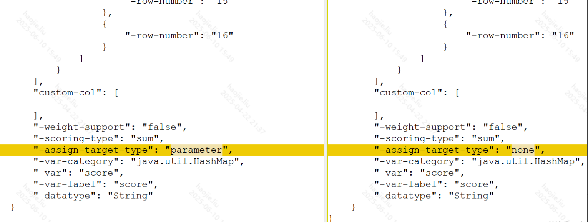

# URule相关

https://www.bstek.com/resources/doc/3.x/

## 一、智能风控下修改urule源代码或源xml的一些功能点

### **1、评分卡在原有最后结果分数前加和一个用户自定义的基础分**

背景：用户想要以规则维度对于评分卡设置一个基础分，需要给评分卡的结果进行加和

改动：由于最终评分卡的结果是urule直接输出的，而在配置的时候就需要将这个结果赋值给某个变量，那么如果在结果输出后做文章在运行中实际上不知道用户需要映射到那个字段，因为前端直接生成json，如下图，前者是把结果赋值给某个字段，后者就是不赋值，所以就需要在urule的xml中做文章了

解决方案：在json中添加一个字段，然后在评分卡的urule对象中也加入一个，json转化成xml，然后xml转化成评分卡对象就能拿到这个基础分了，然后到评分卡的处理类中加上这个分数即可

### **2、urule规则集在不设置优先级的前提下，每个子规则集的执行方式**

- 每个符合条件的子规则集都会被执行，但是顺序不定
- 同时每个子规则判断条件的入参的值永远是到这个规则集时的那个值，而不是某个子规则命中后如果给这个参数赋值了，不会用这个最新的值
- 如果配置的子规则集的出参都给同一个变量赋值，由于顺序不固定，所以最终的结果无法预测，每次都不一样

疑问：

- 为什么当前urule自己的优先级无法满足浦发银行的需要

浦发优化了优先级的执行，即顺序执行

做法：原先将整个规则直接传入了rete算法进行优化，然后整个丢给urule执行，而现在将子规则提取出来作为一个单独的规则集给rete优化，然后每个rule都有前端指定的顺序，根据顺序排列成一个list，循环丢给urule执行

### **3、urule指定某个子规则集满足条件后跳出**

让前端传一个标志位，然后判断某个子规则集是否命中if，这个是根据fireRules返回的结果来的，某个参数在满足if或者else时是不一样的，那么判断满足if的时候通过传入的标志位来判断是否跳出，跳出本质上就是把当前大的规则集直接结束