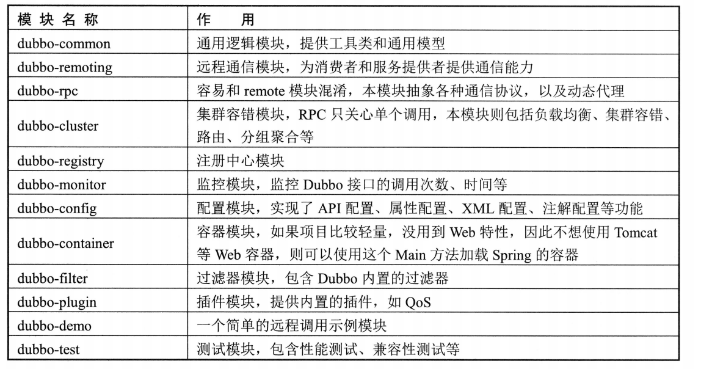
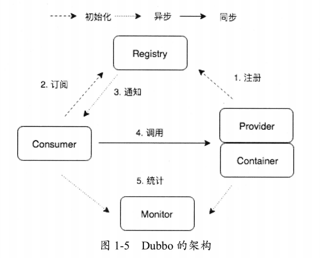
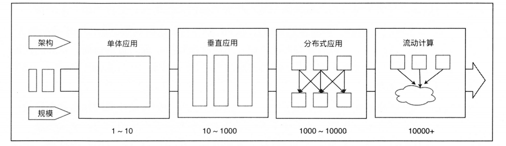

# Dubbo架构与核心组件

## 概念卡
Q: 为什么Dubbo要设计为分层架构，十层分别解决什么问题？

A:
- 设计动机：Dubbo遵循"微内核+插件"思想，将RPC调用的复杂流程拆解为独立层次，每层只关注自己的职责，通过SPI机制实现各层的可替换性，从而让框架具备高度可扩展能力——Protocol、Transport、Serialization等核心能力都可以被第三方实现替换
- Service层：业务接口与实现，是用户编码的入口，框架对上层完全透明
- Config层：围绕ServiceConfig（服务暴露配置）和ReferenceConfig（服务引用配置）展开，管理整个Dubbo的配置初始化，支持XML、注解、属性文件三种配置方式
- Proxy层：生成代理类，让远程调用对开发者看起来像本地调用，默认使用Javassist字节码生成（比JDK Proxy性能更好且使用更简单）
- Registry层：负责服务的自动注册与发现，核心接口是RegistryFactory，通过@Adaptive({"protocol"})动态选择ZooKeeper/Redis/Nacos等注册中心实现
- Cluster层：集群容错层，包含容错策略（Failover等7种）、路由（Router）、负载均衡（LoadBalance）三大核心能力，所有容错逻辑在客户端完成
- Monitor层：统计调用次数、耗时等监控信息，通过MonitorFilter收集数据上报到dubbo-monitor
- Protocol层：RPC调用主入口，管理Invoker的整个生命周期——服务暴露（export）和引用（refer）都在此层完成
- Exchange层：在Transport层之上建立Request-Response模型，封装同步/异步请求转换，让上层只关心请求-响应对
- Transport层：抽象网络传输接口，屏蔽Netty/Mina等底层通信框架的差异，统一为Channel模型
- Serialize层：负责网络传输时的序列化/反序列化，默认使用Hessian2

## 概念卡
Q: Dubbo的RPC调用过程中，Invoker模型为什么是核心抽象？

A:
- Invoker是Dubbo的实体域核心模型，框架中所有其他模型都向它靠拢或转换成它。它代表一个可执行体（Executable），调用invoke方法即可触发执行
- 设计意义：无论目标实现是本地的、远程的还是集群的，上层代码通过统一的Invoker接口发起调用，不感知底层差异。这是典型的"面向接口编程"思想在RPC框架中的落地
- 本地实现：InjvmExporter持有的Invoker直接调用本地Service实例
- 远程实现：DubboInvoker封装了Netty Client的网络通信，将请求序列化后发送到远程服务提供者
- 集群实现：AbstractClusterInvoker聚合多个Invoker，在invoke方法中完成Directory获取服务列表、Router过滤、LoadBalance选择节点，最终委托给选中的Invoker
- 装饰增强：ProtocolFilterWrapper通过buildInvokerChain构造过滤器链，每个Filter都是一个Invoker的装饰器，在invoke前后插入逻辑（类似Servlet Filter的责任链模式）

## 机制卡
Q: Dubbo服务提供者暴露服务的完整流程是怎样的？

A:
- 入口：ServiceConfig#doExport → doExportUrls → doExportUrlsFor1Protocol，支持多协议多注册中心同时暴露
- 第一步：通过反射将配置信息（应用名、注册中心地址等）读取到Map中，用于构造URL
- 第二步：如果配置了监控中心地址，注册MonitorFilter用于调用数据上报
- 第三步：通过ProxyFactory#getInvoker将服务实例ref包装成AbstractProxyInvoker（Javassist或JDK动态代理），所有方法调用委托给代理转发到ref
- 第四步：调用Protocol#export将Invoker转换为Exporter。经过ProtocolFilterWrapper构建过滤器链，再经RegistryProtocol委托具体协议（如DubboProtocol）创建NettyServer监听端口
- 第五步：RegistryProtocol将Exporter的元数据注册到注册中心（如ZooKeeper的/dubbo/com.xxx.Service/providers节点），并向configurators节点注册Watcher监听动态配置变更
- 第六步：默认还会通过InjvmProtocol做本地暴露，同一个JVM内的消费者直接走内存调用，避免网络开销

## 机制卡
Q: Dubbo消费者发起远程调用的完整链路是怎样的？

A:
- 入口：ReferenceConfig#createProxy，消费者启动时从注册中心拉取服务列表，RegistryDirectory订阅providers/routers/configurators三个目录并监听变更
- 第一步：RegistryDirectory#toInvokers将注册中心的URL列表转换为可调用的Invoker列表，每个URL通过Protocol#refer创建DubboInvoker（底层建立Netty Client连接）
- 第二步：Cluster#join将多个Invoker合并为一个ClusterInvoker（默认FailoverCluster），实现调用时的容错逻辑
- 第三步：ProxyFactory#getProxy将ClusterInvoker转换为业务接口的动态代理对象，调用代理方法时触发InvokerInvocationHandler#invoke
- 第四步：每次RPC调用前，ClusterInvoker通过Directory#list获取最新Invoker列表，经Router过滤（如条件路由、脚本路由），再经LoadBalance选出一个节点
- 第五步：选中节点的Invoker#invoke发起远程调用：构建Request（分配全局唯一ID），通过DubboCodec编码为16字节头+消息体，由Netty Client发送到服务端
- 第六步：客户端通过DefaultFuture阻塞等待响应，Response根据ID匹配唤醒对应线程，超时由定时扫描线程处理

## 机制卡
Q: Dubbo的十层架构是如何通过SPI串联起来的？画出关键扩展点的依赖关系。

A:
- SPI是串联各层的胶水：ExtensionLoader从META-INF/dubbo/、META-INF/dubbo/internal/、META-INF/services/读取配置，按需加载和缓存扩展类
- Proxy层：ProxyFactory接口上有@SPI("javassist")，通过proxy参数动态选择Javassist或JDK实现
- Registry层：RegistryFactory有@Adaptive({"protocol"})，根据URL的protocol参数（zookeeper/redis/nacos）动态选择注册中心实现
- Cluster层：Cluster接口有@SPI("failover")，通过cluster参数选择容错策略；LoadBalance接口有@SPI("random")，通过loadbalance参数选择算法
- Protocol层：Protocol接口有@SPI("dubbo")，通过URL协议头选择具体协议实现。ProtocolFilterWrapper作为Wrapper类自动包装所有Protocol实现，统一添加过滤器链
- Exchange层：Exchanger接口有@SPI("header")，屏蔽同步/异步差异
- Transport层：Transporter接口有@SPI("netty")，通过server/transporter参数选择Netty/Mina等
- Serialize层：Serialization接口有@SPI("hessian2")，通过serialization参数选择序列化方式
- 交叉依赖：ExtensionFactory本身也是SPI扩展点，AdaptiveExtensionFactory遍历SpiExtensionFactory和SpringExtensionFactory，实现Dubbo容器与Spring容器的互通——扩展实例可以从Spring容器中获取
