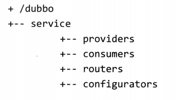
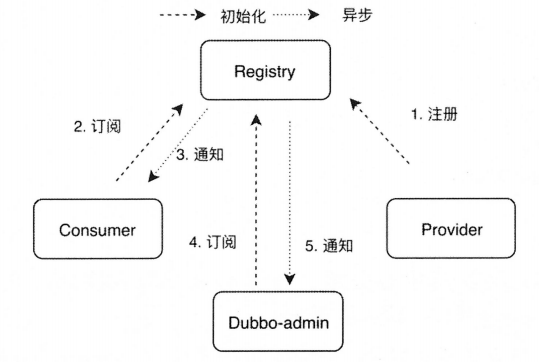
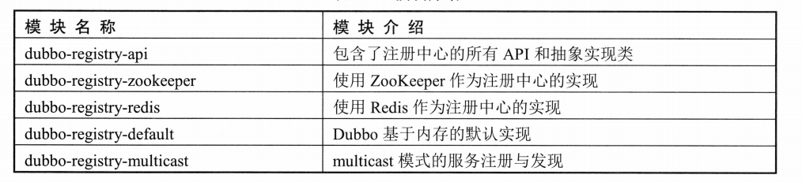

# Dubbo注册中心

## 概念卡
Q: 为什么Dubbo需要注册中心，它解决了微服务架构中的什么核心问题？

A:
- 动态加入：服务提供者通过注册中心动态暴露自己，新节点上线无需消费者手动修改配置文件，注册中心自动通知订阅方
- 动态发现：消费者动态感知新的服务提供者、路由规则和配置变更，无需重启服务即可生效——这解决了传统静态配置模式下变更需要重启的痛点
- 动态调整：支持参数的运行时动态下发，如修改超时时间、权重等，新参数通过override协议自动更新到所有相关节点
- 统一配置：避免各服务节点本地配置不一致的问题，将配置集中到注册中心管理
- 设计权衡：注册中心引入了一致性延迟——服务提供者下线后消费者可能需要一定时间才能感知（依赖注册中心的推送机制和客户端的缓存刷新策略），Dubbo通过多级缓存（内存缓存+磁盘持久化）缓解了注册中心不可用时的服务发现降级问题

## 机制卡
Q: Dubbo在ZooKeeper中的数据结构是怎样的，四层目录分别存储什么？

A:
- 第一层（Root）：根节点，路径为/dubbo（或用户配置的group值），是持久节点
- 第二层（Service）：接口全限定名，如/com.foo.BarService，持久节点
- 第三层（Type）：四种服务目录，均为持久节点
  - providers：存储服务提供者的元数据URL（IP、端口、权重、应用名等），使用临时节点，连接断开自动删除
  - consumers：存储消费者的元数据URL，临时节点
  - routers：存储路由规则，持久节点，由dubbo-admin写入
  - configurators：存储动态配置（override协议），持久节点，支持运行时修改服务参数
- 第四层（URL）：具体的Dubbo服务URL元数据，临时节点，包含该实例的完整配置信息
- 为什么用临时节点：服务提供者宕机或Session超时后，ZooKeeper自动删除对应临时节点，触发Watcher通知所有订阅方更新本地服务列表，实现了服务健康状态的全自动感知
- 与Redis注册中心对比：ZooKeeper通过树形结构和临时节点天然支持服务健康检测，Redis则需要通过key过期机制+publish/subscribe通道+服务治理中心定期清理过期key来保证最终一致性

## 机制卡
Q: Dubbo注册中心的订阅/发布机制是如何实现的，为什么采用"事件通知+客户端拉取"模式？

A:
- 发布：服务提供者/消费者启动时在注册中心创建对应目录节点（ZooKeeper中调用zkClient.create），写入元数据URL
- 订阅模式：Dubbo采用"第一次启动拉取全量 + 后续事件通知触发重新拉取"的混合模式，而非纯push或纯pull
- ZooKeeper实现细节：客户端首次连接时拉取对应目录下全量数据，并在订阅的节点上注册Watcher。后续节点数据变化时，注册中心通过Watcher回调主动通知客户端（事件通知），客户端收到通知后重新拉取该节点下的全量数据（客户端拉取）——NotifyListener#notify接口明确约束了全量数据
- 为什么不全量push：全量推送在微服务节点较多时会对注册中心造成巨大的网络压力，混合模式兼顾了实时性和网络开销
- 类别订阅：可以指定订阅providers/routers/consumers/configurators中的某一类，只拉取对应子节点数据
- Redis实现差异：Redis注册中心通过过期机制+publish/subscribe通道实现。服务提供者周期性续期key的过期时间（通过expireExecutor定时线程池调用deferExpired方法），宕机后key过期被删除。依赖服务治理中心dubbo-admin遍历超时key并发送unregister事件，保证数据的最终一致性

## 概念卡
Q: Dubbo注册中心的缓存机制是如何设计的，为什么需要磁盘持久化？

A:
- 设计动机：如果每次RPC调用都从注册中心获取服务列表，注册中心将成为性能瓶颈。缓存用空间换时间，让注册中心的压力与调用频率解耦
- 双层缓存架构（AbstractRegistry实现）：
  - 内存缓存：ConcurrentHashMap<URL, Map<String, List<URL>>> notified，外层key是消费者URL，内层key是类别（providers/consumers/routers/configurators），value是对应服务列表。没有提供者的服务使用空协议标识empty://
  - 磁盘缓存：Properties对象持久化到本地文件，key为URL#serviceKey()，value为服务列表（空格分隔），包含特殊的key.registries存储所有注册中心地址
- 加载时机：AbstractRegistry构造函数中从磁盘文件读取持久化的注册数据到Properties并加载到notified内存缓存。如果启动时注册中心不可用，框架自动使用本地缓存文件加载Invokers——这是注册中心完全宕机后的兜底方案
- 保存策略：同步保存（syncSaveFile）和异步保存（通过registryCacheExecutor线程池），异步保存使用原子类版本号保证数据是最新的

## 机制卡
Q: Dubbo注册中心的失败重试机制（FailbackRegistry）是如何设计的？

A:
- 设计动机：注册中心的连接可能出现瞬时故障，如果在注册/订阅失败时直接抛出异常，服务将无法正常启动或动态感知变化
- 核心结构：FailbackRegistry继承AbstractRegistry，增加了一个定时重试Timer（retryTimer）和四个失败集合
  - failedRegistered：注册失败的URL集合
  - failedUnregistered：注销失败的URL集合
  - failedSubscribed：订阅失败的URL集合
  - failedUnsubscribed：取消订阅失败的URL集合
- 重试逻辑：retryTimer定时调用retry方法，遍历四个失败集合中的所有URL，调用子类实现的模板方法（doRegister/doSubscribe等）进行重试。重试成功则从集合中移除，失败（捕获异常）则保留在集合中等待下次重试
- 模板方法模式的应用：AbstractRegistry定义了注册/订阅的接口和缓存逻辑，FailbackRegistry添加了重试机制作为通用能力，ZookeeperRegistry/RedisRegistry只需实现具体的doRegister/doSubscribe即可。这种分层设计让不同的注册中心实现共享重试逻辑，同时又不影响各自的注册/订阅细节
