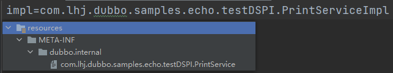
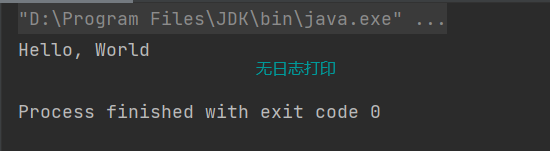
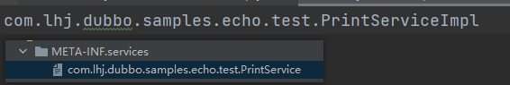

# Dubbo SPI扩展机制

## 概念卡
Q: 为什么Dubbo要设计自己的SPI机制，相比Java SPI有哪些改进？

A:
- Java SPI的缺陷：ServiceLoader会一次性实例化所有扩展点实现，初始化耗时且浪费资源（未使用的实现也被加载）；如果某个扩展加载失败，连扩展名称都获取不到，根本错误原因被掩盖
- Dubbo SPI的改进：
  - 按需加载：启动时只加载配置文件中类的Class并缓存，不立即初始化，真正使用时才通过getExtension按名称实例化——性能显著优于Java SPI
  - 失败隔离：扩展加载失败时抛出真实异常并打印日志，部分扩展失败不影响其他扩展和框架使用
  - IoC支持：扩展类可以通过setter方法自动注入其他扩展点实例（类似Spring的依赖注入），实现扩展点之间的解耦协作
  - AOP支持：自动包装（Wrapper）机制，如果扩展类构造函数包含同类型的参数，框架自动将其识别为包装类，在原始实现外包装一层增强逻辑——类似Spring AOP的装饰器模式
- 配置文件路径：按优先级扫描META-INF/services/、META-INF/dubbo/、META-INF/dubbo/internal/三个目录，配置文件名为接口全限定名，内容为key=实现类全限定名

## 概念卡
Q: Dubbo SPI的三个核心注解@SPI、@Adaptive、@Activate分别解决什么问题？

A:
- @SPI：标记接口为Dubbo扩展点，value属性指定默认实现名称。如@SPI("netty")表示默认使用netty实现。运行时通过ExtensionLoader#getDefaultExtension获取默认实现
- @Adaptive：解决"运行时根据URL参数动态选择实现类"的问题。可以标注在类上（直接指定自适应实现，如AdaptiveCompiler、AdaptiveExtensionFactory），也可以标注在方法上（自动生成$Adaptive动态代理类，从URL中按顺序匹配key值找到具体实现）。例如@Adaptive({"server", "transporter"})会先从URL取server的值，没有则取transporter的值，都没有则用@SPI的默认值
- @Activate：解决"多个扩展点实现需要同时激活"的问题（如Filter链需要多个过滤器同时生效）。通过group（PROVIDER/CONSUMER）、order、before、after等属性控制激活条件和执行顺序。例如@Activate(group=Constants.PROVIDER, order=-11000)表示仅在服务提供端生效且优先级为-11000
- 三者关系：@SPI定义扩展点，@Adaptive实现运行时的动态选择（多选一），@Activate实现运行时的批量激活（多选多）。getActivateExtension底层依赖getExtension获取具体实例

## 机制卡
Q: ExtensionLoader#getExtension的工作原理是什么，加载一个扩展类需要经过哪些步骤？

A:
- 入口：getExtension(String name)实现完整的普通扩展类加载过程，每一步先检查缓存再执行加载
- 第一步：getExtensionClasses检查类缓存，如果没有则loadExtensionClasses从三个配置目录读取SPI配置文件，通过loadClass根据注解判断扩展类类型（普通类/Wrapper类/Adaptive类）并分别缓存到对应Map中。注意此阶段只加载Class到JVM，不初始化
- 第二步：根据name从缓存中获取对应Class，通过反射（Class.forName）实例化
- 第三步：injectExtension实现IoC注入。通过反射获取所有set开头的方法，根据参数类型调用ExtensionFactory#getExtension获取对应的扩展点实例并注入——当ExtensionFactory找不到时会从Spring容器中查找
- 第四步：检查wrapperClasses集合，查找构造函数参数包含当前扩展类类型的Wrapper类，用装饰器模式逐层包装。例如Class A初始化后，框架找到构造参数需要Class A的Wrapper类，将A注入Wrapper并返回包装后的实例
- 第五步：返回扩展类实例。整个过程双重检查锁（不加锁检查缓存 + 加锁后再检查）保证并发安全
- 缓存体系：cachedClasses（Class缓存）、cachedInstances（实例缓存）、cachedAdaptiveClass（自适应类）、cachedWrapperClasses（Wrapper类）、cachedNames（扩展名缓存）

## 机制卡
Q: @Adaptive注解标注在方法上时，Dubbo是如何自动生成自适应类的？

A:
- 生成时机：调用getAdaptiveExtension时，如果cachedAdaptiveClass中没有类级别的@Adaptive实现（标注在类上则直接使用），则调用createAdaptiveExtension动态生成
- 代码生成流程：生成字符串代码 → 获取Compiler编译 → 实例化
  - 生成package、import（只引入ExtensionLoader，其他类使用全路径）和类名（接口名+$Adaptive）
  - 遍历接口所有方法，为有@Adaptive注解的方法生成默认实现，没有的方法生成空实现（throw UnsupportedOperationException）
  - 生成参数空值校验代码
  - 生成默认实现类名称：如果@Adaptive未指定key值，则根据类名自动生成（如YyyInvokerWrapper → yyy.invoker.wrapper），规则是不断找大写字母并用点连接
  - 生成获取扩展点名称代码：根据@Adaptive配置的key值生成url.getXxx()调用，如@Adaptive("protocol") → url.getProtocol()
  - 通过ExtensionLoader#getExtension获取真正的扩展实现类并调用
- 优先级：如果URL中@Adaptive指定的key没找到值 → 按驼峰规则二次匹配 → 使用@SPI的默认值 → 将类名转换为驼峰再查找
- 编译器选择：Compiler也是SPI扩展点，@SPI("javassist")默认Javassist。AdaptiveCompiler作为@Adaptive标注的实现类，管理所有编译器，通过ExtensionLoader获取真正的编译器做编译

## 概念卡
Q: Dubbo的ExtensionFactory是如何打通Dubbo容器和Spring容器的？

A:
- 三层工厂架构：AdaptiveExtensionFactory（门面） → SpiExtensionFactory / SpringExtensionFactory（具体实现）
- AdaptiveExtensionFactory：标注了@Adaptive，作为默认实现。构造方法中通过ExtensionLoader获取所有ExtensionFactory实现并缓存到TreeSet中（SPI排在前面，Spring排在后面）
- 调用链：getExtension时先遍历SPI容器查找（SpiExtensionFactory直接返回有@Adaptive注解的扩展类），找不到再从Spring容器查找
- SpringExtensionFactory：内部维护一个Set<ApplicationContext>静态集合。何时保存？——在ReferenceBean和ServiceBean的初始化过程中，调用静态方法将当前Spring上下文保存到集合中
- getExtension逻辑：遍历所有Spring上下文，先按名称匹配Bean，没匹配到则按类型匹配，都没有返回null
- 实际意义：Dubbo扩展类的属性注入（injectExtension）通过ExtensionFactory查找依赖，这意味着扩展类既可以从Dubbo容器获取依赖，也可以从Spring容器获取——两个容器的Bean实现了互通
