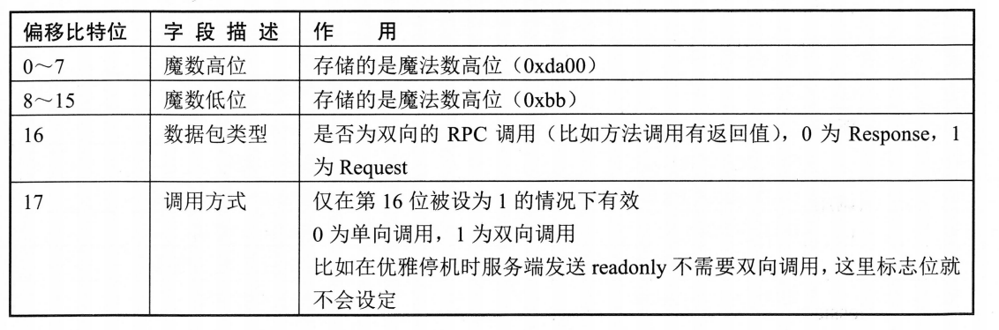
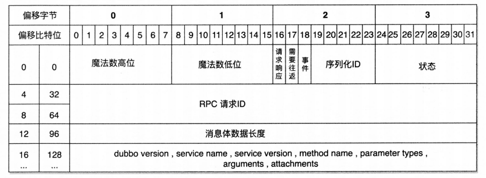
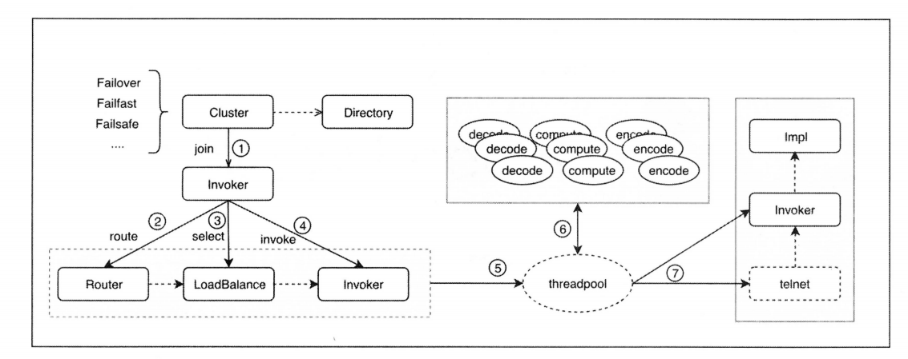

# Dubbo远程调用

## 概念卡
Q: Dubbo协议的数据包结构是怎样的，16字节头部各字段的设计意图是什么？

A:
- 设计借鉴了TCP/IP协议的分层思想，一次RPC调用包含协议头（16字节固定长度）和协议体（变长）
- 第0-1字节（16位）：魔法数0xdabb，用于标识Dubbo协议报文。核心作用：解决TCP粘包/拆包问题——解码时通过查找流中第一个0xdabb定位报文起始位置
- 第2字节：第16位标记请求/响应（FLAG_REQUEST），第17位标记是否双向通信（FLAG_TWOWAY），第18位标记是否为心跳事件（FLAG_EVENT），第19-23位（5位）存储序列化协议编号（如Hessian2=2）
- 第3字节：响应状态码（Response时有效）。20=OK，30=CLIENT_TIMEOUT，31=SERVER_TIMEOUT，40=BAD_REQUEST等，实现调用结果的标准化传递
- 第4-11字节（8字节）：全局唯一请求ID（long类型）。核心作用：匹配请求与响应——客户端将Request ID与DefaultFuture关联存入Futures这个静态ConcurrentHashMap，收到Response后根据ID查找并唤醒对应阻塞线程
- 第12-15字节（4字节）：消息体长度（int类型），最大支持8MB（DEFAULT_PAYLOAD）。用于判断是否已收到完整报文——如果可读字节数小于头部长度+消息体长度，则等待更多数据

## 机制卡
Q: DubboCodec的编码流程是怎样的，请求和响应的编码有什么不同？

A:
- 编码基类层次：AbstractCodec（基础校验）→ TransportCodec（序列化/反序列化抽象）→ TelnetCodec（Telnet支持）→ ExchangeCodec（请求/响应模型）→ DubboCodec（Dubbo协议具体实现）
- 请求编码（ExchangeCodec#encodeRequest → encodeRequestData）：
  - 获取序列化协议（默认Hessian2）
  - 构造16字节头部：写入魔法数、设置FLAG_REQUEST标志位和序列化协议序号、设置need-response标记、分配全局唯一请求ID
  - 跳过头部16字节，序列化消息体：Dubbo版本号 → 服务接口名 → 接口版本（默认0.0.0） → 方法名 → 参数类型描述符 → 方法参数值 → 隐式参数（attachment，如timeout、group等）
  - 检查消息体是否超过8MB
  - 回填消息体长度到头部第12字节，写入完整头部到buffer
- 响应编码（ExchangeCodec#encodeResponse → DubboCodec#encodeResponseData）：
  - 头部设置与请求类似，但设置FLAG_RESPONSE标志位和第3字节的状态码
  - 消息体先写入一个字节的返回值标记：1=正常返回→序列化结果，0=返回null，非1非0=异常→序列化异常对象
  - 服务端Dubbo版本号和隐式参数也会写入，用于支持隐式参数从服务端向客户端透传
  - 编码失败时的容错：复位buffer → 将异常信息转为字符串发送给客户端，防止客户端等到超时才感知错误

## 机制卡
Q: Dubbo协议解码器如何处理粘包和半包问题？

A:
- 粘包处理：通过查找流中的魔法数0xdabb定位报文分割点。decode方法中，如果流起始处不是0xdabb，则遍历流中所有字节查找第一个0xdabb位置，将读索引指向该位置，前面的数据丢弃或作为Telnet字符串处理
- 半包处理：首先尝试读取16字节头部，如果流中不足16字节则读取全部并返回NEED_MORE_INPUT，等待更多数据到达。读取头部后获取消息体长度，检查可读字节是否≥头部长度+消息体长度，不够则返回NEED_MORE_INPUT继续等待
- 批量解码优化（DubboCountCodec）：流中可能包含多个完整RPC请求，DubboCountCodec循环调用DubboCodec解码，每次成功解码一个完整报文就加入消息列表，触发下一个Handler处理。一次读取尽可能多的完整报文，减少I/O系统调用次数
- 解码消息体（DecodeableRpcInvocation）：严格按照客户端写数据顺序读取——Dubbo版本 → 接口名 → 版本号 → 方法名 → 参数类型描述符 → 参数值 → 隐式参数。解码时可以选择在I/O线程中直接解码或延迟到Dubbo业务线程池中解码（通过decode.in.io参数控制）

## 概念卡
Q: Dubbo的线程模型是如何设计的，Dispatcher和ThreadPool如何配合工作？

A:
- 双层线程池设计：I/O线程池（如Netty的EventLoopGroup）负责网络读写、编解码等轻量操作；业务线程池（Dubbo ThreadPool）负责真正的方法调用（可能涉及数据库查询等耗时操作）
- Dispatcher的职责：不是直接派发线程，而是创建具有线程派发能力的ChannelHandler。提供了6种派发策略：
  - all（默认）：所有事件（连接、读写）都派发到业务线程池，I/O线程只负责编解码 → 最安全，避免业务阻塞影响I/O
  - direct：所有事件都在I/O线程中执行 → 性能最好但风险最高，要求业务处理极快
  - message：只将读写事件派发到业务线程池，连接事件在I/O线程处理
  - execution：只将请求事件派发到业务线程池，响应事件在I/O线程处理
  - connection：只将连接事件派发到业务线程池，读写事件在I/O线程处理
  - connection-ordered：连接事件排队处理，保证连接顺序
- ThreadPool的四种实现：
  - fixed（默认）：固定大小线程池，启动时创建，永不关闭
  - cached：缓存线程池，空闲1分钟自动回收，需要时重建
  - limited：可伸缩但只增长不收缩，避免收缩时突发大流量导致性能抖动
  - eager：优先创建Worker而非放入队列。coreSize<任务数<maxSize时创建Worker，超过maxSize时才放入队列，队列满则抛异常（cached则是直接抛异常）
- Handler聚合优化：Netty的ChannelPipeline中最多只有3个Handler（编码、解码、NettyServerHandler/NettyClientHandler），Dubboy用装饰器模式将大量Handler聚合为一个，避免Pipeline链式查找的开销

## 概念卡
Q: Dubbo的心跳机制是如何实现的，为什么需要心跳？

A:
- 设计动机：TCP的长连接可能因为网络中断、防火墙超时等原因变为"死连接"，如果不检测，调用方会持续向无效连接发送请求，直到超时才感知。心跳机制可以提前发现并关闭死连接
- 实现方式：客户端和服务端各有一个HeartBeatTask定时扫描线程（默认60秒间隔），遍历所有Channel
- 服务端行为：检查每个Channel的最后读/写时间，如果空闲超过心跳时间（默认60秒），发送心跳事件报文。如果连续3分钟（可配置）没有收到任何报文，主动关闭该客户端连接
- 客户端行为：同样检查空闲时间并发送心跳。如果连续3分钟未收到报文，判定连接失效，主动断开并重新建立TCP连接
- 心跳报文特点：报文头部标记FLAG_EVENT，无消息体，不经过业务线程池处理——直接在HeaderExchangeHandler中更新读写时间戳即可
- 优雅停机联动：服务端下线时发送readonly事件报文，客户端收到后在Channel中标记该provider不可用，下次负载均衡自动跳过该节点，实现毫秒级的摘除速度（比注册中心通知更快）
