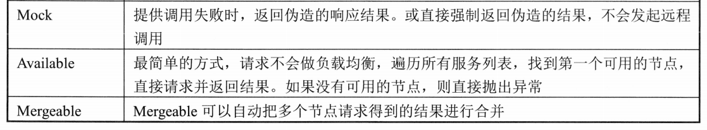
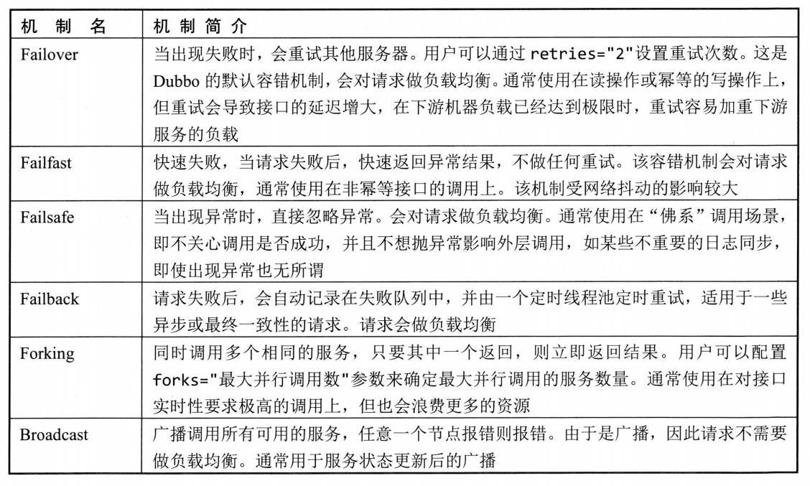
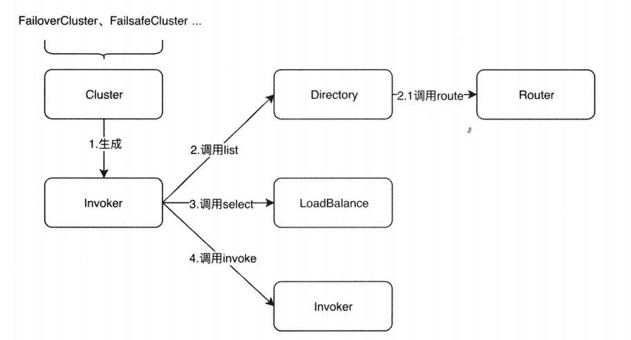

# Dubbo集群容错与负载均衡

## 概念卡
Q: Dubbo的Cluster层是如何设计的，为什么容错、路由、负载均衡要分层？

A:
- Cluster层是一个抽象概念，包含Cluster（容错策略）、Directory（服务列表）、Router（路由过滤）、LoadBalance（负载均衡）四大核心接口
- 分层原因：单一职责——每层只关注一个决策维度。Directory负责"有哪些服务可用"，Router负责"哪些符合规则"，LoadBalance负责"选哪一个"，Cluster负责"调用失败了怎么办"。分层设计让每个维度可以独立扩展（SPI），组合灵活
- 调用流程（AbstractClusterInvoker）：
  - Directory#list获取所有Invoker列表（动态从注册中心获取或静态配置）
  - Router#route根据路由规则过滤Invoker（如条件路由、脚本路由）
  - LoadBalance#select从剩余Invoker中选出一个
  - 发起RPC调用，根据Cluster策略处理成功/失败结果
- 所有容错逻辑在客户端完成，服务端无感——这是Dubbo的核心设计原则之一

## 概念卡
Q: Dubbo的7种容错策略各适用于什么场景，有什么权衡？

A:
- Failover（默认）：失败自动切换，通过retries配置重试次数。缺点：重试会增加延迟，不适用于幂等性要求严格的操作（如扣款）。优点：自动恢复，对短暂故障容忍度高
- Failfast：失败立即抛出异常。适用于非幂等写操作，如插入记录——重试可能导致重复数据
- Failsafe：失败直接忽略，返回空结果。适用于非关键功能（如日志记录），不阻断主流程
- Failback：失败后异步定时重试（默认每5秒），将失败请求存入ConcurrentHashMap，重试成功则移除。适用于对实时性要求不高但最终必须成功的操作（如消息通知）
- Forking：并行调用多个服务端，只要有一个成功就立即返回。缺点：浪费资源，仅在延迟极其敏感的场景使用。通过forks参数控制最大并行数，阻塞队列poll实现超时控制
- Broadcast：广播调用所有节点，任何一个失败则返回异常（只抛出最后一个异常，前面的被覆盖）。适用于通知类操作（如刷新所有节点缓存）
- Available：遍历Invoker列表找第一个可用的直接调用。适用于最简单场景，不做负载均衡

## 机制卡
Q: Dubbo的四种负载均衡算法分别如何工作，RoundRobin的平滑权重轮询解决了什么问题？

A:
- Random（默认）：按权重随机。计算总权重，生成[0, totalWeight)的随机偏移量，遍历Invoker在权重前缀和中找到对应位置。权重为1:2:3:4时，前缀和数组为[1,3,6,10]，随机值5落在index=2（权重3）的节点上。随着请求数增加近似达到权重比例
- RoundRobin：平滑权重轮询算法（借鉴Nginx的smooth weighted round-robin）。普通权重轮询的问题：按照权重顺序连续调用同一节点，导致瞬间流量暴增。平滑算法的核心：
  - 每个Invoker维护一个current值，每次遍历时current = current + weight
  - 选出current最大的节点，将其current减去总权重
  - 效果：节点不会被连续选中，交替穿插其他节点，流量更平滑
  - 例子：权重A=1, B=6, C=9，经过16次选择后分别被调用1、6、9次，完美符合比例
- LeastActive：最少活跃调用数。筛选活跃数最小的Invoker集合，再在其中按Random算法选择。需要配合ActiveLimitFilter使用——每次请求计数+1，调用完成计数-1。活跃数反映节点的实时负载，适合长短耗时不均匀的场景
- ConsistentHash：一致性Hash，相同参数的请求总是路由到同一台机器。使用Ketama算法为每个节点创建160个虚拟节点（replicaNumber），通过MD5哈希分布到TreeMap环上。请求参数也做MD5，顺时针找第一个≥该哈希值的虚拟节点。节点下线时只有该节点负责的请求重新分配，其他节点不受影响——解决了普通Hash节点变更导致全局重新映射的问题

## 机制卡
Q: Dubbo的RegistryDirectory是如何动态维护服务列表的？

A:
- RegistryDirectory实现了NotifyListener接口，是连接注册中心与Cluster层的关键组件
- 订阅-通知-刷新三大核心方法：
  - subscribe：在消费者启动时调用registry.subscribe，订阅providers/routers/configurators三种URL的变化
  - notify：注册中心推送变化时回调。遍历收到的所有URL，按类别分入三个List：Invoker URL列表、路由配置URL列表、配置URL列表
    - router类：通过RouterFactory将URL包装为路由规则，更新本地路由配置
    - configurator类：解析dynamic配置参数（override协议覆盖本地参数，absent协议仅新增不覆盖，empty协议清空）
    - Invoker类：合并新旧URL列表——新的URL创建新Invoker，老的且不在新列表中的Invoker销毁，空协议则禁用服务
  - refreshInvoker：将更新后的Invoker列表转换为methodInvokerMap（key=方法名，value=Invoker列表）
- doList实现：获取可调用Invoker列表，按优先级匹配：服务禁用检查 → 方法名+首参数匹配 → 纯方法名匹配 → "*"匹配 → 遍历第一个列表兜底

## 概念卡
Q: Dubbo的条件路由规则是如何解析和执行的？

A:
- 规则语法：以"=>"分隔，前部分是消费者匹配条件（whenRule），后部分是提供者过滤条件（thenRule）。例如"method=find* => host=192.168.1.22"表示：所有find开头的方法调用都被路由到IP为192.168.1.22的节点
- 空规则含义：匹配条件为空表示应用于所有消费者，过滤条件为空表示禁止访问（如"host=192.168.1.22 =>"表示禁止该IP的消费者调用）
- ConditionRouter构造方法中的解析：通过正则循环匹配，支持四种分隔符形式（A=B、A&B、A!=B、A,B），将每对key-value封装为MatchPair对象存入Map
- MatchPair机制：内部两个Set——匹配规则集和不匹配规则集。isMatch方法处理通配符（*尾匹配）和占位符（$protocol/$host/$port等从URL动态获取）。如"host=192.168.1.*"匹配该网段所有IP
- route方法执行：遍历Invoker列表，对每个Invoker的URL执行thenRule的MatchPair匹配，匹配成功的保留。如果配置了force=true（强制过滤），则不满足条件的全部丢弃；否则非强制模式下，过滤后为空的返回原始全部列表
- 三种路由方式：条件路由（自定义语法规则）、文件路由（读取文件中的规则，转换为脚本路由执行）、脚本路由（使用JDK ScriptEngine执行JavaScript等脚本，如function route(invokers){...}）
