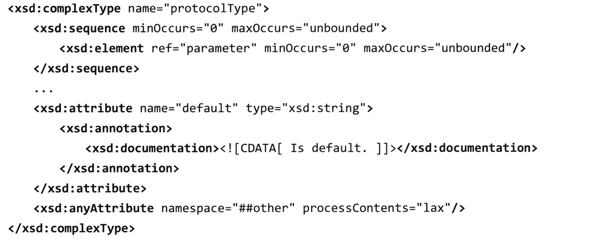
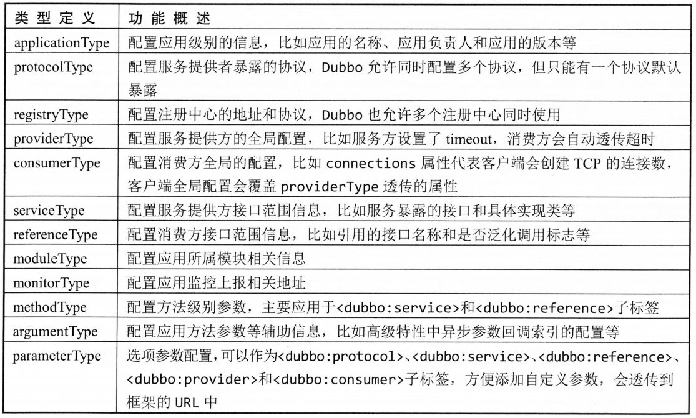
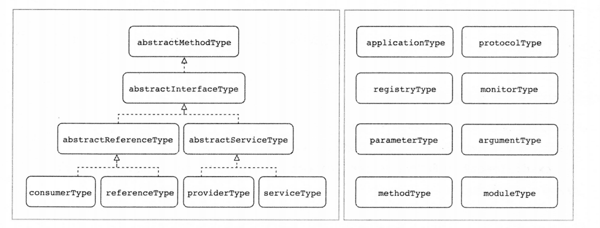

# Dubbo服务暴露与引用

## 概念卡
Q: 为什么Dubbo的服务暴露流程要分为"本地暴露"和"远程暴露"两部分？

A:
- 远程暴露：将服务通过具体协议（如Dubbo协议）暴露到注册中心，打开Netty端口监听，供其他JVM的消费者跨网络调用
- 本地暴露：通过InjvmProtocol同时将服务暴露到JVM内存中（存入exporterMap），不打开端口，不经过网络协议栈
- 设计动机：在同一个JVM内部，如果消费者和提供者恰好部署在同一进程，直接走内存调用比走网络调用效率高几个数量级（避免了序列化、网络传输、反序列化的开销）。这是Dubbo的服务自省（self-inspection）机制
- 消费端的配合：消费者启动时首先检查是否有injvm协议的本地服务可用——如果有，直接使用本地Invoker，跳过注册中心订阅和网络连接建立
- 权衡：本地调用虽然性能极高，但绕过了网络层的Filter链和监控统计，可能导致MonitorFilter无法收集该调用的数据

## 机制卡
Q: Dubbo服务暴露的完整源码级流程是怎样的？

A:
- 入口：ServiceConfig#doExport → doExportUrls → doExportUrlsFor1Protocol
- 配置聚合：遵循三级优先级——JVM -D参数 > XML/代码配置 > dubbo.properties配置文件。Provider端的配置（如timeout）会自动透传到Consumer端，但Consumer端如果也配置了相同属性则覆盖Provider端
- 多协议多注册中心支持：doExportUrls中遍历所有注册中心URL和协议配置，组合排列出所有"注册中心×协议"的暴露组合
- doExportUrlsFor1Protocol核心步骤：
  - 读取全局配置信息（应用名等）到Map，用于构造URL，配置属性自动添加default.前缀以便兜底使用
  - 如果当前JVM已有同接口的本地暴露，直接复用
  - 通过ProxyFactory#getInvoker将服务实现ref包装为AbstractProxyInvoker——JavassistProxyFactory创建Wrapper子类（实现invokeMethod，匹配方法名和参数后直接调用），省去反射开销；JdkProxyFactory则通过反射调用
  - 调用Protocol#export，经过ProtocolFilterWrapper构建过滤器链（加载所有PROVIDER group的Filter，按@Activate的order排序），Filter链末尾是真实Invoker
  - 再经RegistryProtocol：
    - 委托具体协议（DubboProtocol）创建NettyServer监听端口 → 将端口+接口名+分组+版本作为key，Exporter作为value存入HashMap
    - 创建注册中心客户端连接 → 将服务元数据URL注册到/dubbo/接口名/providers
    - 订阅configurators节点监听动态配置变更
  - 同时调用InjvmProtocol#export做本地暴露

## 机制卡
Q: Dubbo消费者引用服务的完整流程是怎样的？

A:
- 入口：ReferenceConfig#createProxy（ReferenceBean#getObject触发），与暴露流程对称地遵循三级配置优先级
- 本地检查：首先检查是否存在injvm协议的本地服务，有则直接使用
- 单注册中心场景（最常见）：
  - 创建注册中心实例并连接
  - RegistryProtocol#refer → 创建RegistryDirectory实例并注册消费者元数据到注册中心 → 订阅providers/routers/configurators三个目录
  - 首次订阅触发全量数据拉取：RegistryDirectory#toInvokers将URL列表转换为Invoker
    - 根据消费端protocol配置过滤不匹配协议的服务
    - 合并Provider端配置数据（如IP、端口）
    - 使用具体协议Protocol#refer创建远程连接：DubboProtocol#refer → initClient创建Netty客户端连接（除非配置lazy则延迟到首次调用时创建）
    - 构建Filter链（CONSUMER group的Filter），返回DubboInvoker
  - Cluster#join将多个Invoker合并为一个ClusterInvoker（默认FailoverCluster）
  - ProxyFactory#getProxy将ClusterInvoker转换为业务接口的动态代理对象
- 多注册中心场景：每个注册中心对应一个Invoker，通过StaticDirectory保存所有Invoker，最终通过AvailableCluster合并（判断哪个注册中心有可用服务就调用哪个）
- 直连模式：绕过注册中心，直接在<dubbo:reference url="dubbo://ip:port"/>中指定目标地址，适用于压测或调试场景

## 概念卡
Q: Dubbo的优雅停机是如何设计的，为什么需要readonly事件报文？

A:
- 设计动机：核心业务在服务端正在执行时突然中断（kill -9）会导致数据不一致或业务异常。优雅停机确保正在执行的请求完成后再关闭服务
- 五步停机流程：
  - 收到kill信号，Spring容器触发销毁事件（AbstractApplicationContext#doClose）
  - Provider端从注册中心取消注册（删除ZooKeeper中的临时节点）
  - Consumer端收到注册中心推送的变更通知，更新本地服务列表（排除停机的Provider）
  - Dubbo协议主动发送readonly事件报文给所有已连接的Consumer——这一步是优化的关键：注册中心通知存在网络延迟，readonly报文直接告诉Consumer"我马上不可用了"，Consumer收到后立即将对应Channel标记为不可用，下次负载均衡自动跳过。这个动作在毫秒级别完成，远快于注册中心推送
  - 服务端等待已接收的请求执行完毕，同时拒绝新请求（返回异常告知Consumer切换节点）
- 为什么需要readonly报文：注册中心的通知链路过长（Provider→注册中心→所有Consumer），在大型集群中可能需要数秒。readonly报文利用已有的TCP长连接直接通知，降低停机期间的服务不可用窗口

## 概念卡
Q: Dubbo的配置覆盖策略是怎样的，Provider端和Consumer端的配置如何协调？

A:
- 三级配置优先级：JVM -D参数（最高） > XML/代码配置（中等） > dubbo.properties配置文件（最低）
- Provider → Consumer配置透传（运行期属性值影响）：
  - 如果只有Provider端配置了某属性（如timeout=3000），框架自动将该值透传给Consumer端使用
  - 如果Consumer端也配置了相同属性，Consumer端的值覆盖Provider端——"消费者说了算"
  - 这符合"谁调用谁负责"的原则，消费者最清楚自己能容忍的超时时间
- 聚合逻辑（ServiceConfig#doExport中）：遍历服务的所有方法，优先取方法级配置 → 接口级配置 → Provider/Consumer默认配置 → JVM -D参数 → dubbo.properties
- 配置的继承关系（Schema设计）：AbstractInterfaceConfig（通用） → AbstractServiceConfig/AbstractReferenceConfig（Provider/Consumer各自特有） → ServiceConfig/ReferenceConfig（具体实例）。XML变更时只需要在对应xsd类型中添加属性，对应的Config类中添加getter/setter即可
