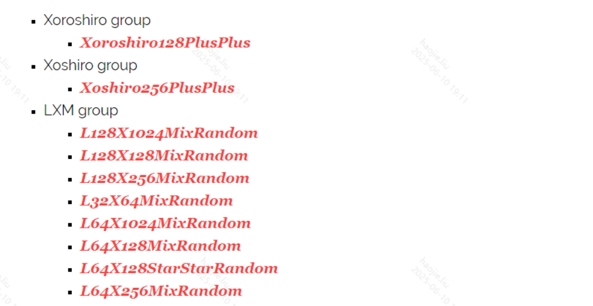
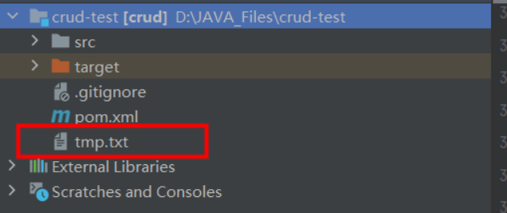

# JDK 11-17 重要变化



## 概念卡
Q: JDK11 作为继 JDK8 后的第二个 LTS 版本，新增了哪些在日常开发中可直接替代三方库的 API？

A:
- String API 增强（替代 Apache Commons Lang 的部分功能）：
  - `isBlank()`: 判空（包括空白字符），比 `isEmpty()` 更实用
  - `strip()` / `stripLeading()` / `stripTrailing()`: 去除首尾空格，支持 Unicode 空白字符，比 `trim()` 范围更广
  - `lines()`: 按换行符分割为 Stream，替代 `String.split("\n")`
  - `repeat(int n)`: 重复字符串 n 次
- 文件读写简化（替代 Guava Files 的部分功能）：
  - `Files.readString(Path)` / `Files.writeString(Path, String)`: 一行代码读写文件，解决读取配置文件的常见需求
- HTTP Client 标准化（替代 OkHttp/Apache HttpClient 的简单场景）：
  - `java.net.http.HttpClient`: 原生支持 HTTP/2、WebSocket、同步/异步调用
  - 从 JDK9 的孵化模块 `jdk.incubator.httpclient` 迁移到正式的 `java.net.http` 包

## 概念卡
Q: JDK14 引入的 Record 与 Lombok 的 @Data 相比有何本质差异？什么场景下 Record 不能替代 Lombok？

A:
- Record 是**语言级不可变数据载体**：
  - 自动生成：全参构造器、equals、hashCode、toString、每个字段的访问器（方法名同字段名，无 get 前缀）
  - 所有字段隐式 final，不可修改，无 setter
  - 隐式 final 类，不能被继承
  - 不自动生成无参构造器
- 与 @Data 的核心差异：
  - @Data 生成 getter/setter/toString/equals/hashCode，类可变
  - Record 不生成 setter，不可变
  - Lombok 是编译时注解处理器，Record 是语言原生特性
  - Record 适合 DTO/VO/配置项等不需要修改的纯数据对象
- 不能替代 Lombok 的场景：
  - 需要可变对象（如 JPA Entity）
  - 需要继承关系（Record 是 final 的）
  - 需要 @Builder（Record 可与 @Builder 配合，但在 lombok 1.18.16 之后）
  - 需要 @Slf4j、@SneakyThrows 等非数据相关的 Lombok 注解

## 概念卡
Q: JDK15 的 Sealed Classes（密封类）解决了什么设计问题？与 final 有何不同？

A:
- 解决的问题：类作者需要**精确控制子类范围**
  - final：一刀切，完全禁止继承，不够灵活
  - 不加修饰：任何人都能继承，扩展失控
- Sealed Classes 的设计：
  - `sealed class A permits B, C`：明确声明只允许 B 和 C 继承 A
  - 子类必须声明为 `final`（不能再被继承）、`sealed`（继续限制）或 `non-sealed`（恢复开放继承）
  - `non-sealed` 的子类可以被任意类继续继承
- 核心价值：为**模式匹配**服务
  - 编译器知道所有可能的子类，switch 时能检查覆盖度，减少 default 分支
  - 配合 Record：`record CLevel(String type) implements Employee {}`
- 典型场景：API 设计时限定返回类型仅有成功/失败两种子类

## 机制卡
Q: JDK16 正式推出的 Pattern Matching for instanceof 和 JDK17 的 Switch 类型匹配，如何减少样板代码？

A:
- instanceof 模式匹配（JDK16 正式）：
  - 旧写法：`if (obj instanceof String) { String s = (String) obj; ... }`
  - 新写法：`if (obj instanceof String s) { ... }`，一步完成类型判断+强转+变量绑定
  - 变量的作用域是条件成立的代码块，包括 && 的后续条件
- Switch 类型匹配（JDK17 正式，JDK12 预览）：
  - 旧写法需要 if-else-if 链，每个分支 instanceof + 强转
  - 新写法：
    ```java
    return switch (o) {
        case Integer i -> String.format("int %d", i);
        case Long l    -> String.format("long %d", l);
        case String s  -> String.format("String %s", s);
        case null      -> "oops!";
        default        -> o.toString();
    };
    ```
  - switch 对 null 的显式支持（之前 null 会直接 NPE）
  - yield 关键字用于需要多行逻辑的 case 分支返回值
- 本质：将类型判断从传统的"判断-强转-使用"三步压缩为一步

## 概念卡
Q: 为什么 Spring Boot 3.x 和 Spring 6.x 要求最低 JDK17？JDK17 作为 LTS 版本集成了哪些孵化多年的关键特性？

A:
- JDK17 是一个"收获"版本，以下特性在本版本正式退出预览/孵化：
  - **密封类（Sealed Classes）**：JDK15 预览 -> JDK17 正式
  - **Switch 类型匹配**：JDK12 预览 -> JDK14 二次预览 -> JDK17 正式
  - **Record**：JDK14 预览 -> JDK16 正式
  - **文本块（Text Blocks）**：JDK13 预览 -> JDK15 正式
  - **ZGC**：JDK11 引入 -> JDK15 正式可用
- Spring 选择 JDK17 的原因：
  - JDK17 是 LTS 版本，企业级稳定性保障
  - 可以安全使用以上所有特性编写框架代码
  - 利用 JDK9+ 的模块化能力精简 Spring 框架
  - 向用户传递信号：请升级 JDK，不要停留在 JDK8
- 其他 JDK17 增强：增强的伪随机数生成器（PRNG）、NPE 精准提示（JDK14 引入，17 默认开启）
