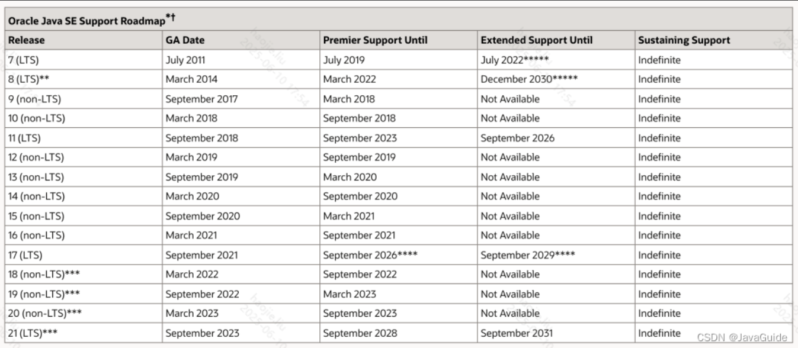

# JDK 8 关键特性

## 概念卡
Q: 为什么 Java 在 JDK8 引入 Lambda 表达式和函数式接口？它们解决了什么本质问题？

A:
- 本质问题：将**行为**作为一等公民传递，消除策略模式的样板代码
- 在 JDK7 之前，传递一段行为需要：
  - 创建匿名内部类，至少 5 行样板代码
  - 内部类会生成单独的 .class 文件，增加类加载开销
  - 内部类中的局部变量必须是 final（生命周期不一致问题）
- Lambda 的核心优势：
  - 编译后使用 invokedynamic 指令，运行时生成方法句柄，不产生 .class 文件
  - lambda 中的变量隐式 final（effectively final），编译器自动检查
  - 语法极简：`(a, b) -> b.compareTo(a)` 替代 5 行匿名类代码
- 函数式接口（`@FunctionalInterface`）为其提供类型锚点：只有一个抽象方法的接口，Lambda 表达式自动匹配
  - 四大内置接口：Predicate（断言）、Function（转换）、Supplier（生产）、Consumer（消费）
- 这是 Java 向函数式编程迈出的关键一步，使 Stream API 成为可能

## 机制卡
Q: Stream API 的中间操作与最终操作如何协作？为什么中间操作是惰性的？

A:
- Stream 操作流水线 = 数据源 + N 个中间操作 + 1 个最终操作
- 中间操作（filter/map/sorted/peek等）：
  - 返回一个新的 Stream，只记录操作步骤（函数引用），不实际执行
  - 惰性求值（lazy evaluation）：数据不会在中途被消费
- 最终操作（forEach/collect/reduce/count等）：
  - 触发整个流水线的执行
  - 每个元素依次经过所有中间操作后到达最终操作（而非先完成全部 filter 再做全部 map）
- 这种设计的优势：
  - **短路优化**：如 `findFirst()` 找到第一个元素立即终止，不需要处理整个数据集
  - **避免中间数据结构**：不需要为每个中间步骤创建临时列表
  - **融合优化**：多个操作可以在一次遍历中完成
- 注意：Stream 只能消费一次，消费后即关闭，重复消费抛 IllegalStateException

## 概念卡
Q: Optional 真能消灭 NullPointerException 吗？它的设计边界在哪里？

A:
- Optional 的设计意图：强迫调用方在 API 层面面对"值可能不存在"的情况，而非遗忘 null 检查
- 正确用法：
  - 链式处理：`Optional.ofNullable(user).map(User::getName).orElse("Unknown")`
  - 延迟抛异常：`.orElseThrow(() -> new BizException("..."))`
  - 条件执行：`.ifPresent(System.out::println)`
- 设计边界（Brian Goetz 的设计建议）：
  - **不要用 Optional 做字段类型**：它不应该被序列化，不是 JavaBean 属性
  - **不要用 Optional 做方法参数**：调用方仍可传 null，Optional 不解决这个问题
  - **不要用 `optional.get()` 不加判断直接取值**：这是用 Optional 但绕过了它的保护
  - Optional 适用于方法返回值，让调用方"被迫"处理空值情况
- 本质：Optional 不是 null 的完全替代品，而是一种**契约级别的文档和编译级别的提醒**

## 概念卡
Q: 为什么 JDK8 要在接口中引入 default 方法？它打破了 Java 的什么设计约束？

A:
- 直接原因：向后兼容——在不破坏已有实现的前提下为 Collection 接口增加 stream() 方法
- Java 接口之前的核心约束：接口只能声明行为，不能有实现
- default 方法的引入打破了这一约束，使接口具有了"混入"能力：
  - 接口可以为新方法提供默认实现，旧实现类无需修改即可编译运行
  - 实现类可以选择性地覆盖 default 方法
- 与抽象类的区别：类只能单继承但可实现多个接口，default 使接口获得了有限的多继承能力
- 冲突解决规则：
  - 类中的方法实现优先于接口的 default 方法
  - 多个接口有同名 default 方法时，实现类必须手动重写来解决冲突
  - Lambda 表达式不能访问接口的 default 方法

## 概念卡
Q: CompletableFuture 比原始的 Future 多了什么能力？它解决了什么实际问题？

A:
- Future 的三大痛点：
  1. 无法手动完成：Future 的结果只能由异步任务计算完毕产生
  2. 阻塞获取：`get()` 会阻塞当前线程直到结果返回
  3. 无法组合：多个 Future 之间无法编排，形成回调地狱
- CompletableFuture 实现了 CompletionStage 接口，提供函数式编排能力：
  - 一元依赖：`thenApply`——依赖前一个任务结果继续执行
  - 二元依赖：`thenCombine`——等待两个任务完成，合并结果
  - 多元依赖：`allOf`——等待所有指定任务完成后统一处理
- 实际应用场景：下单流程中，需要并行查询库存、优惠券、用户等级，然后汇总计算
  - 用 Future 需要手动 join 并嵌套回调
  - 用 CompletableFuture 可以声明式编排，代码清晰可读
- 注意：不指定线程池时默认使用 ForkJoinPool.commonPool()，对于 IO 密集任务应自定义线程池
