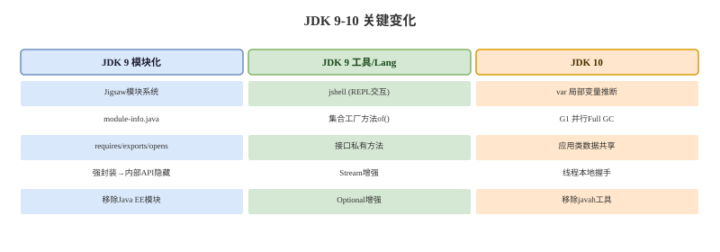

# JDK 9-10 模块化与工具


## 概念卡
Q: 为什么 JDK9 要引入 JPMS（Java 平台模块系统）？它解决的核心痛点是 CLASSPATH 的什么问题？

A:
- JPMS 引入的根本原因：解决 **CLASSPATH 的缺陷**
  - **JAR Hell**：CLASSPATH 是所有 JAR 平铺在一起，同名的类会被最先找到的那个覆盖，版本冲突无从解决
  - **无封装边界**：CLASSPATH 下所有 public 类对所有代码可见，无法区分"内部 API"和"公开 API"
  - **运行时依赖不透明**：启动时才知道缺少某个 JAR，编译期无法检测依赖完整性
  - **JRE 臃肿**：即使应用只用 JDK 10% 的类库，也需要加载整个 rt.jar（60MB+）
- JPMS 的层级结构：module（模块） > package（包） > class（类）
  - 通过 `module-info.java` 显式声明 `requires`（依赖）和 `exports`（导出）
  - 编译期就能发现模块依赖缺失
  - 可以创建精简的自定义 JRE，只包含真正需要的模块
- 行业影响：实际业务代码较少使用，大多数项目仍基于 Maven/Gradle 的 CLASSPATH 模式；但 JDK 自身的模块化使 jlink 自定义镜像成为可能，对云原生/容器化部署有价值

## 概念卡
Q: 为什么 JDK9 将 String 底层存储从 char[] 改为 byte[]？这是一种什么优化？

A:
- 动机：节省内存。char 类型占 2 字节，但大多数 Java 应用中的字符串内容为 LATIN1 字符（西欧字符），只需 1 字节
- Compact Strings（紧凑字符串）机制：
  - 底层改为 `byte[] value`，增加 `byte coder` 标记编码方式
  - LATIN1 编码：每个字符 1 字节，coder = 0
  - UTF16 编码：每个字符 2 字节（与原来相同），coder = 1
- 效果：
  - 纯英文/数字字符串内存占用减少约 50%
  - 中文字符串内存占用与之前持平（仍为 UTF16）
  - 大多数业务应用字符串中英文占多数，实际收益显著
- 同步受益：StringBuffer、StringBuilder 也跟随改为 byte[] 底层存储

## 概念卡
Q: JDK9 引入的 List.of() / Set.of() / Map.of() 创建的集合与之前有何不同？为什么它们是不可变的？

A:
- 这些方法返回的是**真正的不可变集合**，与 `Collections.unmodifiableList()` 有本质区别：
  - `List.of()` 返回的是不可变集合本身，任何修改操作直接抛 UnsupportedOperationException
  - `Collections.unmodifiableList()` 返回的是可变集合的只读视图，如果原集合被修改，"只读视图"也随之变化
  - `List.of()` 不允许 null 元素，`Collections.unmodifiableList()` 取决于原集合
- 设计优势：
  - 内存更紧凑：不需要维护 modCount 等并发检测字段
  - 不可变性是真实的，可安全地在多线程间共享
  - Map.of() 支持最多 10 组键值对，超过需要用 Map.ofEntries()
- 实际使用：适合常量配置、缓存 key 等确定不变的场景

## 机制卡
Q: JDK9 Stream 新增的 takeWhile 与 filter 的行为有何本质区别？

A:
- filter：遍历全部元素，筛选出所有满足条件的元素
- takeWhile：从流的头部开始取元素，**遇到第一个不满足条件的元素就立即停止**
  ```java
  Stream.of(1,2,3,4,5,4,3,2,1)
      .filter(i -> i < 4).forEach(...)     // 输出: 1 2 3 3 2 1
  Stream.of(1,2,3,4,5,4,3,2,1)
      .takeWhile(i -> i < 4).forEach(...)   // 输出: 1 2 3
  ```
- 这对有序流才有意义：for 循环中的 break 行为，filter 做不到
- 对应的 `dropWhile`：跳过满足条件的头部元素，取第一个不满足以后的剩余全部
- 实际应用场景：处理有序日志时，找到第一条错误日志之前的所有日志（takeWhile）或忽略正常日志取错误及之后（dropWhile）

## 概念卡
Q: JDK10 引入的 var 关键字能用于哪些场景？不能用于哪些场景？为什么有这些限制？

A:
- `var` 是**局部变量类型推断**，编译器根据初始化表达式自动推断类型
- 可以使用：
  - 带构造器的局部变量声明：`var list = new ArrayList<String>();`
  - for 循环变量：`for (var i = 0; i < 10; i++)`
- 不能使用：
  - 方法参数、方法返回类型、类字段：类型关联到方法签名和序列化，必须显式声明
  - 不初始化或初始化为 null：编译器无法推断类型
  - Lambda 表达式：Lambda 的类型由目标函数式接口决定，不能自推断
  - 数组初始化器 `{1,2,3}`：Java 数组初始化语法需要显式类型
- 设计原则：`var` 是编译时语法糖，不会降低运行时性能，保留 Java 的静态类型安全
  - JDK11 进一步增强了 var：`(var i) -> System.out.println(i)` 允许在 Lambda 参数上使用，但没什么实际优势
