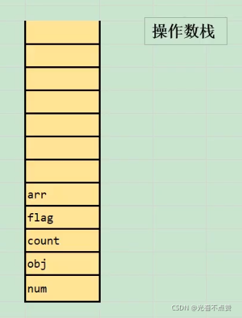
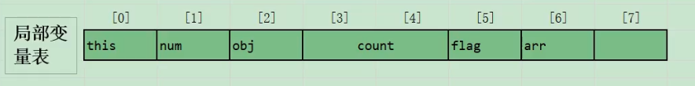
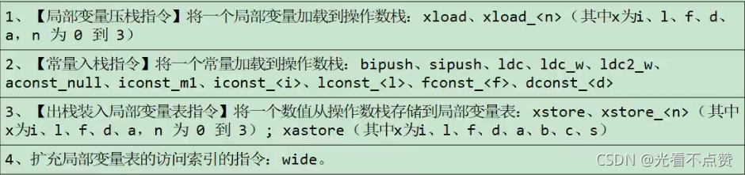

# 字节码指令集

## 概念卡
Q: 为什么JVM指令集操作码总数不超过256条？数据类型相关的指令如何复用同一个操作码？
A:
- 操作码长度限制：JVM指令操作码长度固定为1个字节（8位），2^8=256，因此指令集的理论上限就是256条。这是JVM规范在设计上的刻意限制——保持指令集精简、字节码文件紧凑
- 数据类型相关的指令复用策略：
  1. 通过助记符前缀区分类型：i(int)load, l(long)load, f(float)load, d(double)load, a(reference)load 等。相同操作对应不同数据类型的指令是不同的操作码
  2. 类型不敏感的通用指令：某些指令与数据类型无关，如arraylength（操作数必然是数组）、goto（无条件跳转）、dup/pop（操作数栈管理仅操作Slot单位不关心类型）等，这些指令只有一条操作码
  3. byte/char/short/boolean的"二等公民"待遇：这四个类型在JVM指令集中没有独立完整的指令集。原因有二：
     - 它们在局部变量表中都占32位（同int），在操作数栈中运算时自动转型为int
     - 如果为这四种类型各添加一套独立指令，256条操作码空间远远不够（每种都对应加载、存储、运算等几十条指令）
  - 特殊情况：boolean在字节码层面表现为int（0=false, 非0=true），有专门的baload/bastore指令处理boolean数组，T_BOOLEAN类型标志用于newarray
- 设计权衡：256条操作码是"紧凑"和"表达能力"之间的平衡。通过数据类型前缀复用操作语义，在有限的操作码空间内覆盖了JVM所需的所有操作

## 概念卡
Q: JVM字节码的9大指令类别分别是什么？各负责什么层面的操作？
A:
- 1. 加载与存储指令（最频繁）：
  - 负责数据在局部变量表和操作数栈之间的来回传递
  - 包括：load系列（局部变量表->操作数栈）、store系列（操作数栈->局部变量表）、const/push/ldc系列（常量->操作数栈）
  - 设计优化：iload_0/iload_1/iload_2/iload_3等带下标的指令将操作数隐含在操作码中（节省1字节），超过3时使用iload + 操作数
- 2. 算术指令：对操作数栈顶两个值进行运算，结果压回栈顶。包括加法(iadd/ladd/fadd/dadd)、减法(isub等)、乘法(imul等)、除法(idiv等)、求余(irem等)、取反(ineg等)、位移、按位或/与/异或
- 3. 类型转换指令：宽化(i2l/i2f/i2d/l2f/l2d/f2d)和窄化(i2b/i2s/i2c/l2i/f2i/d2i等)。窄化转换可能丢失精度但JVM规范保证不抛出运行时异常
- 4. 对象创建与访问指令：new/newarray/anewarray（创建对象/数组）、getfield/putfield/getstatic/putstatic（字段访问）、baload/iastore等（数组读写）、checkcast/instanceof（类型检查）
- 5. 方法调用与返回指令：invokevirtual/invokespecial/invokestatic/invokeinterface/invokedynamic（方法调用），ireturn/lreturn/freturn/dreturn/areturn/return（方法返回）
- 6. 操作数栈管理指令：pop/pop2（弹出废弃）、dup/dup2/dup_x1等（复制栈顶并插入指定位置）、swap（交换栈顶两个Slot）
- 7. 控制转移指令：ifeq/ifne等（条件跳转）、if_icmpeq等（比较条件跳转）、tableswitch/lookupswitch（多条件分支）、goto/goto_w（无条件跳转）
- 8. 异常处理指令：athrow（异常抛出）；异常处理（catch）不是由字节码指令实现的，而是通过异常表（Exception Table）来完成
- 9. 同步控制指令：monitorenter/monitorexit（方法内代码块同步）；方法级同步通过ACC_SYNCHRONIZED标志实现（隐式，不生成额外指令）

## 概念卡
Q: 五条方法调用指令（invokevirtual、invokespecial、invokestatic、invokeinterface、invokedynamic）各用于什么场景？它们的绑定机制有何不同？
A:
- 1. invokestatic：调用静态方法（static方法）。解析阶段确定唯一方法版本，静态绑定（早期绑定），不可被重写
- 2. invokespecial：调用实例构造器`<init>`、私有方法（private）、父类方法（super.xxx）。解析阶段确定唯一方法版本，静态绑定，不可被重写。注意如果private和static同时出现，优先static使用invokestatic
- 3. invokevirtual：调用所有可被重写的虚方法（非private、非static、非final、非构造器的实例方法）。运行时根据对象实际类型进行动态分派——在虚方法表中查找目标方法，支持多态
- 4. invokeinterface：调用接口方法。运行时在实现类的方法表中搜索匹配的接口方法。与invokevirtual逻辑类似，但查找策略不同（接口方法在itable中查找）
- 5. invokedynamic（JDK7引入）：动态解析调用点，分派逻辑不固化在JVM内部，而是由用户设定的引导方法（Bootstrap Method）决定。主要应用：
  - Lambda表达式：编译时不生成匿名内部类，而是生成invokedynamic指令+引导方法，运行时动态生成Lambda实现类。这大幅减少了编译产生的匿名类数量
  - 字符串拼接优化（JDK9）：字符串拼接不再硬编码为StringBuilder，改用invokedynamic + StringConcatFactory，允许JDK未来更换拼接策略而无需重新编译用户代码
- 绑定机制的区别：invokestatic和invokespecial对应静态链接/早期绑定/非虚方法；invokevirtual和invokeinterface对应动态链接/晚期绑定/虚方法（支持多态）；invokedynamic是最灵活的动态绑定——每次调用都可能解析出不同的目标方法
- 前四条指令的分派逻辑固化在JVM内部（硬编码在C++代码中），invokedynamic把分派逻辑的控制权交给应用程序（通过java.lang.invoke包）

## 机制卡
Q: 字节码层面的i++和++i有什么区别？为什么 `i = i++` 的结果是原值？
A:
- i++（后置自增）的字节码执行过程（以i=10为例，结果赋给a）：
  1. iload_1：将局部变量表索引1的值（10）压入操作数栈
  2. iinc 1, 1：将局部变量表索引1的值加1（变为11），操作数栈不变（仍为10）
  3. istore_2：将操作数栈顶的值（10）弹出，存入局部变量表索引2（a=10）
- ++i（前置自增）的字节码执行过程（以j=20为例，结果赋给b）：
  1. iinc 3, 1：将局部变量表索引3的值先加1（20->21）
  2. iload_3：将索引3的值（21）压入操作数栈
  3. istore 4：将操作数栈顶的值（21）弹出，存入索引4（b=21）
- 关键区别：iinc指令修改的是局部变量表，不影响操作数栈。后置自增先把原值压栈再修改变量表，实际赋值的是压栈时的原值；前置自增先修改局部变量表再从变量表读取新值压栈
- `i = i++` 输出原值的完整过程：
  1. iload_1：将i的值（10）压入操作数栈
  2. iinc 1, 1：局部变量表中i变为11
  3. istore_1：将操作数栈顶的值（10）弹出写回局部变量表索引1，i被覆盖为10
  - 所以最终i=10，虽然中途变成了11但被istore操作写回了10。这解释了为什么结果看起来"自增无效"
- 当++未用于赋值（独立的i++或++i语句，结果不赋给任何变量）时，两者的字节码完全相同（都只是一条iinc指令），没有性能差异
- 这个例子是字节码层面理解操作数栈和局部变量表交互的经典案例，也是面试高频题

## 概念卡
Q: tableswitch和lookupswitch的区别是什么？JDK7引入String类型的switch后底层如何实现？
A:
- tableswitch（表跳转）：
  - 适用场景：case值连续或接近连续（如case 1: case 2: case 3: ... case 10:）
  - 实现：内部记录起始值（low）、终止值（high）和跳转偏移量数组。通过 index - low 直接计算出偏移量数组下标，O(1)定位
  - 特点：效率高，但要求case值连续，否则跳转表会有大量空洞（默认跳转到default）
- lookupswitch（查找跳转）：
  - 适用场景：case值离散（如case 1: case 100: case 5000:）
  - 实现：内部存放有序的case-offset对，运行时通过二分查找定位匹配的case，O(log n)
  - 特点：内存占用小，但查找效率低于tableswitch
- JDK7引入String switch的底层实现：
  - 编译为两个switch：先对String的hashCode()值做switch，匹配到hash值后再用equals()做精确比较
  - 两个switch可能都使用lookupswitch（因为String的hashCode是离散的int值）
  - equals()的引入是为了处理hash冲突——不同String可能hashCode相同，必须再用equals确认内容一致
  - 过程：switch(s.hashCode()) -> case: 匹配hashCode -> if(s.equals("target")) -> 执行对应代码 -> 不匹配则break到default
- 注意事项：因为引入了hashCode和equals，String switch在遇到hash冲突时的实际执行路径比int switch复杂，但编译器会优化为高效的形式。总体上JDK7的String switch相当于是语法糖

## 机制卡
Q: synchronized方法和synchronized代码块在字节码层面有什么区别？为什么方法级同步不需要monitorenter/monitorexit指令？
A:
- synchronized代码块（方法内部）的字节码实现：
  - 使用monitorenter和monitorexit指令配对
  - monitorenter：尝试获取对象监视器锁，成功则计数器+1，失败则阻塞等待
  - monitorexit：释放监视器锁，计数器-1，当计数器为0时锁被完全释放
  - 编译器为每个synchronized块生成一个monitorenter和两个monitorexit：一个monitorexit用于正常退出路径，另一个用于异常退出路径（由异常表驱动）
  - 无论正常退出还是异常退出，都能保证锁被释放——异常表中catch any的handler包含monitorexit，确保即使异常发生也会执行锁释放
- synchronized方法（方法级）的字节码实现：
  - 不在字节码中生成monitorenter/monitorexit指令
  - 通过方法访问标志中的ACC_SYNCHRONIZED标志位（0x0020）来标识
  - 当JVM调用方法时，检查方法标志：如果设置了ACC_SYNCHRONIZED，执行线程先持有同步锁再执行方法体（对实例方法是this对象，对静态方法是Class对象），方法完成时自动释放锁
  - 异常退出时同样自动释放锁——JVM保证在线程异常退出同步方法时锁一定被释放
- 两种方式的本质区别：
  - 代码块同步需要显式的monitorenter/monitorexit配对，粒度更细，可以只锁定关键代码段
  - 方法同步是隐式的，整个方法体都在锁保护下，但字节码更简洁（不需要额外指令）
  - 方法同步的锁释放由JVM内部机制保证，代码块同步的锁释放由编译器生成的异常表保证——两者都能确保"一定释放"，但实现机制不同
- 现代JVM对synchronized做了大量优化：偏向锁（Biased Locking）、轻量级锁（Lightweight Locking）、锁粗化（Lock Coarsening）、锁消除（Lock Elision by Escape Analysis），实际性能已大幅提升
