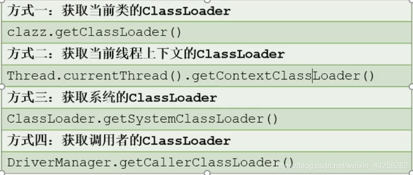
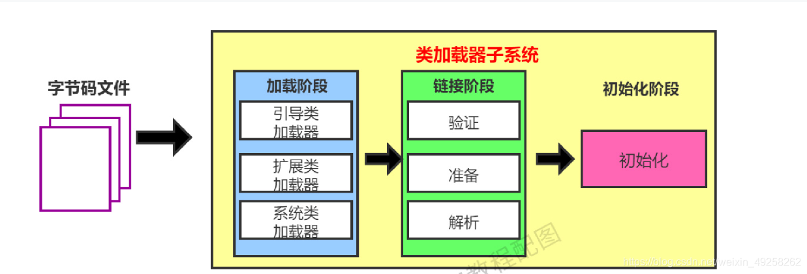
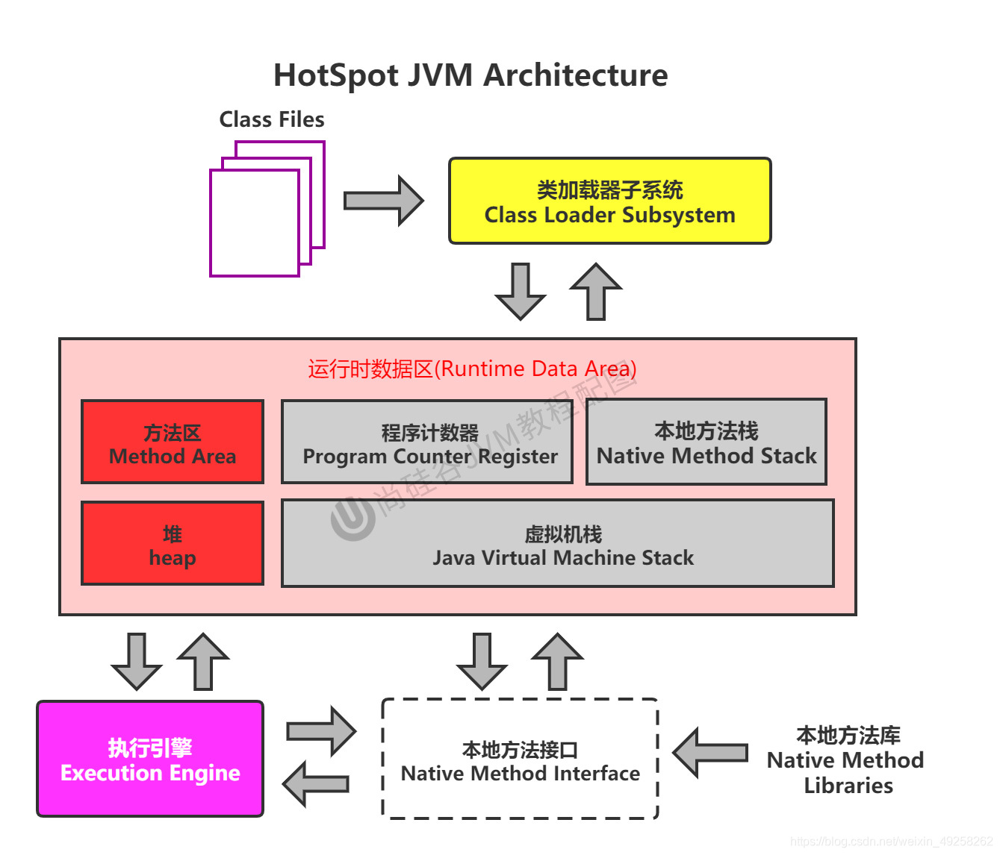

# JVM体系与类加载

## 概念卡
Q: 为什么JVM选择基于栈的指令集架构而不是基于寄存器的架构？
A:
- Java的设计目标是"一次编译，到处运行"，基于栈的架构不需要依赖硬件寄存器，可移植性远优于寄存器架构
- 栈式架构设计和实现更简单，避开了寄存器分配的难题，适用于资源受限的系统
- 代价是指令数量多（零地址指令为主），执行效率不如寄存器架构；但这一点通过JIT编译器的热点代码编译为本地机器指令得到了弥补
- 基于栈的架构使用操作数栈作为计算中介，指令集更小但完成同样操作需要的指令条数更多
- 跨平台性体现在：字节码不绑定任何特定硬件架构的寄存器模型，所有JVM统一使用栈帧模型执行字节码

## 概念卡
Q: 双亲委派机制的设计目的是什么？它的缺陷又是什么？
A:
- 双亲委派机制的核心思想：类加载器收到加载请求时，先委托给父加载器，逐级向上，父加载器能加载则直接返回，无法加载时才由子加载器尝试。本质上规定了加载顺序：Bootstrap ClassLoader -> Extension/Platform ClassLoader -> Application ClassLoader
- 两大设计目的：
  1. 避免类的重复加载——父加载器加载过的类，子加载器不会再次加载
  2. 保护核心API安全——通过优先级保证java.lang.String等核心类由Bootstrap加载，防止用户自定义同名类篡改核心库
- 缺陷：委托过程是单向的，顶层ClassLoader无法访问底层ClassLoader加载的类。典型场景：JDBC中DriverManager（由Bootstrap加载）需要调用第三方厂商实现的Driver（由AppClassLoader加载），单向委托无法满足，必须引入线程上下文类加载器（Thread Context ClassLoader）来打破这一限制
- 破坏双亲委派的三种方式：JDK1.2之前重写loadClass方法的兼容性、SPI机制中的上下文类加载器、OSGi/模块化热部署中的网状类加载器结构

## 概念卡
Q: JVM的三类类加载器分别负责什么？JDK9之后发生了什么变化？
A:
- Bootstrap ClassLoader（引导类加载器）：C/C++实现，嵌套在JVM内部，加载JAVA_HOME/jre/lib/rt.jar等核心类库（java.*、javax.*、sun.*），获取它为null。也是Extension/Platform ClassLoader的父加载器
- Extension ClassLoader（扩展类加载器，JDK8及以前）：Java实现（sun.misc.Launcher$ExtClassLoader），加载jre/lib/ext/目录下的类库。JDK9之后被Platform ClassLoader取代，扩展机制被移除（因为模块化系统天然支持可扩展性），保留名称仅为向后兼容
- Application ClassLoader（系统/应用类加载器）：Java实现（sun.misc.Launcher$AppClassLoader），加载classpath下的类，是程序中默认的类加载器。JDK9之后不再继承URLClassLoader，与Platform ClassLoader一样继承自BuiltinClassLoader
- JDK9变化：类加载器层级从三层变为更灵活的模块化委派关系——平台和应用类加载器在委派给父加载器前，先判断类是否归属某个系统模块，优先委派给负责该模块的加载器

## 机制卡
Q: 类加载子系统的三个核心阶段（加载、链接、初始化）各做了什么？为什么链接阶段的解析操作通常延迟到初始化之后？
A:
- 加载（Loading）：通过全限定名获取二进制字节流（可从文件系统、jar包、网络、运行时生成等来源），将字节流转换为方法区的运行时数据结构，在堆中生成java.lang.Class对象作为方法区数据的访问入口
- 链接（Linking）分三步：
  1. 验证（Verification）：确保Class文件字节流符合JVM规范，包括文件格式验证、元数据验证、字节码验证、符号引用验证。格式验证与加载阶段同步完成
  2. 准备（Preparation）：为类变量（static变量）分配内存并赋默认零值（不是显式赋值）。final static的基本类型和字面量String在编译期已确定值，在此阶段通过ConstantValue属性直接完成显式赋值
  3. 解析（Resolution）：将常量池中的符号引用转换为直接引用（内存中的指针或偏移量）。解析延迟执行的原因是：符号引用的目标在类加载阶段可能还不确定（如多态场景），等到初始化时类结构已稳定再执行解析更可靠
- 初始化（Initialization）：执行`<clinit>()`方法——编译器自动收集所有类变量的显式赋值动作和static代码块按源码顺序合并生成。父类的`<clinit>()`保证在子类之前执行，多线程下JVM保证同步加锁

## 机制卡
Q: 主动使用和被动使用（触不触发初始化）的边界在哪里？这个边界为什么重要？
A:
- 主动使用（触发类的初始化，执行`<clinit>()`）：
  1. new创建实例、反射、克隆、反序列化
  2. 调用类的静态方法（invokestatic指令）
  3. 访问类/接口的静态字段（getstatic/putstatic指令），但final static常量除外——常量在链接的准备阶段已赋值，不会触发初始化
  4. 反射调用（Class.forName）
  5. 初始化子类时先初始化父类（但接口不会因子接口/实现类初始化而初始化，只有被首次使用静态字段时才初始化）
  6. 虚拟机启动时指定的主类
- 被动使用（不触发初始化）：
  1. 通过子类引用父类静态字段——只初始化父类
  2. 通过数组定义类引用——不会触发该类的初始化
  3. 引用final static常量——编译期常量已在链接阶段赋值
  4. ClassLoader.loadClass()——仅加载不初始化
- 这个边界在调优中非常重要：未初始化的类不会执行`<clinit>()`，可以避免不必要的类初始化和静态资源消耗；在多线程场景下，`<clinit>()`是同步加锁的，不恰当地触发大量类初始化可能导致线程阻塞甚至死锁
