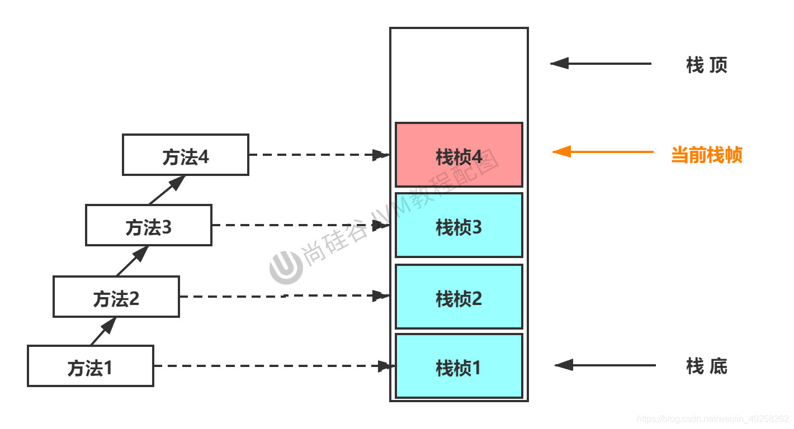
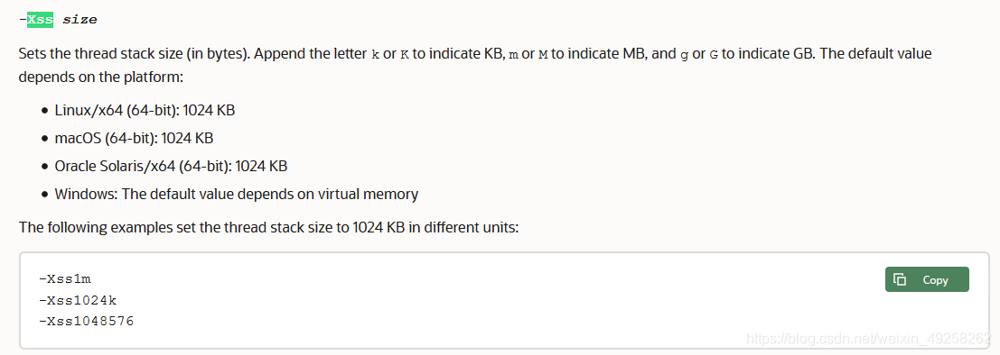
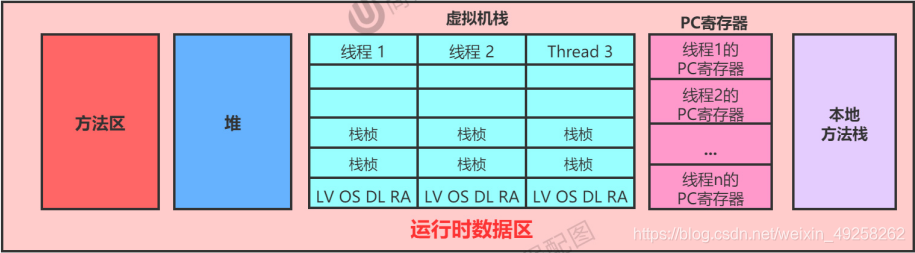

# 运行时数据区

## 概念卡
Q: 为什么JVM的运行时数据区要分为线程共享和线程私有两类？这样划分解决什么问题？
A:
- 线程私有区（每个线程独有一份）：
  1. 程序计数器（PC Register）：存储当前线程正在执行的字节码指令地址，CPU切换线程时通过PC寄存器恢复执行位置。线程私有的根本原因是——如果多线程共享一个PC寄存器，线程切换后将无法确定各线程应继续执行的指令位置
  2. 虚拟机栈（VM Stack）：每个线程创建时分配，每个方法调用对应一个栈帧入栈。存储局部变量表、操作数栈、动态链接、返回值地址。栈解决的是"程序如何执行"的问题
  3. 本地方法栈（Native Method Stack）：管理本地方法（native方法）的调用，与虚拟机栈功能类似但服务于非Java方法
- 线程共享区（所有线程共享）：
  1. 堆（Heap）：存放几乎所有对象实例和数组，是GC的重点区域。解决"数据怎么放"的问题
  2. 方法区/元空间（Method Area/Metaspace）：存储类型信息、常量、静态变量、JIT编译后的代码缓存
- 划分的核心原因：
  1. 隔离并发线程在执行过程中各自的方法调用状态（局部变量、操作数中间结果），保证线程安全
  2. 共享堆和方法区允许线程间数据共享和通信，同时由GC统一管理内存回收
  3. 栈不存在垃圾回收问题，只存在OOM（动态扩展时内存不足）和StackOverflowError（固定大小时超出容量）
- 栈与堆的本质区别：栈是运行时单位（方法调用流转），堆是存储单位（对象存储分配）

## 概念卡
Q: 为什么堆要分为年轻代（Eden、S0、S1）和老年代？TLAB又是为了解决什么问题？
A:
- 分代设计的根本原因：Java对象的生命周期差异极大——80%的对象"朝生夕死"，另一些则存活极长。如果不分代，所有对象混在一起，GC每次都需要全堆扫描，效率极低。分代后可以针对不同代采取不同回收策略
- 年轻代（Young Generation）：
  - Eden区：绝大多数对象在此分配，当Eden满时触发Minor GC
  - S0/S1（Survivor From/To）：复制算法的工作区，每次Minor GC后存活对象在这两个区之间来回复制。From和To是相对概念，谁空谁是To。设计两个Survivor区是为了通过复制算法保证存活对象地址的连续性，防止内存碎片化
  - 默认比例 Eden:S0:S1 = 8:1:1（HotSpot有自适应机制，可能实际为6:1:1）
- 老年代（Old Generation）：存储长期存活对象（经过阈值次数GC仍然存活或大对象直接分配）
- TLAB（Thread Local Allocation Buffer）：堆是线程共享的，多线程并发分配对象时需要用锁保证安全，严重影响性能。TLAB在Eden区为每个线程预分配一小块私有缓冲区（仅占Eden的1%），线程在自己的TLAB中分配对象无需加锁；TLAB空间不足时再用CAS+重试机制在Eden中分配。本质上是用空间换时间的线程局部优化
- JDK8之后永久代变为元空间，使用本地内存而非JVM堆内存，默认不设上限

## 概念卡
Q: 虚拟机栈的栈帧内部包含哪些结构？每个结构在方法执行中起什么作用？
A:
- 局部变量表（Local Variables）：编译期确定的数组，存储方法参数和方法体内的局部变量。基本单位是Slot（变量槽），32位类型占1个Slot，64位（long/double）占2个Slot。非静态方法的this引用存放在index为0的Slot。Slot可复用——变量超出作用域后其Slot可被新变量占用，这也是为什么需要手动置null来帮助GC的原因
- 操作数栈（Operand Stack）：JVM执行引擎的工作区，用于保存计算中间结果和临时变量。方法开始执行时操作数栈为空，最大深度在编译期确定。字节码指令从局部变量表加载数据到操作数栈→执行运算→将结果存回。栈顶缓存技术（Top-of-Stack Caching）将栈顶元素缓存在物理CPU寄存器中，减少内存读写次数
- 动态链接（Dynamic Linking）：指向运行时常量池中当前方法的引用。Java源文件中所有变量和方法引用编译为符号引用存放在常量池，动态链接在运行时将符号引用转换为直接引用（内存地址），这是支持多态（晚期绑定）的基础
- 方法返回地址（Return Address）：保存调用该方法的PC寄存器值。正常return时使用调用者的下一条指令地址；异常退出时通过异常表确定返回地址，栈帧中一般不保存异常返回信息
- 虚拟方法表（vtable）：在方法区中创建，用于提高动态分派效率。记录类中可被重写的方法的实际入口地址，以索引表代替逐级查找父类方法的性能开销

## 机制卡
Q: 方法调用中静态链接和动态链接、早期绑定和晚期绑定、虚方法和非虚方法这三组概念是什么关系？它们如何支撑Java的多态？
A:
- 三组概念的对应关系：
  - 静态链接（编译期确定调用目标）→ 早期绑定 → 非虚方法
  - 动态链接（运行时确定调用目标）→ 晚期绑定 → 虚方法
- 非虚方法（编译期确定唯一调用版本）：
  - 静态方法（invokestatic）、私有方法（invokespecial）、final方法（invokevirtual但不可重写）、实例构造器`<init>`（invokespecial）、父类方法（invokespecial）
  - 这类方法在解析阶段就能确定直接引用
- 虚方法（运行时根据实际类型确定调用版本）：
  - 除上述非虚方法外的所有实例方法
  - 动态分派的实现过程：在操作数栈顶找到对象的实际类型→在该类型的方法表中查找匹配方法→找到则进行权限校验通过后调用→未找到则沿继承链向上查找→最终未找到抛AbstractMethodError
- Java多态的本质：invokevirtual指令在运行时不直接跳转到编译期确定的符号引用地址，而是根据操作数栈顶对象实际类型在虚方法表中查找对应方法入口。虚方法表在类加载的链接阶段创建，子类重写方法的方法入口指向子类自身实现，未重写的方法入口指向父类实现

## 机制卡
Q: Minor GC、Major GC和Full GC的触发条件分别是什么？为什么说Full GC是调优中应尽量避免的？
A:
- Minor GC（Young GC）：
  - 触发条件：Eden区满（Survivor满不会触发）
  - 回收范围：仅年轻代（Eden + Survivor）
  - 特点：非常频繁（大多对象朝生夕灭），速度快，会引发STW
- Major GC（Old GC）：
  - 触发条件：老年代空间不足
  - 注意：老年代不足时会先尝试触发一次Minor GC，空间仍不足再触发Major GC
  - 特点：只有CMS GC有单独收集老年代的行为，速度比Minor GC慢10倍以上，STW时间更长
  - Major GC后内存仍不足则报OOM
- Full GC：
  - 触发条件：方法区（元空间）或老年代空间不足；显式调用System.gc()
  - 回收范围：整个Java堆 + 方法区
  - 特点：STW时间最长，应尽量避免
- Full GC需要避免的原因：
  1. STW时间可能是Minor GC的数十倍甚至百倍
  2. 所有用户线程被暂停，对响应时间敏感的应用（互联网服务）影响巨大
  3. Full GC频繁发生通常意味着堆空间配置不合理或存在内存泄漏，需要从根因解决
- 新概念Mixed GC（仅G1）：收集整个新生代+部分老年代Region，是G1在低延迟目标下平衡回收效率的关键机制
