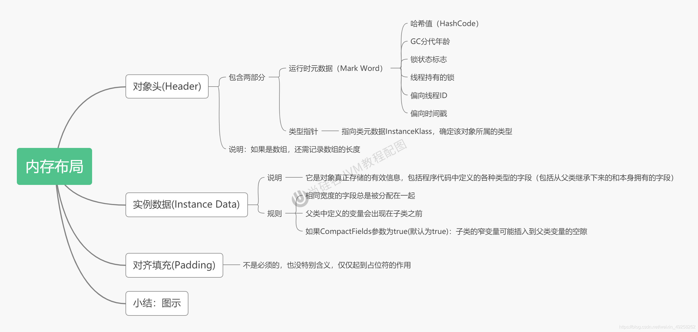
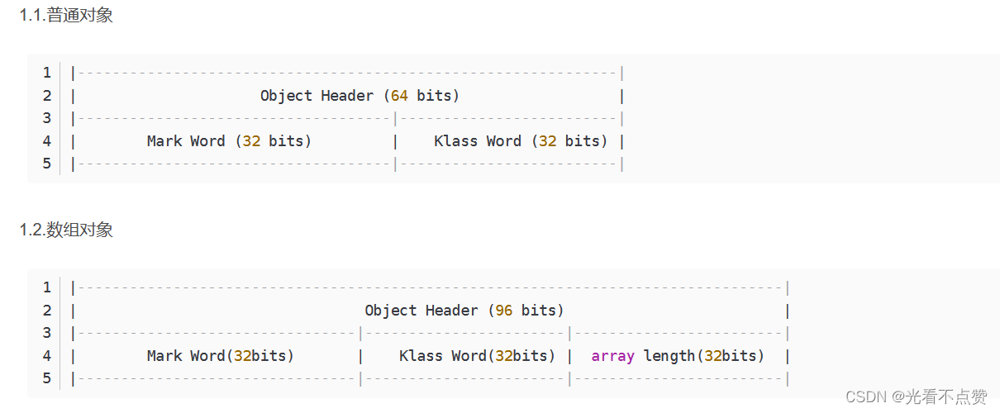
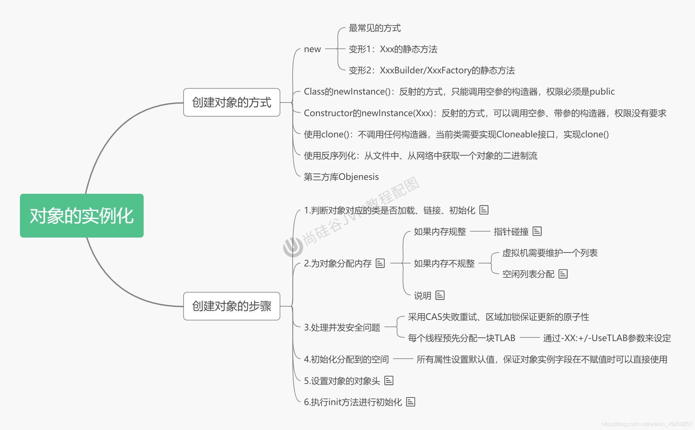

# 对象创建与内存布局

## 概念卡
Q: 从JVM层面看，new一个对象经历了哪几个步骤？每一步为什么这样设计？
A:
- 步骤1：类加载检查。虚拟机遇到new指令时，先去元空间的运行时常量池检查指令参数（符号引用）对应的类是否已经被加载、链接、初始化。如果未加载，则通过双亲委派机制加载该类。这一步保证对象所属类型的元数据已就绪，对象头中写入的类型指针才有意义
- 步骤2：分配内存。计算对象占用空间大小，从堆中划分对应内存。分配方式取决于堆是否规整：
  - 指针碰撞（Bump the Pointer）：堆内存规整时（已用内存和空闲内存各在一边），用指针标记分界点，分配内存只需移动指针。对应Serial、ParNew等带压缩整理的收集器
  - 空闲列表（Free List）：堆内存不规整时，JVM维护空闲内存列表，从中找合适大小的空间。对应CMS等基于标记-清除的收集器
  - 分配内存时的并发安全问题通过CAS+失败重试或TLAB解决
- 步骤3：初始化零值。将分配到的内存空间初始化为零值（不包括对象头）。这一步保证对象的实例字段在未赋显式值时就已有确定的默认值（int为0，boolean为false/false，引用为null），符合Java语言规范
- 步骤4：设置对象头。将对象的运行时元数据（哈希码、GC分代年龄、锁状态标志、偏向线程ID等）和类型指针（指向方法区中类的元数据）写入对象头。数组对象还需记录数组长度
- 步骤5：执行`<init>`方法。从Java程序员视角这步才是真正的初始化——按源码顺序执行实例变量显式赋值、实例代码块、构造方法。注意：成员变量赋值有确定的顺序：默认初始化(0) -> 显式初始化/代码块初始化（按源码顺序） -> 构造器初始化
- 步骤6：引用赋值。将堆中对象的首地址赋值给栈中的引用变量，建立栈到堆的引用关系
- 整体设计思想：将内存分配和状态初始化分离——JVM先完成底层内存操作（步骤2-4），再由程序员定义的`<init>`方法完成业务初始化（步骤5），保证了对象状态的正确性和一致性

## 概念卡
Q: Java对象的内存布局是怎样的？对象头中存储哪些信息？为什么要这样设计？
A:
- 对象内存布局分三部分：
  1. 对象头（Object Header）：
     - Mark Word（运行时元数据）：存储哈希码（identityHashCode）、GC分代年龄、锁状态标志、偏向线程ID、偏向时间戳等。这些数据与对象自身数据无关，是JVM为管理和优化而附加的。Mark Word的设计是动态的——不同锁状态下复用同一块内存存储不同信息（偏向锁时存线程ID，轻量级锁时存指向栈中锁记录的指针）
     - 类型指针（Klass Pointer）：指向方法区中类的元数据（InstanceKlass），确定该对象的类型。这是运行时判断对象类型、实现instanceof、反射等操作的基础
     - 数组长度（仅数组对象有）：记录数组元素个数
  2. 实例数据（Instance Data）：存放程序中定义的各种类型的字段，包括从父类继承的字段。存储规则：相同宽度的字段总是分配在一起，父类定义的变量出现在子类之前（CompactFields参数为true时，子类窄变量可插入父类变量空隙以节省空间）
  3. 对齐填充（Padding）：HotSpot要求对象起始地址必须是8字节的整数倍，对象大小不足8的倍数时补足。这是因为64位系统上8字节对齐可以提高CPU访问效率
- 为什么要压缩指针：64位JVM中对象指针占8字节，相比32位翻倍，内存压力大。使用压缩指针（-XX:+UseCompressedOops，堆小于32GB时默认开启）将指针压缩为4字节，节省内存的同时利用8字节对齐的位移操作还原真实地址

## 概念卡
Q: 句柄访问和直接指针访问两种对象定位方式各有什么优缺点？HotSpot为什么选择直接指针？
A:
- 句柄访问（Handle Access）：
  - 实现：在堆中划分句柄池，reference指向句柄池中的句柄，句柄包含两个指针——一个指向对象实例数据，一个指向对象类型数据（方法区）
  - 优点：对象被移动时（垃圾收集中的整理阶段），只需修改句柄中的实例数据指针，reference本身不需要修改，引用稳定性好
  - 缺点：多一次指针跳转，访问速度较慢
- 直接指针访问（Direct Pointer，HotSpot采用）：
  - 实现：reference直接指向堆中的对象实例，对象实例中包含类型指针指向方法区
  - 优点：访问速度快，减少一次指针定位开销，这在Java频繁的对象访问场景下具有性能优势
  - 缺点：对象移动时需要更新所有指向该对象的reference，包括栈中局部变量表和堆中其他对象的引用字段
- HotSpot的选择理由：Java是面向对象语言，对象字段访问极其频繁，直接指针减少间接访问次数能显著提升整体性能。而对象移动（GC整理）的频率远低于对象访问的频率，用偶尔的指针更新开销换取持续的性能提升是合理的权衡

## 机制卡
Q: 逃逸分析是什么？它如何优化对象分配？为什么目前还不够成熟？
A:
- 逃逸分析（Escape Analysis）的基本原理：分析对象的作用域，判断对象是否"逃逸"出方法或线程。如果一个对象仅在方法内使用且不会返回或传递给外部，则认为该对象未逃逸
- 三种优化手段：
  1. 栈上分配（Stack Allocation）：未逃逸对象直接分配在栈帧中，方法结束自动销毁，无需GC介入。消除了堆分配和垃圾回收的开销
  2. 同步省略/锁消除（Lock Elision）：如果确定锁对象只被一个线程访问（未线程逃逸），JIT编译器会消除同步代码块，去掉monitorenter/monitorexit
  3. 标量替换（Scalar Replacement）：将聚合量（对象）分解为标量（基本类型字段），对象的各字段直接作为局部变量分配在栈上，甚至不需要创建对象本身
- 还不够成熟的原因：
  1. 逃逸分析本身是耗时的编译期分析，如果分析成本高于收益，反而降低性能
  2. 分析精度有限——复杂的控制流、异常路径、反射调用等场景下难以准确判断是否逃逸
  3. 栈上分配受限于栈空间大小（每个线程栈通常只有几百KB到几MB），大对象无法在栈上分配
- 目前保守的回答仍是"对象实例主要分配在堆上"。逃逸分析默认开启（-XX:+DoEscapeAnalysis），但不保证所有场景都能优化

## 机制卡
Q: 成员变量（非静态）的赋值过程有哪几个阶段？为什么执行顺序重要？
A:
- 成员变量赋值按严格顺序执行：
  1. 默认初始化：在对象分配内存并清零时，JVM为实例字段赋予默认零值（int=0，boolean=false，引用=null）。这步保证变量在任何情况下都有确定的值，避免使用未初始化变量
  2. 显式初始化/代码块初始化：按源码中出现的先后顺序执行。例如 `int id = 1001;` 和 `{ name = "匿名用户"; }` 中，先执行id赋值再执行代码块
  3. 构造器初始化：执行构造方法体中的赋值
  4. 对象创建后的赋值：通过"对象.属性"或setter方法赋值
- 执行顺序重要性的体现：
  - 代码块中的赋值可能依赖前面已赋值的字段——如果顺序错乱，可能出现依赖的字段还是零值
  - 构造器是最后执行的，这意味着代码块的赋值可以被构造器覆盖，但构造器的赋值可以被外部后续调用覆盖
  - 子类构造器在执行前会隐式调用super()，父类的完整赋值链（1->2->3）执行完毕后，子类的步骤2和3才开始，保证继承层次中状态的正确性
- 与类变量（static）赋值的区别：类变量在链接的准备阶段赋默认零值，初始化阶段通过`<clinit>()`显式赋值（final static基本类型和字面量String例外，在准备阶段就完成显式赋值）
