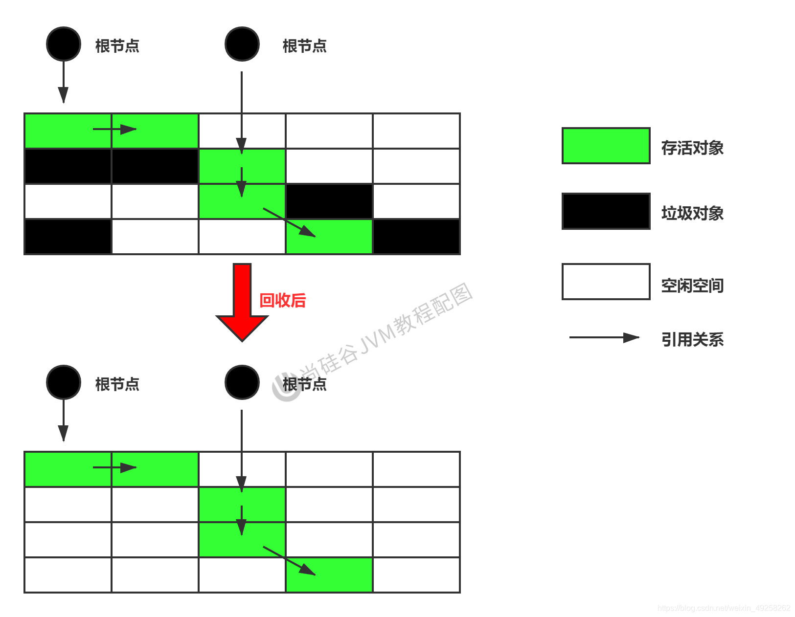
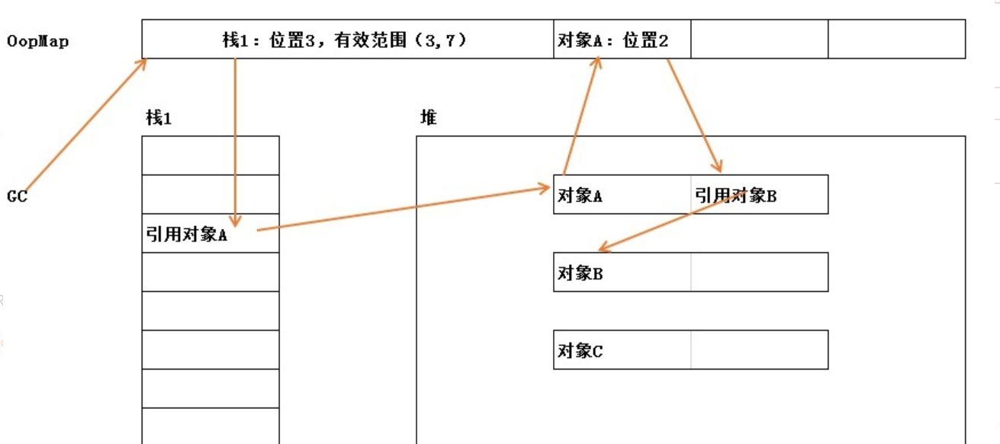
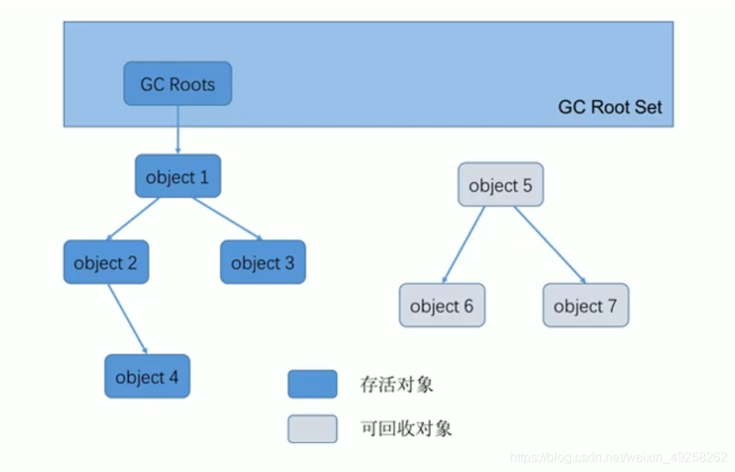

# 垃圾回收算法

## 概念卡
Q: 为什么Java不用引用计数算法而选择可达性分析算法来标记垃圾对象？
A:
- 引用计数算法（Reference Counting）：每个对象维护一个整型引用计数器，被引用时+1，引用失效时-1，计数器为0即可回收
  - 优点：实现简单，判定效率高，回收无延迟（实时回收）
  - 缺点：
    1. 需要额外存储空间存放计数器
    2. 每次引用赋值都需要更新计数器，时间开销大
    3. 致命缺陷：无法处理循环引用——A引用B、B引用A，两者计数器永远不为0，即使外部已无法访问它们
  - 虽然Python使用引用计数，但通过手动解除和weakref（弱引用）来弥补循环引用问题，这本身就说明引用计数在处理循环引用上的先天不足
- 可达性分析算法（Reachability Analysis）：以GC Roots为起点，沿着引用链向下搜索，无法从GC Roots到达的对象被标记为垃圾
  - 优点：能有效解决循环引用问题（循环引用的对象只要无法从GC Roots到达，就会被正确标记），实现和执行同样高效
  - 代价：分析必须在能保证一致性的快照中进行，这是GC需要STW（Stop The World）的核心原因
  - 枚举GC Roots时必须STW——HotSpot使用OopMap记录GC Roots的位置，只在安全点（Safepoint）更新OopMap，避免为每条指令维护OopMap的巨大空间开销

## 概念卡
Q: 哪些对象可以作为GC Roots？设计规则背后的逻辑是什么？
A:
- GC Roots是一组必须活跃的引用集合，包括：
  1. 虚拟机栈（栈帧中的局部变量表）中引用的对象——当前执行的方法中正在使用的参数和局部变量
  2. 本地方法栈中JNI引用的对象——本地方法正在使用的对象
  3. 方法区中类静态属性引用的对象——static变量
  4. 方法区中常量引用的对象——字符串常量池（StringTable）中的引用
  5. 所有被同步锁synchronized持有的对象——正在被锁定的对象不能回收
  6. JVM内部的引用——基本数据类型对应的Class对象、常驻异常对象（NullPointerException、OOM等）、系统类加载器
- 规则背后的逻辑（判断技巧）：如果一个指针保存了堆内存对象的引用，但自己不在堆内存中，那它就是GC Root。GC Roots本质上是"在当前程序状态下一定能被访问到、绝对不能被回收的一组引用"
- 枚举GC Roots的优化：HotSpot使用OopMap数据结构记录栈中哪些位置是引用，在安全点更新OopMap。这样GC时无需扫描整个栈，直接通过OopMap快速定位GC Roots。类加载完成时HotSpot还会把对象内什么偏移量上是引用类型也计算出来，存储为OopMap

## 概念卡
Q: 三种基础GC算法（标记-清除、标记-复制、标记-整理）各自适用什么场景？为什么JVM要组合使用它们？
A:
- 标记-清除（Mark-Sweep）：
  - 过程：标记所有可达对象 -> 线性遍历堆，清除未标记对象（将地址指针回收，并非真正清空数据）
  - 优点：不需要移动对象，实现简单
  - 缺点：产生内存碎片，需维护空闲列表；效率不高；全过程需要STW
  - 适用：老年代中的CMS收集器（老年代存活对象多，少量垃圾，碎片代价可接受）
- 标记-复制（Mark-Copy）：
  - 过程：将内存分为两块，只使用其中一块；GC时将存活对象复制到另一块，清空当前块，两块角色互换
  - 优点：无内存碎片（存活对象复制到连续内存区域，可使用指针碰撞分配）；实现简单运行高效
  - 缺点：浪费一半内存空间（但实际只需10%的Survivor区即可，因为新生代98%的对象朝生夕死）
  - 适用：新生代（Eden + S0/S1），因为新生代大多数对象会被回收，需复制的存活对象很少
- 标记-整理（Mark-Compact）：
  - 过程：标记所有可达对象 -> 将所有存活对象压缩移动到内存一端 -> 清理边界外空间
  - 优点：消除内存碎片，不需要额外内存空间
  - 缺点：移动对象需更新所有引用地址；比复制算法效率低（多一个标记阶段）；全程STW
  - 适用：老年代（Serial Old、Parallel Old），老年代存活率高，不适合复制算法
- JVM组合使用的逻辑——分代收集理论：
  1. 弱分代假说：绝大多数对象朝生夕灭 → 新生代用复制算法（回收快、无碎片）
  2. 强分代假说：熬过多次GC的对象越难消亡 → 老年代用标记-清除+标记-整理组合（存活率高不适合复制）
  3. 跨代引用假说：跨代引用仅占极少数 → 引入Remembered Set（记忆集）避免全堆扫描

## 机制卡
Q: Stop The World（STW）的本质原因是什么？安全点和安全区域机制如何协调GC与用户线程？
A:
- STW的本质原因：可达性分析必须在能保证一致性的快照中进行——分析期间对象引用关系不能变化，否则分析结果不可靠（可能将活对象判为垃圾或反之）。因此枚举GC Roots和关键标记阶段必须暂停所有用户线程
- 枚举GC Roots为什么必须STW：GC Roots中的栈帧引用在执行过程中不断变化，如果不暂停线程，无法得到当前时刻准确的GC Roots集合
- 安全点（Safepoint）：
  - 为什么需要安全点：如果为每条指令都生成OopMap，空间开销无法承受。HotSpot只在特定位置（安全点）记录OopMap，这意味着只能在这些位置进行GC
  - 安全点的选择标准：选择那些"具有让程序长时间执行的特征"的指令位置——方法调用、循环跳转、异常跳转的前后。因为这些位置程序可能停留较长时间，线程能及时响应GC请求
  - 线程到达安全点的机制：HotSpot使用主动式中断——设置一个全局中断标志，线程到达安全点时主动轮询该标志，发现需要GC则将自己挂起
  - 可数循环（Counted Loop）的问题：使用int作为循环索引的短循环默认不会被放置安全点（JVM认为其执行时间短）。如果循环体执行时间实际很长，会导致所有GC线程等待这一个循环结束，延长STW时间。解决方法是改用long作为循环索引（不可数循环会放置安全点）
- 安全区域（Safe Region）：线程处于Sleep或Blocked状态时无法响应中断请求到达安全点，安全区域机制覆盖这段代码——线程进入安全区域时标记自身状态，GC直接忽略该线程；离开安全区域时检查GC是否完成，未完成则等待

## 机制卡
Q: 四种引用类型（强、软、弱、虚）在GC时的行为有何不同？它们的设计各有何用途？
A:
- 强引用（Strong Reference）：`Object obj = new Object()` ——无论如何都不会被GC回收，即使发生OOM。这是造成内存泄漏的主要原因之一——如果不需要的对象仍被强引用关联，就永远无法回收
- 软引用（Soft Reference）：
  - 行为：内存足够时不回收，系统将发生OOM之前进行二次回收（先回收不可达对象，若内存仍不足则回收软引用关联对象）
  - 设计用途：实现内存敏感的缓存。如Guava Cache的softValues缓存——内存充足时缓存保留提升性能，内存紧张时自动释放避免OOM
- 弱引用（Weak Reference）：
  - 行为：GC一旦发现就回收，无论内存是否足够
  - 设计用途：WeakHashMap——当key除了WeakHashMap中的弱引用外没有任何强引用时，Entry自动被清理。适合做规范映射（Canonical Mapping）和防止内存泄漏的监听器注册。ThreadLocal的内部Entry也使用弱引用
- 虚引用（Phantom Reference）：
  - 行为：完全不影响对象生命周期，无法通过虚引用获取对象实例
  - 设计用途：对象回收跟踪（唯一目的是在对象被回收时收到系统通知）。DirectByteBuffer使用虚引用管理直接内存的释放——当DirectByteBuffer对象被GC时，通过虚引用通知Cleaner执行Unsafe.freeMemory释放堆外内存。这是"自动管理堆外内存"的关键机制
- 终结器引用（Final Reference）：与finalize()方法配合，由Finalizer线程调用finalize()后再由GC回收。但finalize()已被JDK9标记为Deprecated，不建议使用
