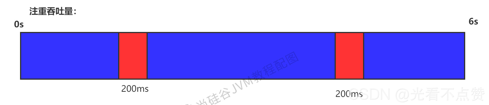
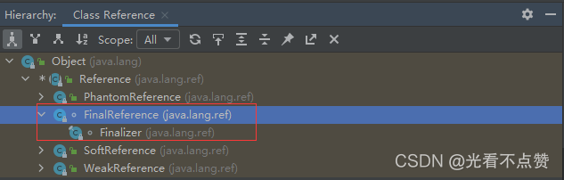
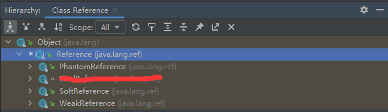

# 垃圾回收器

## 概念卡
Q: 为什么没有一款"万能"的垃圾回收器？评估GC性能的三个核心指标（吞吐量、暂停时间、内存占用）为什么不能同时最优？
A:
- GC性能的"不可能三角"：吞吐量（Throughput）、暂停时间（Pause Time/Latency）和内存占用（Footprint）三者无法同时达到最优
  - 高吞吐量 → 需要减少GC频率和总开销 → GC执行时间占比小 → 但单次GC时间可能较长
  - 低暂停时间 → 需要GC频繁执行、每次只回收少量区域 → 回收线程与用户线程交替 → 但线程切换和GC总开销增加，吞吐量下降
  - 低内存占用 → GC必须更频繁地运行以保持可用空间 → 吞吐量下降，暂停频率增加
- 设计哲学：在最大吞吐量优先的情况下，尽量降低停顿时间。不同应用场景侧重不同：
  - 后台计算任务（批处理、科学计算）→ 侧重吞吐量 → 选择Parallel Scavenge + Parallel Old
  - 互联网交互应用（Web服务、API服务）→ 侧重低延迟 → 选择CMS或G1
  - 大内存应用（>6GB堆）→ 需要可预测的暂停时间 → G1或ZGC
- 选择建议流：优先调整堆大小让JVM自适应 → 内存<100M用Serial → 单核无延迟要求用Serial → 多核高吞吐用Parallel → 多核低延迟用G1（目前互联网主流）

## 概念卡
Q: CMS收集器的7步过程和浮动垃圾问题是什么？为什么CMS最终被JDK14废弃？
A:
- CMS（Concurrent Mark Sweep）的7步完整过程（通常简化为4步）：
  1. 初始标记（Initial Mark，STW）：仅标记GC Roots能直接关联到的对象，速度极快
  2. 并发标记（Concurrent Mark）：从GC Roots直接关联对象开始遍历整个对象图，与用户线程并发
  3. 并发预清理（Concurrent Preclean）：处理并发标记阶段引用关系变化
  4. 可中断的并发预清理（Concurrent Abortable Preclean）：等待Minor GC，减少Remark阶段的压力
  5. 重新标记（Remark，STW）：修正并发标记期间因用户线程运行导致标记变动的对象。比初始标记稍长但远短于并发标记
  6. 并发清除（Concurrent Sweep）：清理死亡对象，与用户线程并发
  7. 并发重置（Concurrent Reset）：重置CMS内部数据结构，为下次GC做准备
- 浮动垃圾（Floating Garbage）：并发标记阶段新产生的垃圾对象，这些对象在并发标记期间已经变成垃圾但CMS无法标记，只能留到下一次GC回收。这是CMS使用的标记-清除算法在并发模式下固有的缺陷
- 被废弃的原因：
  1. 内存碎片严重——标记-清除算法不整理内存，长时间运行后碎片化严重，可能提前触发Full GC
  2. CPU资源敏感——并发阶段占用CPU导致应用程序变慢，吞吐量降低
  3. 无法处理浮动垃圾——可能因预留空间不足导致"Concurrent Mode Failure"，回退为Serial Old单线程Full GC（STW时间极长）
  4. G1在延迟可控的情况下提供更高的吞吐量，且不存在碎片问题
  - JDK9标记为Deprecated，JDK14正式移除

## 概念卡
Q: G1收集器的Region-based设计解决了什么问题？与CMS相比它的核心优势在哪里？
A:
- Region-based堆布局：
  - 将堆划分成约2048个大小相同的Region块（1MB~32MB，2的N次幂），每个Region可以是Eden、Survivor、Old或Humongous
  - Humongous区专门存储大对象（超过单个Region容量的50%），连续H区可存储更大的对象
  - 物理上Region不连续，逻辑上各代由若干Region组成
- G1的核心优势：
  1. 可预测的停顿时间模型：通过-XX:MaxGCPauseMillis设定目标停顿时间（默认200ms），G1在后台维护Region的优先级列表（回收价值=回收空间/回收时间），每次只回收价值最高的若干Region，将停顿控制在目标时间以内
  2. 空间整合：单Region内使用复制算法，整体上看类似标记-压缩，无内存碎片——生存对象拷贝到新Region，原Region整体释放
  3. 兼顾分代收集：同时工作于年轻代和老年代，不像CMS只能处理老年代。G1的GC周期包含Young GC、Concurrent Marking、Mixed GC三个阶段
  4. 并发与并行结合：并发标记阶段与用户线程并发，Young GC和Mixed GC阶段多线程并行回收
- Remembered Set（记忆集）：解决跨Region引用问题。每个Region维护一个RSet记录其他Region指向本Region的引用，避免Minor GC时全堆扫描。代价是RSet需要额外内存（通常占堆的5%左右），这是G1内存占用比CMS高的原因之一
- 与CMS的选择：小内存（<6GB）CMS可能更优，大内存G1优势明显。JDK9起G1成为默认垃圾回收器

## 概念卡
Q: ZGC的设计目标是什么？它如何实现亚毫秒级的停顿时间？
A:
- ZGC（Z Garbage Collector）的设计目标：停顿时间不超过1ms（JDK21中进一步降低），停顿时间不随堆大小或活跃对象数量增长，支持8MB到16TB级别的堆
- 核心技术：
  1. 指针染色（Colored Pointers）：在64位指针的元数据位中嵌入对象状态信息（Marked、Remapped等），将GC状态信息直接编码到指针中，无需额外的对象头开销
  2. 读屏障（Load Barrier）：应用线程读取对象引用时，读屏障检查指针颜色，如果对象已被移动则自动修正引用指向新位置。这使得对象的并发移动成为可能——GC移动对象时应用线程可以继续运行
  3. 并发转移：ZGC只有三个短暂STW阶段（初始标记、再标记、初始转移），所有耗时操作（并发标记、并发转移、并发重映射）都与用户线程并发
- 与G1的对比：
  - ZGC的最小堆建议为8GB（G1可在1-2GB下运行），因为ZGC需要更多空间支持并发转发和多版本对象
  - ZGC的停顿更低（亚毫秒 vs G1的目标200ms），但内存占用更大和吞吐量可能低于G1
  - JDK15起ZGC生产可用，JDK21开始支持分代ZGC
- ZGC采用标记-复制算法，并发转移存活对象而不需STW。通过"自愈"机制——应用线程访问已被移动的对象时，读屏障自动修正引用并可能完成转发，无需等待GC完成
- 适用场景：超大堆（百GB到TB级）、对延迟极其敏感的应用（金融交易、实时分析等）

## 概念卡
Q: Serial、ParNew、Parallel Scavenge三款新生代收集器有什么区别？各自的定位是什么？
A:
- Serial（串行收集器）：
  - 单线程GC，复制算法，工作期间完全STW
  - 定位：Client模式下默认新生代收集器，适用于单核CPU、内存小于100M的场景。简单高效，没有线程切换开销，在资源受限环境下反而表现最好
  - 搭配：Serial Old（老年代）
- ParNew（并行收集器）：
  - Serial的多线程版本，复制算法，多线程并行回收但仍需STW
  - 定位：Server模式下常用的新生代收集器，唯一的能与CMS配合的新生代收集器（JDK9之前）
  - 搭配：CMS（老年代）或Serial Old（备选）
  - 默认GC线程数=CPU核数，可通过-XX:ParallelGCThreads调整
- Parallel Scavenge（吞吐量优先收集器）：
  - 多线程GC，复制算法，STW+并行回收
  - 定位：JDK8默认收集器，目标是达到可控制的吞吐量（运行用户代码时间/总时间）。自带自适应调节策略——JVM根据运行情况自动调整Eden/Survivor比例、晋升阈值等参数
  - 搭配：Parallel Old（老年代），JDK8中两者互相激活
  - 与ParNew的区别：Parallel Scavenge关注吞吐量，不能与CMS配合；ParNew关注低延迟，可与CMS配合
- 核心取舍：Serial单线程但无切换开销适合小内存；ParNew多线程缩短回收时间适合多核；Parallel Scavenge通过自适应策略最大化吞吐量适合后台批处理

## 机制卡
Q: G1的Mixed GC和Young GC本质区别是什么？Mixed GC是如何实现"增量式回收"老年代的？
A:
- Young GC（仅年轻代GC）：
  - 触发条件：Eden区Region满
  - 回收范围：所有年轻代Region（Eden + Survivor）
  - 过程：STW -> 存活对象复制到Survivor或晋升到Old Region -> 清空回收的Region
  - 特点：单次回收，全量年轻代Region参与
- Mixed GC（混合回收）：
  - 触发条件：全局并发标记（Global Concurrent Marking）完成后，根据垃圾占比判断是否启动
  - 回收范围：所有年轻代Region + 部分老年代Region（垃圾占比最高的若干个）
  - 过程：与Young GC类似，但回收集（Collection Set）中增加了筛选出的老年代Region
  - 增量式回收：不是一次性回收所有老年代Region，而是分多次Mixed GC逐步回收。两次Mixed GC之间可能穿插Young GC
- 增量式回收的关键参数：
  - -XX:G1MixedGCLiveThresholdPercent（默认85%）：只有存活对象低于此比例的Old Region才能加入CSet
  - -XX:G1MixedGCCountTarget（默认8）：一次全局并发标记后最多执行8次Mixed GC
  - -XX:G1HeapWastePercent（默认5%）：垃圾占比低于此值时停止Mixed GC
  - -XX:G1OldCSetRegionThresholdPercent（默认10%）：单次Mixed GC最多回收堆10%的Old Region
- 设计思想：通过分批次回收老年代Region，每批次只回收有限数量，将单次GC的停顿时间控制在目标范围内。这是G1实现"可预测停顿时间"的核心机制——以多次短停顿替代一次长停顿
