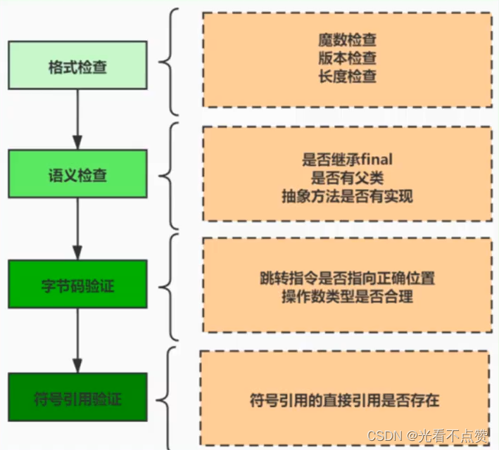
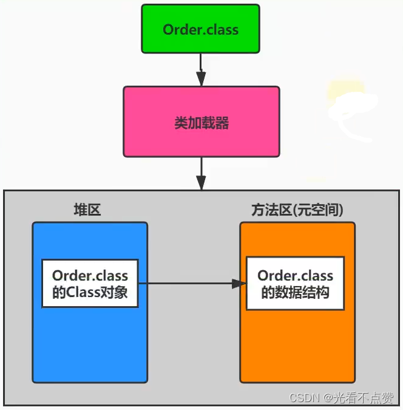
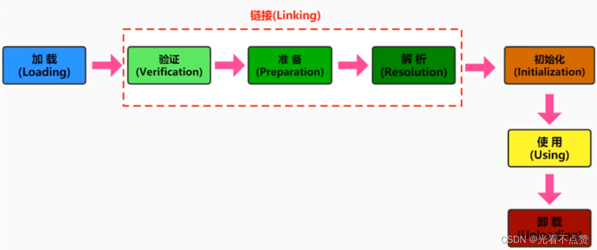

# 类加载过程详解

## 概念卡
Q: 类加载过程中，"类模型"与"Class实例"的区别是什么？为什么要分别存储在方法区和堆中？
A:
- 类模型（Class Model/Template）：存储在方法区（元空间），是Java类在JVM内存中的结构快照，包含从字节码文件中解析出的常量池、类字段、类方法、方法字节码等信息。这是类的"元数据"，描述了类的所有结构信息
- Class实例：存储在堆中，是java.lang.Class类的实例对象。每个被加载的类在堆中有一个对应的Class对象，作为访问方法区中类模型数据的入口（封装了访问元数据的接口）
- 分离存储的设计理由：
  1. 职责分离：方法区存储静态的结构元数据（生命周期与类一致），堆存储动态的访问入口对象（可被GC回收）。类模型是"蓝图"，Class实例是"访问蓝图的钥匙"
  2. 反射机制的基础：程序通过Class对象访问类的元数据信息（方法、字段、注解等），Class实例是反射的入口。如果元数据也在堆中，将难以区分反射操作和普通对象操作
  3. 内存管理：类模型数据量大且生命周期长（通常伴随整个JVM运行期），放在方法区（JDK8后用本地内存）不会对堆GC造成压力；Class实例作为普通对象在堆中，当类被卸载时可以被GC正常回收
- 相互关系：Class实例的构造方法是私有的（只有JVM能创建），Class实例持有指向方法区类模型的指针。每个类只对应一个Class实例，由类加载器在加载阶段创建
- 数组类的特殊性：数组类本身不由类加载器创建，而是JVM在运行时根据需要直接创建。但数组的元素类型（如果是引用类型）仍需通过类加载器加载

## 概念卡
Q: 链接阶段的"准备"和"初始化"阶段都涉及静态变量赋值，它们的区别是什么？为什么有些static final字段在准备阶段就完成了赋值？
A:
- 准备阶段（Preparation）的赋值：
  - 为类变量（static变量）分配内存，并设置默认零值（隐式初始化），这仅仅是内存清零操作
  - 例外：对被static final修饰的基本数据类型字段和String字面量，在准备阶段就通过字段表中的ConstantValue属性完成显式赋值。因为这类值在编译期就已完全确定（编译时常量），不需要等到初始化阶段
- 初始化阶段`<clinit>()`的赋值：
  - 执行类构造器方法，按源码中出现的顺序执行所有类变量的显式赋值和static代码块
  - 处理所有非编译时常量的赋值：对于基本数据类型无final修饰、final但值由方法调用确定的（如Integer.valueOf(100)）、final String但通过new创建的、final int但通过随机数生成的——这些都必须在此阶段赋值
- 举例：`static final int A = 10` 在准备阶段赋值；`static final Integer B = Integer.valueOf(100)` 在初始化阶段赋值（方法调用在编译期无法确定值）；`static final String C = "hello"` 在准备阶段赋值；`static final String D = new String("hello")` 在初始化阶段赋值
- 这个区分的实际意义：
  1. 不生成`<clinit>()`的条件：类中没有任何static变量需要显式赋值、或者只有static final编译时常量
  2. 被动使用不触发初始化：访问编译时常量（准备阶段已赋值）不会触发类的初始化，这也是访问final static常量不会导致类加载的原因

## 机制卡
Q: `<clinit>()`方法是由谁生成的？它的线程安全性如何保证？为什么可能导致死锁？
A:
- `<clinit>()`的生成规则：
  - 由javac编译器自动收集类中的所有static变量的显式赋值动作和static代码块，按源码顺序合并生成
  - 程序员无法自定义同名方法，JVM负责调用
  - 不生成的情况：类中没有类变量需要显式赋值；所有类变量都是final static编译时常量（在准备阶段已赋值）
- 线程安全性：
  - JVM保证一个类的`<clinit>()`方法在多线程下被同步加锁——如果多个线程同时触发同一个类的初始化，只有一个线程执行`<clinit>()`，其他线程被阻塞等待
  - 类的初始化在JVM层面有隐式的锁机制保护，这是语言规范要求的
- 死锁风险：
  - 如果`<clinit>()`中有耗时很长的操作，多个线程可能长时间阻塞
  - 更致命的是：如果类A的`<clinit>()`中引用了类B，而类B的`<clinit>()`又引用了类A（循环依赖），两个线程分别负责初始化A和B，各自持有自己类的锁并等待对方的锁，形成死锁
  - 这种死锁非常隐蔽——没有显式的锁代码，调用栈中也不显示锁信息，排查困难
- 父类优先规则：子类的`<clinit>()`执行前，JVM保证父类的`<clinit>()`已经执行完毕。但接口不同——父接口不会因子接口或实现类的初始化而初始化，只有首次使用接口的静态字段时才初始化该接口

## 概念卡
Q: 类加载器的命名空间机制如何保证类的唯一性？同一个Class文件被不同类加载器加载会产生什么结果？
A:
- 类的唯一性由两部分共同确认：类加载器 + 类本身的全限定名。即使两个类源自同一个Class文件、被同一个JVM加载，只要类加载器不同，它们就是两个不同的类
- 命名空间（Namespace）：
  - 每个类加载器都有自己的命名空间，由该加载器及其所有父加载器加载的类组成
  - 同一命名空间中不会出现全限定名相同的两个类
  - 不同命名空间中可能出现全限定名相同的两个类，它们被视为不同类
- 三个基本特征：
  1. 双亲委派模型：标准加载流程
  2. 可见性：子加载器可以访问父加载器加载的类型，但反过来不允许。这为容器隔离提供了基础——例如Tomcat为每个web应用分配独立的类加载器，应用A无法访问应用B的类
  3. 单一性：父加载器加载过的类型，子加载器不会重复加载。但"邻居"加载器间，同一类型可以被各自加载多次（互相不可见）
- 实际应用场景：多个版本的库共存——通过自定义类加载器，可以在同一个JVM中加载同一个库的不同版本，各版本运行在独立的命名空间中
- 类型转换时的陷阱：两个不同类加载器加载的"同名类"之间不能强制类型转换（会抛ClassCastException），因为JVM认为它们是完全不同的类型

## 机制卡
Q: 自定义类加载器应该重写findClass()还是loadClass()？为什么？
A:
- 推荐重写findClass()而非loadClass()的三个理由：
  1. 保持双亲委派机制的完整性：loadClass()是双亲委派机制的实现入口（先检查是否已加载 -> 委托父加载器 -> 自己调用findClass()）。如果重写loadClass()破坏了这个委托逻辑，就会丧失双亲委派的安全保护
  2. 职责单一：findClass()只负责从特定来源获取类的字节码并调用defineClass()转换为Class实例。loadClass()负责整个加载流程控制。各司其职更清晰
  3. JDK安全保护：即使重写loadClass()绕过了双亲委派，defineClass()方法中的preDefineClass()仍然会检查JDK核心类库保护——所以自定义类加载器无论如何也无法用自己的版本来替换java.lang.String等核心类
- 自定义类加载器的实现步骤：
  1. 继承ClassLoader类
  2. 重写findClass(String name)方法——获取字节码二进制流（从文件、网络、数据库等），调用defineClass()生成Class对象
  3. 如果需求简单，可以直接继承URLClassLoader（JDK8及以前）简化实现，但JDK9后URLClassLoader不再是AppClassLoader和PlatformClassLoader的父类
- 自定义类加载器的四大应用场景：隔离加载类（容器框架）、修改类加载方式（按需动态加载）、扩展加载源（从非文件系统加载）、防止源码泄漏（字节码加密后由自定义加载器解密加载）
- Tomcat的类加载器架构是自定义类加载器的典型应用：Common -> Catalina/Shared -> WebApp（每个应用独立加载器），实现应用间隔离
