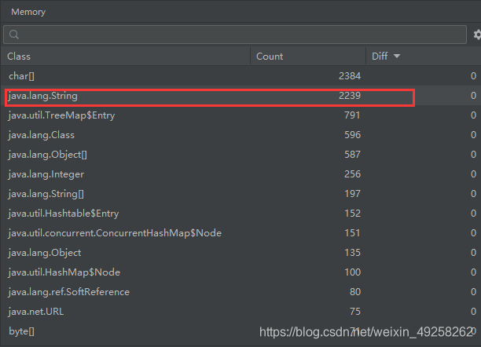
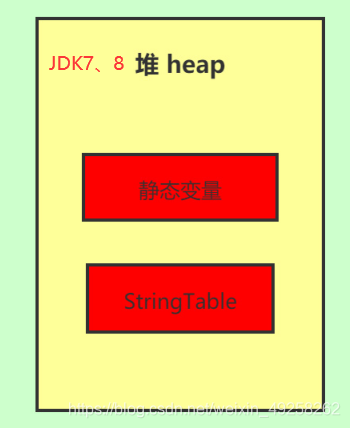
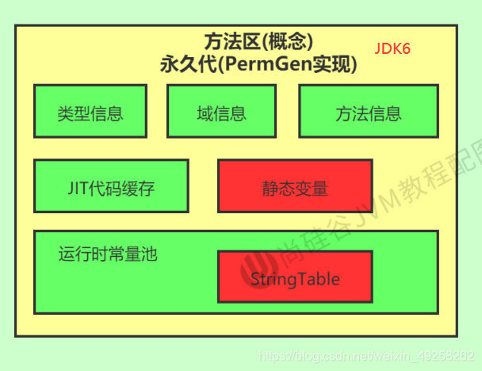

# StringTable与字符串




## 概念卡
Q: 为什么String被设计为不可变的？这与String Pool的位置变迁有什么关系？
A:
- String不可变性的设计理由：
  1. 字符串常量池的前提条件：String Pool（底层是固定大小的HashTable）中不会存储相同内容的字符串。如果String可变，常量池中的同一字符串对象被一个引用修改后，所有引用该对象的变量都会受影响，这是不可接受的
  2. 安全性：String被广泛用作HashMap的key、类名、文件路径、网络连接参数等。不可变性保证Hash值稳定（String的hashCode被缓存），不会因为值变了导致HashSet/HashMap找不到元素——这就是为什么修改存入HashSet的对象的参与哈希计算的字段会导致"对象消失"的根本原因
  3. 线程安全：不可变对象天然线程安全，可以在多线程间安全共享无需同步
  4. 实现Comparable接口：String支持比较，不可变性保证比较结果的一致性
- String Pool位置变迁：
  - JDK6及以前：String Pool在永久代（PermGen）中。永久代默认大小小（约20-82M），GC频率极低（只有Full GC才会回收永久代），String又是最常用的类型，大量字符串很容易撑爆永久代导致OOM
  - JDK7：String Pool移到堆中。好处：堆空间远大于永久代，GC频率高（Minor GC就能回收无引用的字符串），回收效率大幅提升。代价：堆GC压力略有增加，但远小于永久代OOM的代价
  - JDK8：永久代改为元空间（本地内存），String Pool仍在堆中
- StringTable底层是HashTable，默认大小JDK6为1009，JDK7及之后可设置的最小值为1009（通过-XX:StringTableSize设置）。如果放入的String过多导致Hash冲突严重，链表变长，调用intern()的性能会大幅下降

## 概念卡
Q: 字符串拼接在字节码层面是如何实现的？从JDK5之前到现在经历了怎样的优化？
A:
- 编译期优化（仅适用于常量拼接）：
  - `String s = "a" + "b" + "c"` 在编译期被优化为 `String s = "abc"`，结果直接放入常量池
  - `final String s1 = "a"; String s2 = s1 + "b"` 也是编译期优化，因为final变量在编译期确定为常量
- 变量拼接的字节码实现（JDK5之前）：
  - 底层使用StringBuffer（线程安全，有synchronized开销）。每次拼接创建新的StringBuffer对象和新的String对象
  - `String s = s1 + s2` 等价于 `new StringBuffer().append(s1).append(s2).toString()`
- 变量拼接的字节码实现（JDK5及之后）：
  - 改用StringBuilder（非线程安全，无同步开销）。代码逻辑同StringBuffer，但省去了synchronized的锁开销
  - 每次`+`拼接仍会创建新的StringBuilder和String对象，多次拼接应直接使用StringBuilder并指定初始容量以减少扩容和对象创建
- JDK9的优化（Compact Strings）：
  - String内部字符存储从char[]改为byte[] + coder标志位。如果字符串全为Latin-1字符（1字节），使用1字节编码；否则使用UTF-16（2字节）。这减少了很多场景下约一半的内存占用
  - 字符串拼接改用StringConcatFactory + invokedynamic指令动态生成拼接策略，不再硬编码为StringBuilder，为未来优化留出空间

## 概念卡
Q: `new String("ab")` 和 `new String("a") + new String("b")` 分别会创建几个对象？两者的关键区别是什么？
A:
- `new String("ab")` 创建2个对象：
  1. 堆中的String对象（通过new关键字）
  2. 字符串常量池中的"ab"字面量对象（类加载时已将"ab"放入常量池）
  - 注意：如果常量池中已经存在"ab"，则只创建1个堆中对象
- `new String("a") + new String("b")` 创建6个对象：
  1. new String("a") → 常量池中的"a" + 堆中的String对象
  2. new String("b") → 常量池中的"b" + 堆中的String对象
  3. 拼接过程 → new StringBuilder()对象
  4. StringBuilder.toString() → new String("ab")对象（在堆中）
  - **关键区别：常量池中没有"ab"**——因为拼接结果是通过StringBuilder动态生成的，不是字面量定义，不会自动放入常量池。除非调用intern()手动入池
- 这个区别在内存敏感的场景中有重要影响：使用字面量定义字符串（`"xxx"`）会自动放入常量池实现复用；而通过拼接或new创建的字符串在堆中各自独立，大量类似字符串会浪费内存
- 实际开发建议：对于需要大量字符串拼接的场景，使用StringBuilder并预估容量；对于需要复用的拼接结果，调用intern()放入常量池（但注意JDK7后intern()可能将堆中对象引用放入常量池而非复制对象，节省了空间）

## 机制卡
Q: intern()方法在JDK6和JDK7/8中的行为有什么本质区别？这个变化的动机是什么？
A:
- JDK6中的intern()行为：
  - 如果字符串常量池中已有该字符串，返回池中对象的地址
  - 如果池中没有，在常量池中**复制一份**该字符串对象，返回新复制的对象的地址
  - 特点：池中对象和堆中对象是两份独立的数据，intern()总是返回池中副本的引用
- JDK7/8中的intern()行为：
  - 如果字符串常量池中已有该字符串，返回池中对象的地址
  - 如果池中没有，**不复制对象，而是将堆中该字符串对象的引用地址存入常量池**，返回堆中对象的引用
  - 特点：常量池中存的只是一个引用（指针），指向堆中的实际对象。此后通过字面量创建的相同字符串也会直接使用堆中这个对象
- 变化的动机：节省内存。JDK7将String Pool从永久代移到堆后，如果intern()仍然复制对象，会产生大量重复字符串对象，浪费堆空间。改为存储引用后，常量池和堆中对象是同一个，内存占用减半
- 面试经典案例分析：
  ```java
  String s3 = new String("1") + new String("1");
  s3.intern();
  String s4 = "11";
  System.out.println(s3 == s4); // JDK6: false, JDK7/8: true
  ```
  解释：JDK7/8中，s3.intern()发现常量池中没有"11"，将s3的引用（指向堆中"11"对象）存入常量池；之后s4的字面量赋值从常量池获取的正是这个引用，因此指向同一对象
- 合理使用intern()可以节省内存：对于大量重复字符串的场景（如解析大量JSON/protobuf中的字段名），适当使用intern()将字符串去重可显著减少内存占用

## 机制卡
Q: G1收集器的字符串去重（String Deduplication）机制与intern()的去重有什么不同？为什么需要这个特性？
A:
- String Deduplication（JDK8u20引入，G1专用）：
  - 机制：G1在Young GC/Mixed GC的并发标记阶段，自动检测堆中多个String对象底层的char[]/byte[]数组内容是否相同。如果相同，将所有相同内容的String对象指向同一个底层数组，回收重复的数组内存
  - 开启方式：-XX:+UseStringDeduplication（默认关闭）
  - 特点：对应用程序完全透明，不需要修改代码；不改变String对象的身份（==比较仍不相等，但底层数组共享）；仅在GC时进行，不增加运行时开销
- 与intern()的区别：
  - intern()是显式的、手动的去重，需要程序员在代码中主动调用；String Deduplication是全自动的，由GC线程完成
  - intern()去重的是String对象本身（多个引用指向同一个String对象）；String Deduplication去重的是String对象底层的byte[]数组（多个String对象仍各自独立，但共享底层的数据数组）
  - intern()影响==比较；String Deduplication不影响==比较（对象仍然是不同的），只影响内存占用
  - intern()在运行时完成（每次调用都要查询HashTable）；String Deduplication在GC时完成（不占应用线程时间）
- 为什么需要：大型Java应用中，String对象及其底层char[]/byte[]通常占堆内存的20%-30%，其中大量是重复的（如配置文件中的key名、JSON字段名、数据库列名等）。自动去重可节省10%-15%的堆内存
- 使用建议：如果应用有大量重复字符串且使用G1，开启String Deduplication通常能获得显著的内存收益，且对性能影响极小
