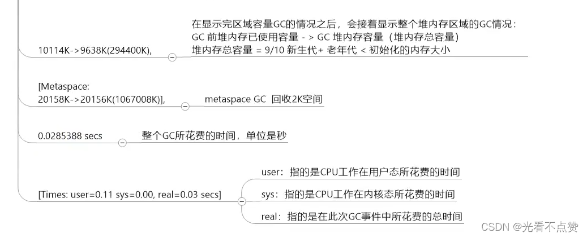
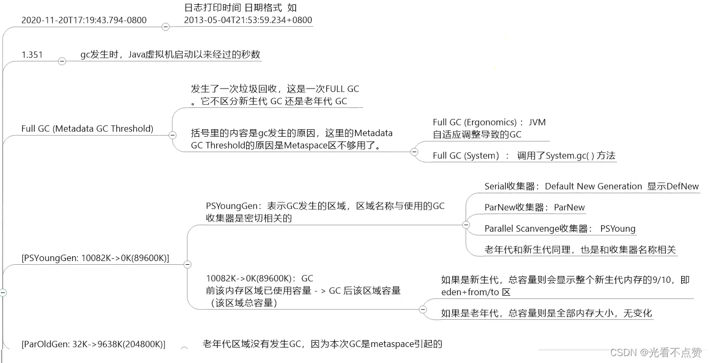
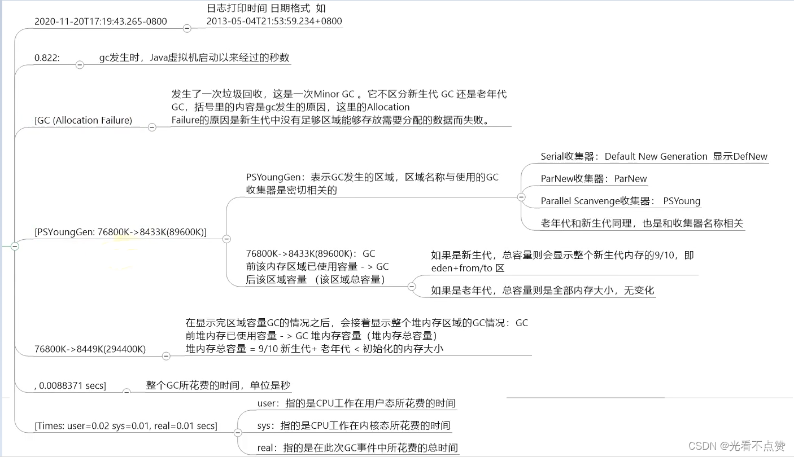

# JVM运行时参数与GC日志




## 概念卡
Q: JVM参数的三类选项（标准、-X、-XX）有什么不同？为什么-Xmx实际上属于-XX参数？
A:
- 标准参数（以-开头）：
  - 最稳定，跨JDK版本几乎不变，所有JVM实现都支持
  - 例如：-help, -version, -server, -client, -agentlib, -javaagent
  - 可通过java -help查看所有标准参数
- -X参数（非标准化参数）：
  - 功能相对稳定但官方声明后续版本可能变更
  - 例如：-Xint（纯解释执行）、-Xcomp（优先编译执行）、-Xmixed（混合模式，默认）
  - 可通过java -X查看所有-X参数
- -XX参数（实验性/非标准化参数，使用最多）：
  - 分Boolean类型（-XX:+/-<option>）和Key-Value类型（-XX:<option>=<value>）
  - 用于开发和调试JVM，可能在不同版本间变化
  - 例如：-XX:+UseG1GC、-XX:MaxGCPauseMillis=200
- -Xmx/-Xms/-Xss的本质：
  - 虽然以-X开头，但实际上等价于-XX参数：
    - -Xms = -XX:InitialHeapSize
    - -Xmx = -XX:MaxHeapSize
    - -Xss = -XX:ThreadStackSize
  - 这些是使用最频繁的参数，以-X简写形式方便记忆
- 查看参数值的命令：
  - -XX:+PrintFlagsInitial：查看所有参数的默认初始值
  - -XX:+PrintFlagsFinal：查看运行时的最终值（冒号标记=被修改过的值）
  - -XX:+PrintCommandLineFlags：查看用户手动设置和JVM自动设置的参数

## 概念卡
Q: 为什么生产环境中通常将-Xms和-Xmx设置为相同值？新生代的比例参数如何影响GC行为？
A:
- -Xms = -Xmx的原因：
  - 防止堆内存动态扩缩容的开销：JVM在运行时会根据内存压力扩缩堆大小，扩容需要重新计算堆分区比例（年轻代/老年代边界），缩容需要压缩整理内存，这些操作都需要额外的GC或STW
  - 避免GC性能波动：堆大小不稳定导致GC频率和停顿时间波动，使性能不可预测
  - 生产环境最佳实践：将-Xms和-Xmx设为相同值，配合-XX:+AlwaysPreTouch（启动时物理分配所有内存页，避免运行时按需分配的延迟抖动）
- 新生代比例参数：
  - -XX:NewRatio（默认2）：老年代:新生代 = 2:1，新生代占堆的1/3。调大新生代 → 减少Minor GC频率 → 但每次Minor GC时间变长，晋升到老年代的对象更少，减少Full GC风险
  - -XX:SurvivorRatio（默认8）：Eden:S0 = 8:1，即Eden:S0:S1 = 8:1:1
  - -XX:+UseAdaptiveSizePolicy（默认开启）：JVM自适应调整各区比例。如果显式设置了SurvivorRatio但不关闭此参数，实际比例可能不是8:1:1。必须同时显式设置-XX:SurvivorRatio和-XX:-UseAdaptiveSizePolicy才能精确控制
- JDK7之后的空间分配担保规则变化：
  - 无论-XX:HandlePromotionFailure设为true或false，规则统一为：只要老年代的连续空间大于新生代对象总大小或历次晋升的平均大小，就执行Minor GC，否则执行Full GC

## 概念卡
Q: 如何读懂GC日志？GC日志中user、sys、real三个时间的含义是什么？
A:
- GC日志的三个关键时间：
  - user（用户态CPU时间）：GC线程在用户态消耗的CPU总时间。多核并行GC时，这是所有GC线程的CPU时间之和
  - sys（内核态CPU时间）：GC线程在内核态的系统调用和等待事件消耗的CPU时间
  - real（墙上时钟时间）：从GC开始到结束的实际时钟时间。并行GC的real通常远小于user+sys（因为多个GC线程同时在多个核上工作）；如果real > user+sys，可能存在IO瓶颈或CPU资源不足
- 以典型的Minor GC日志为例：
  ```
  [GC (Allocation Failure) [PSYoungGen: 76800K->8433K(89600K)] 76800K->8449K(294400K), 0.0088371 secs]
  ```
  - 中括号内：新生代回收前占用 -> 回收后占用（新生代总大小）
  - 中括号外：整个堆回收前占用 -> 回收后占用（堆总大小）
  - 触发原因：Allocation Failure（Eden区分配失败，即满了）
- Full GC日志示例解析：
  ```
  [Full GC (Metadata GC Threshold) [PSYoungGen: 10082K->0K] [ParOldGen: 32K->9638K] 10114K->9638K, [Metaspace: 20158K->20156K], 0.0285388 secs]
  ```
  - 触发原因：Metadata GC Threshold（元空间达到GC阈值）
  - 可以看到各分区（YoungGen、OldGen、Metaspace）的占用变化
  - Full GC时间0.028秒（约28ms），比Minor GC的8ms长得多
- 不同收集器在GC日志中的标识：
  - Serial新生代: [DefNew
  - ParNew: [ParNew
  - Parallel Scavenge: [PSYoungGen
  - Parallel Old: [ParOldGen
  - G1: garbage-first heap
- 分析工具：GCeasy（在线，部分收费）、GCViewer（开源客户端）

## 机制卡
Q: Full GC的触发原因有哪些？如何通过参数配置来减少Full GC的频率？
A:
- Full GC的触发原因：
  1. 老年代空间不足：晋升的对象总大小超过老年代剩余连续空间
  2. 元空间（Metaspace）不足：类元数据溢出（JDK8后的常见原因）
  3. System.gc()显式调用：可被-XX:+DisableExplicitGC禁用
  4. CMS的Concurrent Mode Failure：CMS并发回收期间老年代被填满，退化为Serial Old单线程Full GC
  5. 空间分配担保失败：Minor GC前判断老年代剩余空间不足
  6. G1的Evacuation Failure：没有足够的to-space存放晋升对象
- 减少Full GC的参数配置策略：
  1. 合理设置堆大小：-Xms = -Xmx（避免动态伸缩），根据应用需求设置合适值
  2. 元空间设置：-XX:MetaspaceSize适当调大（减少因元空间扩容触发的Full GC），-XX:MaxMetaspaceSize设置上限防止无限增长
  3. 老年代GC阈值：CMS的-XX:CMSInitiatingOccupancyFraction适当降低（默认JDK6+为92%，如果内存增长快应降低），让CMS尽早开始回收
  4. 晋升阈值：-XX:MaxTenuringThreshold适当调大，让对象在Survivor多待几轮，减少提前晋升到老年代
  5. 大对象直接分配阈值：-XX:PretenureSizeThreshold设置合理值，避免短期大对象直接进入老年代
  6. 禁用显式GC：-XX:+DisableExplicitGC（但注意依赖System.gc()的框架如RMI可能会有问题）
  7. OOM自动dump：-XX:+HeapDumpOnOutOfMemoryError -XX:HeapDumpPath=/path/to/dump，便于事后分析
- Full GC频繁是系统需要调优的明确信号，不应通过参数"硬撑"，而应从代码层面排查内存泄漏和对象生命周期问题

## 机制卡
Q: JDK8默认使用Parallel Scavenge + Parallel Old组合，JDK9起默认使用G1。这个变化背后的技术考量是什么？
A:
- JDK8默认Parallel收集器的考量（吞吐量优先）：
  - 时代背景：JDK8发布于2014年，当时服务器以多核但内存不算特别大为典型配置，批处理、后台计算场景常见
  - Parallel收集器通过多线程并行回收+自适应调节策略，在固定内存下最大化吞吐量
  - CMS虽然低延迟但碎片和浮动垃圾问题显著，不适合做默认
  - G1在JDK7加入但标记为Experimental，还不够成熟
- JDK9默认G1的考量（延迟可控）：
  - 时代变化：服务器内存越来越大（几十GB甚至上百GB堆），CPU核数越来越多。大堆下CMS和Parallel的Full GC STW时间可能达到几十秒，完全不可接受
  - G1的Region-based设计天然适合大堆——通过增量式回收将停顿时间控制在目标范围内（默认200ms），在大堆下也能保持稳定的响应时间
  - 互联网/微服务架构的主流化——应用更关注响应延迟而非纯吞吐量，G1的低延迟特性更贴合需求
  - G1经过JDK7/8多个版本的打磨已经成熟稳定
- 演进路线：Serial（JDK1.3前默认） -> Parallel（JDK5-8默认） -> G1（JDK9+默认） -> ZGC（未来趋势，JDK15 production-ready，JDK21支持分代）
- 默认GC的变化反映了硬件演进（内存从MB到GB再到TB、核数从单核到数十核）和架构演进（从单体到微服务、从批处理到实时交互）的趋势
