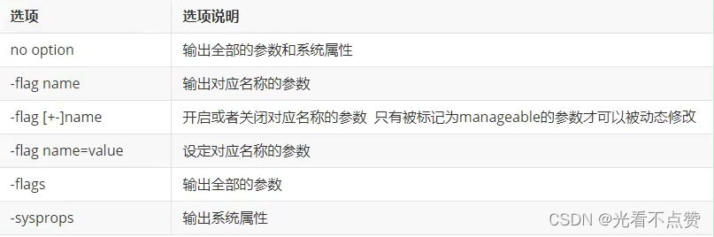
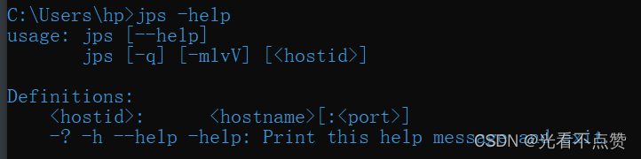
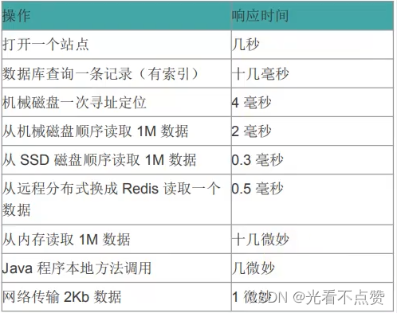

# 性能监控与调优

## 概念卡
Q: jstat如何判断是否存在内存泄漏？其底层原理是什么？
A:
- jstat（JVM Statistics Monitoring Tool）通过两步判断内存泄漏：
  1. 在长时间运行的Java程序中，连续获取多行性能数据（如每1000ms采样一次），取OU列（老年代已占用内存）的最小值作为基准
  2. 每隔一段较长的时间重复上述操作，获得多组OU最小值。如果这些值呈持续上涨趋势，说明老年代内存使用量在不可逆增长——即无法回收的对象在不断增加，很可能存在内存泄漏
- 判断标准（通过-t参数）：比较Java进程启动时间和总GC时间（GCT列）。如果GC时间占运行时间比例超过20%，说明堆压力较大；超过90%，说明堆几乎没有可用空间，随时可能OOM
- 底层原理：
  - jstat是HotSpot内置的性能统计工具，它通过PerfData（性能计数器共享内存）获取数据，不需要STW就能读取
  - 不同于jmap（需要借助安全点、扫描所有对象），jstat读取的摘要数据由GC主动维护在固定内存位置，jstat只需直接读取，对应用几乎无性能影响
  - 这也是为什么jstat是"运行期定位虚拟机性能问题的首选工具"——无侵入、低成本、可持续监控
- 关键指标解读：
  - S0C/S1C：Survivor区容量；S0U/S1U：Survivor区使用量
  - EC：Eden容量；EU：Eden使用量
  - OC：老年代容量；OU：老年代使用量（最重要的泄漏指标）
  - MC/MU：元空间容量/使用量
  - YGC/YGCT：Young GC次数/总耗时
  - FGC/FGCT：Full GC次数/总耗时
  - GCT：GC总耗时

## 概念卡
Q: jmap导出dump文件时为什么要借助安全点？这对分析结果有什么影响？
A:
- jmap需要安全点的原因：
  - jmap的dump操作需要遍历堆中所有对象，记录它们的类型、大小和引用关系。这个过程中堆中的对象和引用关系必须保持不变，否则生成的dump文件数据不一致
  - 为了保证一致性，jmap需要让所有线程停在安全点（Safepoint），此时堆中数据是静态的快照
  - jstat不同——它读取的是GC线程主动维护在固定位置的摘要统计数据，不需要遍历整个堆，因此不需要STW
- 对分析结果的偏差影响：
  1. 快照时间点偏差：dump文件记录的是安全点时刻的堆状态，但安全点之间的对象生命周期（创建和死亡）无法反映——那些在两个安全点之间创建又死亡的对象完全不会被记录
  2. 引用关系偏差：某些引用关系只在特定代码路径中短暂存在，如果安全点恰好不在这段代码中，dump文件无法体现这些临时引用
  3. 线程长时间无法到达安全点时：jmap会一直等待，看起来像"卡住"。这通常发生在可数循环（int索引循环）中，因为JVM不在循环内部放置安全点
- 最佳实践：
  - 使用-XX:+HeapDumpOnOutOfMemoryError自动dump OOM时刻的堆快照，而不是手动jmap（手动时机可能不准确）
  - 多次dump对比分析，而非依赖单次快照
  - 配合jstat持续监控观察趋势，jmap单点分析定位具体对象
  - JDK9+官方推荐使用jcmd代替jmap（jcmd是更全面的命令行工具）

## 概念卡
Q: jstack在什么场景下使用？线程快照中哪些状态是需要重点关注的？
A:
- jstack使用场景：
  1. 线程死锁定位：两个或多个线程相互等待对方持有的锁，应用"卡死"但CPU不高
  2. 死循环排查：某个线程CPU占用100%但应用无响应
  3. 外部资源等待：线程长时间阻塞在数据库连接、网络IO、锁等待等操作上
  4. 线程池满排查：大量线程处于WAITING/BLOCKED状态
- 线程快照中的关键状态：
  1. Deadlock（死锁）——最高优先级，必须立即解决。jstack会自动检测并输出死锁信息
  2. Waiting on condition（等待条件）——线程在等待某个条件满足（如Object.wait()、LockSupport.park()）。大量线程处于此状态可能表示资源不足或线程池配置不当
  3. Waiting on monitor entry（等待获取监视器）——线程在等待进入synchronized代码块/方法。大量线程聚集在同一个锁上说明锁竞争激烈
  4. Blocked（阻塞）——线程被阻塞，等待获取锁。与Waiting on monitor entry类似但锁定更严格
  5. Runnable（执行中）——正常执行状态
  6. Suspended（暂停）——线程被挂起
- 实用技巧：
  - 出现死锁时，jstack输出末尾会直接显示"Found one Java-level deadlock:"及详细信息，包括死锁线程名、持有的锁、等待的锁
  - 对于CPU高占用问题：先用top -Hp pid找到CPU最高的线程ID，转化为16进制，在jstack输出中搜索该nid（native thread ID）
  - jstack -l 可以显示锁的附加信息，包括拥有的锁和等待的锁的地址
- 与jcmd的关系：jcmd pid Thread.print 可以输出与jstack相同的线程信息。官方推荐使用更统一的jcmd工具

## 概念卡
Q: MAT中浅堆（Shallow Heap）、深堆（Retained Heap）、保留集（Retained Set）的区别是什么？如何利用支配树分析内存泄漏？
A:
- 浅堆（Shallow Heap）：对象自身占用的内存。以32位HotSpot为例（具体值与JVM实现有关）：对象头8字节 + 实例数据 + 对齐填充（8字节对齐）。String的浅堆通常包含：int hash(4B)、byte[]引用(4B, 压缩后)等，不包括value数组的内容
- 保留集（Retained Set）：当对象A被GC回收后，可以被释放的所有对象的集合（包括A自身）。通俗地说，保留集是"仅被A直接或间接持有的所有对象"——如果某个对象除了被A引用外还被其他对象引用，则不在A的保留集中
- 深堆（Retained Heap）：保留集中所有对象的浅堆之和。这个指标比浅堆更有意义——它告诉你在保留该对象的情况下"锁定了"多少内存。例如HashMap的Entry浅堆可能只有几十字节，但它的深堆可能包含整个value对象（如果value仅被这个Entry引用）
- 支配树（Dominator Tree）：
  - 概念：如果所有指向对象B的引用路径都经过对象A，则A支配B。支配树将这种支配关系可视化为树状结构
  - 分析内存泄漏的核心方法：在dominator tree中从根向下查找占比最大的子树，定位"谁持有最多无法回收的内存"
  - 支配树与引用图不同：支配树中A->B表示A支配B（不是直接引用关系），而是"A阻止了B被回收"
- MAT分析内存泄漏的典型流程：
  1. 打开dump文件，查看Histogram（按类统计实例数和内存占用）
  2. 对占用异常的类做"List objects -> with outgoing references"查看引用链
  3. 或做"Merge Shortest Paths to GC Roots"排除软/弱/虚引用，查看强引用路径（因为只有强引用才阻止GC）
  4. 在Dominator Tree中找到占比最大的对象，分析它持有的Retained Set
  5. 追溯源码定位持有该对象的逻辑，确定是正常缓存还是内存泄漏

## 机制卡
Q: Java中8种常见内存泄漏场景的根因是什么？如何防止？
A:
- 核心原理：可达性分析认为对象被引用就是"活的"，但程序逻辑上已不再需要这些对象。JVM无法区分"程序需要"和"程序已经不需要"这两种引用状态
- 8种泄漏场景及根因：
  1. 静态集合类（static HashMap/ArrayList）：静态字段生命周期=JVM生命周期，容器中存储的对象永远不会被回收。应使用WeakHashMap或在合适时机清空
  2. 单例模式：单例生命周期随JVM，如果持有外部对象引用且不释放，外部对象也不能回收。应使用弱引用或提供clear/release方法
  3. 内部类持有外部类：非静态内部类隐式持有外部类的this引用。如果内部类实例被长期持有（如作为回调注册），外部类也无法回收。应使用静态内部类替代（或显式使用WeakReference持有外部引用）
  4. 未关闭的资源（数据库连接、IO流、网络连接）：这些连接底层使用native资源，如果未显式close()，GC无法释放native内存。应使用try-with-resources语
  5. 变量不合理作用域：变量定义为成员变量但应作为局部变量，导致生命周期延长。应将变量作用域最小化
  6. 改变哈希值：存入HashSet/HashMap后修改参与hashCode计算的字段，导致元素"丢失"（无法定位也无法删除）。应使用不可变对象作为key，或存入后不修改关键字段。这也是String设计为不可变的核心原因之一
  7. 缓存泄漏：将数据放入缓存后忘记清理。应使用WeakHashMap（GC时自动清理）、或设置缓存的过期时间和最大容量（如Caffeine/Guava Cache）
  8. 监听器和回调：注册回调后未取消注册，导致回调对象及关联的外部对象无法回收。应将回调存为弱引用，或提供显式的unregister机制
- 排查工具链：jstat观察内存趋势（OU持续上升） -> jmap dump堆快照 -> MAT分析支配树定位泄漏根因 -> 修复代码 -> jstat验证修复效果
