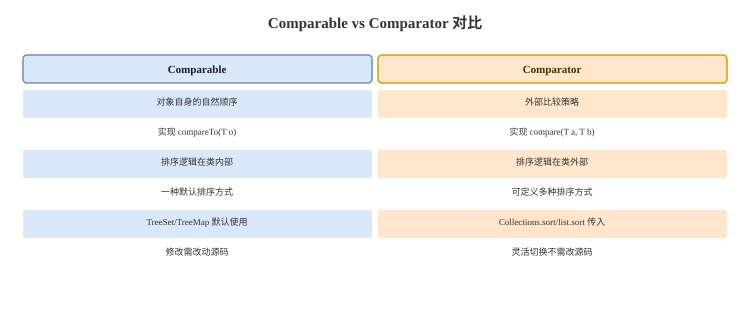

# Comparable 与迭代器

## Comparable 卡
Q: Comparable 和 Comparator 有什么区别？
A:
- Comparable 是对象自身的自然顺序，类实现 compareTo
- Comparator 是外部比较策略，可以为同一类定义多种排序方式
- TreeMap/TreeSet/PriorityQueue 都依赖比较结果组织元素
- compare 返回 0 通常表示排序意义上的相等，TreeSet/TreeMap 会据此判断重复 key
- 面试建议：自然顺序稳定且唯一时用 Comparable，多场景排序用 Comparator

## 比较器契约卡
Q: 编写 Comparator 时要遵守哪些契约？
A:
- 自反性：对象和自己比较应为 0
- 反对称性：a > b 则 b < a
- 传递性：a > b 且 b > c，则 a > c
- 与 equals 一致不是强制要求，但不一致会让有序集合语义变得反直觉
- 不要用 `return a - b` 比较整数，可能溢出，应使用 Integer.compare

## Iterator 卡
Q: Iterator 的 fail-fast 机制是什么？
A:
- ArrayList、HashMap 等集合迭代器会记录 expectedModCount
- 集合结构性修改会改变 modCount
- 迭代过程中发现 modCount != expectedModCount，就抛 ConcurrentModificationException
- fail-fast 是尽早暴露并发或非法修改问题，不是线程安全保证
- 使用 Iterator.remove 可以同步更新 expectedModCount，是迭代中删除当前元素的正确方式

## 增强 for 卡
Q: 增强 for 的本质是什么？为什么遍历时直接 remove 会出问题？
A:
- 增强 for 对 Iterable 本质上会被编译成 Iterator 遍历
- 遍历中直接调用集合 remove 会修改 modCount，但迭代器 expectedModCount 未更新
- 下一次迭代检查时可能抛 ConcurrentModificationException
- 正确删除方式是显式使用 Iterator 并调用 iterator.remove
- 对 CopyOnWriteArrayList 这类集合，迭代基于快照，删除语义又不同，要结合具体集合判断

## fail-safe 卡
Q: fail-fast 和 fail-safe/弱一致迭代有什么区别？
A:
- fail-fast 迭代器检测到结构性并发修改后尽快抛异常，例如 ArrayList、HashMap
- CopyOnWriteArrayList 迭代基于创建迭代器时的数组快照，不会抛 CME，但看不到之后修改
- ConcurrentHashMap 迭代器是弱一致的，不抛 CME，可能看到部分并发更新
- fail-safe 不是官方统一术语，面试更严谨说法是快照迭代或弱一致迭代
- 选择取决于需求：快速失败、快照稳定、还是并发可继续遍历

## 正确性审查卡
Q: Comparable/Iterator 有哪些常见误区？
A:
- “Comparator 返回 0 只影响排序不影响去重”：错误。TreeSet/TreeMap 会把 compare 为 0 当作重复
- “a - b 写比较器没问题”：错误。整数溢出会导致排序错误
- “ConcurrentModificationException 说明集合线程安全”：错误。它只是 fail-fast 检测，不是同步机制
- “增强 for 可以随便 remove”：错误。多数普通集合会触发 fail-fast
- “ConcurrentHashMap 遍历是强一致快照”：错误。它是弱一致遍历
