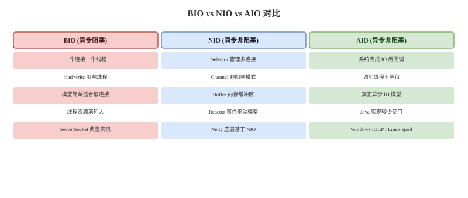

# IO 与 NIO 基础

## BIO/NIO/AIO 卡
Q: BIO、NIO、AIO 的核心区别是什么？
A:
- BIO 是同步阻塞 IO，一个连接通常对应一个线程，read/write 会阻塞线程
- NIO 是同步非阻塞 IO，Channel 可设置非阻塞，配合 Selector 用少量线程管理大量连接
- AIO 是异步 IO，请求发起后由系统完成并通过回调/通知返回结果
- Java 后端主流高性能网络框架如 Netty 基于 NIO/Reactor 模型，而不是为每个连接创建线程
- 面试表达：BIO/NIO/AIO 的区别要从“调用线程是否阻塞”和“谁负责等待 IO 就绪/完成”来讲

## Buffer/Channel 卡
Q: NIO 中 Buffer 和 Channel 分别承担什么角色？
A:
- Channel 表示数据通道，可以从文件、Socket 等源读写数据
- Buffer 是内存缓冲区，NIO 读写都围绕 Buffer 进行
- Buffer 核心指针：capacity 容量、position 当前读写位置、limit 当前可读写边界
- 写入 Buffer 后要 flip 切换为读模式；读完后 clear 或 compact 切换回写模式
- 面试高频坑：忘记 flip 会导致读不到刚写入的数据

## Selector 卡
Q: Selector 如何让一个线程管理多个连接？
A:
- Channel 设置为非阻塞后注册到 Selector，并声明关注 OP_ACCEPT、OP_READ、OP_WRITE 等事件
- Selector.select 阻塞等待至少一个 Channel 就绪
- 线程遍历 selectedKeys，根据事件类型处理 accept/read/write
- 处理完成后要移除 selected key，避免重复处理
- Reactor 模型就是围绕事件分发和非阻塞处理构建，高并发连接下比一连接一线程更节省资源

## 零拷贝卡
Q: 什么是零拷贝？Java 中常见零拷贝 API 有哪些？
A:
- 传统文件发送可能经历磁盘到内核缓冲区、内核到用户缓冲区、用户到 socket 缓冲区、socket 到网卡等多次拷贝
- 零拷贝目标是减少用户态和内核态之间的数据拷贝与上下文切换
- Java 中 FileChannel.transferTo/transferFrom 可以利用操作系统 sendfile 等能力
- MappedByteBuffer 使用内存映射文件，把文件内容映射到进程地址空间
- 面试边界：零拷贝不是完全没有拷贝，而是减少不必要的 CPU 拷贝和用户态参与

## 文件 IO 卡
Q: 字节流、字符流、缓冲流应该如何选择？
A:
- 字节流处理原始二进制数据，例如图片、压缩包、网络协议
- 字符流处理文本数据，需要明确字符编码，例如 UTF-8
- BufferedInputStream/BufferedReader 通过减少系统调用和底层读取次数提升性能
- 文本读写必须显式考虑编码，避免依赖平台默认编码造成乱码
- 大文件处理要流式读取，避免一次性读入内存导致 OOM

## 正确性审查卡
Q: IO/NIO 有哪些常见误区？
A:
- “NIO 一定比 BIO 快”：不一定。低连接数、简单阻塞模型下 BIO 更简单，NIO 优势在大量连接和事件驱动
- “非阻塞等于异步”：错误。NIO 通常仍是同步 IO，只是等待就绪不阻塞业务线程
- “零拷贝完全没有数据复制”：不严谨。它减少用户态拷贝，不代表硬件和内核内部没有任何复制
- “Buffer clear 会清空数组内容”：错误。clear 主要重置 position/limit，旧数据仍可能在内存中
- “字符流不用管编码”：错误。跨平台文本处理必须显式编码
