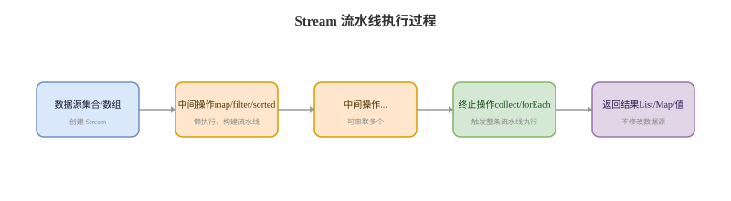

# Lambda Stream 与 Optional

## Lambda 卡
Q: Lambda 表达式的本质是什么？什么是函数式接口？
A:
- Lambda 是把行为作为值传递的语法形式，目标类型必须是函数式接口
- 函数式接口只有一个抽象方法，可以用 @FunctionalInterface 标注让编译器检查
- 常见函数式接口：Function、Consumer、Supplier、Predicate、Runnable、Callable
- Lambda 可以捕获局部变量，但变量必须是 final 或 effectively final
- 面试边界：Lambda 不是任意代码块，它必须依附明确的目标函数式接口类型

## Stream 执行卡
Q: Stream 的中间操作和终止操作有什么区别？
A:
- 中间操作如 map、filter、sorted、peek 返回新的 Stream，通常是懒执行
- 终止操作如 collect、forEach、reduce、count、anyMatch 会触发整条流水线执行
- 短路操作如 findFirst、anyMatch、limit 可能提前结束遍历
- Stream 不存储数据，它只是对数据源的一次计算流水线
- 面试坑：只写 map/filter 没有终止操作，逻辑不会真正执行

## Stream 使用卡
Q: Stream 使用中有哪些性能和可读性边界？
A:
- 简单集合转换、过滤、聚合适合 Stream，能提高表达力
- 复杂分支、异常处理、多步可变状态逻辑，强行 Stream 可能降低可读性
- boxed/unboxed 频繁装箱拆箱会影响性能，可优先使用 IntStream、LongStream
- 大集合链式操作要注意中间对象、排序、distinct 等有状态操作成本
- 面试表达：Stream 是表达数据处理管道的工具，不是替代所有 for 循环

## 并行流卡
Q: parallelStream 为什么不能随便用？
A:
- parallelStream 默认使用 ForkJoinPool.commonPool，可能和其他并行任务争抢公共线程池
- 适合 CPU 密集、数据量较大、任务可拆分、无共享可变状态的场景
- IO 阻塞任务使用并行流可能拖垮 commonPool
- 有共享集合写入、非线程安全累加器、副作用操作时容易出现并发问题
- 面试建议：生产并行任务更倾向显式线程池、CompletableFuture 或专用框架，而不是随手 parallelStream

## Optional 卡
Q: Optional 的设计目的和使用边界是什么？
A:
- Optional 用于明确表达“结果可能不存在”，减少返回值 null 判断遗漏
- 适合作为方法返回值，不适合作为实体字段、DTO 字段或方法参数滥用
- orElse 会立即计算默认值，orElseGet 是懒加载 supplier
- Optional.get 前应先判断或使用 orElse/orElseThrow/map/flatMap 等组合方法
- 面试表达：Optional 是 API 语义工具，不是消灭所有 null 的银弹

## 正确性审查卡
Q: Lambda/Stream/Optional 有哪些常见误区？
A:
- “Stream 一定比 for 循环快”：错误。Stream 主要提升表达力，性能要看场景
- “parallelStream 一定更快”：错误。小数据量、IO 阻塞、共享状态都会让它更慢更危险
- “peek 适合写业务逻辑”：不推荐。peek 主要用于调试，业务副作用会破坏可读性
- “Optional 可以作为所有字段类型”：不推荐。它主要用于返回值语义
- “orElse 和 orElseGet 一样”：错误。orElse 参数会提前求值，orElseGet 懒执行
