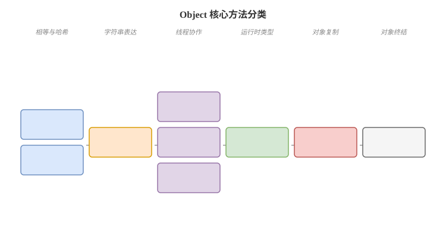

# Object 与基础语义

## Object 方法卡
Q: Object 类有哪些核心方法？面试时应该如何按语义分类？
A:
- 对象相等与哈希：equals、hashCode，决定对象在集合和业务比较中的相等性语义
- 对象字符串表达：toString，主要用于日志、调试和可观测性
- 线程协作：wait、notify、notifyAll，必须在持有对象 monitor 的 synchronized 块/方法中调用
- 运行期类型：getClass，返回对象实际运行时 Class
- 对象复制：clone，浅拷贝语义且设计历史包袱较重，现代代码更推荐拷贝构造器或静态工厂
- 对象终结：finalize 已废弃，不应依赖它释放资源

## 不可变对象卡
Q: 什么是不可变对象？为什么后端工程中常强调不可变性？
A:
- 不可变对象创建后状态不再变化，所有字段通常 private final，且不暴露可变内部对象引用
- 线程安全：多个线程共享不可变对象不需要同步
- 哈希稳定：适合作为 HashMap key，避免字段变化后 get/remove 失败
- 简化推理：方法调用不会暗中修改对象状态，更适合值对象、配置对象、DTO 快照
- 防御性拷贝：构造器和 getter 遇到 List、Date、数组等可变对象时要复制，防止外部修改内部状态

## clone 卡
Q: Java clone 有什么问题？为什么更推荐拷贝构造器或工厂方法？
A:
- clone 默认是浅拷贝，对象内部引用字段仍指向同一对象，容易共享可变状态
- 要使用 clone 通常还要实现 Cloneable，否则 Object#clone 会抛 CloneNotSupportedException
- Cloneable 是标记接口，没有声明 clone 方法，API 设计不直观
- final 字段、继承层级、深拷贝和异常处理都会让 clone 变复杂
- 现代实践更推荐拷贝构造器、静态 copyOf/from 方法，语义清晰且更容易控制深浅拷贝

## finalize 卡
Q: 为什么 finalize 不适合用来释放资源？
A:
- finalize 执行时机不确定，依赖 GC 触发，不能保证资源及时释放
- finalize 可能导致对象复活，让生命周期更难推理
- finalizer 线程执行慢会拖累回收，甚至造成资源堆积
- 现代 JDK 已经废弃 finalize，推荐 try-with-resources、AutoCloseable、Cleaner 或显式 close
- 面试表达：资源释放要由业务生命周期控制，不能交给 GC 的不确定回调

## wait/notify 卡
Q: wait/notify 和 sleep 的区别是什么？
A:
- wait 是 Object 方法，必须在 synchronized 内调用，会释放当前对象 monitor
- sleep 是 Thread 静态方法，不需要持有锁，也不会释放已持有的锁
- wait 通常配合条件循环使用：`while (!condition) lock.wait()`，防止虚假唤醒
- notify 只唤醒一个等待线程，notifyAll 唤醒全部等待线程，具体谁获得锁还要重新竞争 monitor
- 生产中更推荐使用 Lock/Condition、BlockingQueue、CountDownLatch 等更明确的并发工具

## 正确性审查卡
Q: Object 基础语义有哪些常见错误说法？
A:
- “final 字段就一定不可变”：不完整。final 引用不能换，但引用对象内部仍可能可变
- “clone 是深拷贝”：错误。Object#clone 默认浅拷贝
- “finalize 一定会执行”：错误。执行时机和是否执行都不能作为业务保证
- “wait 和 sleep 都会释放锁”：错误。wait 释放 monitor，sleep 不释放锁
- “不可变对象只是为了线程安全”：不完整。它还提升哈希稳定性、缓存安全和代码可推理性
