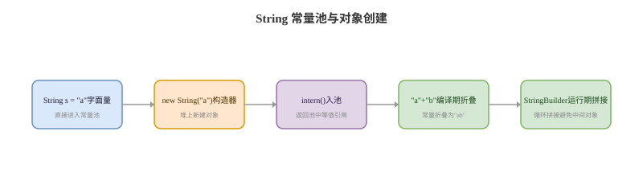

# String 与包装类

## String 卡
Q: String 为什么设计成不可变？不可变带来哪些收益？
A:
- String 内部值不可变，任何拼接、替换、截取都会产生新对象或复用已有不可变对象
- 安全性：字符串常用于类名、文件路径、网络地址、数据库参数，不可变能避免被引用方偷偷修改
- 线程安全：多个线程共享同一个 String 不需要额外同步
- 哈希缓存：String 可缓存 hash 值，适合作为 HashMap key
- 字符串常量池：不可变是常量池复用的前提，否则多个引用共享同一字符串会互相影响

## 常量池卡
Q: String s = "a" 和 new String("a") 有什么区别？
A:
- `"a"` 是字符串字面量，会进入字符串常量池，多个相同字面量可复用同一个对象引用
- `new String("a")` 会在堆上创建新的 String 对象，内容引用或复制自字面量对应的数据
- `==` 比较引用地址，equals 比较字符串内容
- intern() 会尝试返回常量池中等值字符串的引用；如果池中没有，则把当前字符串的规范表示放入池中
- 面试不要只背“一个对象/两个对象”，要结合编译期常量折叠、运行期拼接和 JDK 版本实现差异说明

## 拼接卡
Q: String 拼接在编译期和运行期分别如何优化？
A:
- 编译期常量拼接，例如 `"a" + "b"`，编译器可直接折叠成 `"ab"`
- 包含变量的拼接在早期 JDK 通常会编译成 StringBuilder append
- JDK9 之后字符串拼接主要通过 invokedynamic 和 StringConcatFactory 生成更灵活的拼接策略
- 循环中大量拼接仍应优先使用 StringBuilder，避免产生过多中间对象
- 多线程共享可变拼接对象时才考虑 StringBuffer；普通局部变量 StringBuilder 更常用

## 包装类卡
Q: Integer 缓存和自动装箱有哪些面试坑？
A:
- Integer.valueOf 默认缓存 -128 到 127 范围内的对象，因此这个范围内自动装箱可能返回同一引用
- `new Integer(...)` 每次创建新对象，但该构造方式在现代 JDK 中已不推荐
- `Integer a = 128; Integer b = 128; a == b` 通常为 false，因为超出默认缓存范围
- 包装类比较数值应使用 equals 或拆箱后比较，避免 `==` 引用比较陷阱
- 自动拆箱遇到 null 会抛 NullPointerException，这是线上常见低级错误

## 正确性审查卡
Q: String 和包装类有哪些常见错误说法？
A:
- “String 拼接一定很慢”：不严谨。少量常量拼接会被编译器优化，循环拼接才需要重点关注
- “intern 一定能省内存”：不一定。过度 intern 会增加常量池压力，适合重复率高且生命周期可控的字符串
- “Integer 之间都能用 == 比较”：错误。缓存范围外比较的是引用
- “StringBuilder 线程不安全所以不能用”：不严谨。方法内局部使用没有共享，不存在并发问题
- “String 不可变表示内部数组绝不共享”：不应这样表述。不同 JDK 对底层存储有实现演进，面试重点是语义不可变
