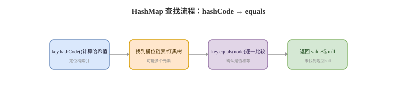

# equals 与 hashCode

## 契约卡
Q: equals 和 hashCode 的契约是什么？
A:
- equals 相等的两个对象，hashCode 必须相等
- hashCode 相等的两个对象，equals 不一定相等，因为哈希冲突允许存在
- equals 要满足自反性、对称性、传递性、一致性，以及与 null 比较返回 false
- hashCode 在对象参与哈希集合期间应保持稳定
- 面试一句话：hashCode 用于快速定位桶，equals 用于冲突后确认对象是否真的相等

## HashMap 卡
Q: 为什么重写 equals 必须重写 hashCode？
A:
- HashMap/HashSet 先用 hashCode 定位桶，再在桶内用 equals 判断是否相同
- 如果两个业务相等对象 equals 返回 true，但 hashCode 不同，它们会落到不同桶，集合会认为是两个对象
- 结果是 HashSet 去重失败、HashMap get 不到刚 put 的 key
- IDE 自动生成时要确保 equals 使用的关键字段和 hashCode 使用字段一致
- 面试建议：用不可变字段作为 key 的相等依据，避免对象放入集合后字段变化

## 可变 Key 卡
Q: 为什么不建议用可变对象作为 HashMap 的 key？
A:
- HashMap 存储时根据 key 的 hash 定位桶
- 如果 key 放入后修改了参与 hashCode/equals 的字段，后续 get 会用新 hash 找新桶
- 原对象仍在旧桶里，导致 get/remove 失败，看起来像“丢了”
- 这种问题很隐蔽，尤其是 Lombok @Data 把所有字段都纳入 equals/hashCode 时
- 建议 key 使用 String、Integer、枚举、不可变值对象等稳定对象

## Comparator 卡
Q: equals/hashCode 和 Comparable/Comparator 的关系是什么？
A:
- HashMap/HashSet 主要依赖 hashCode + equals
- TreeMap/TreeSet 主要依赖 compareTo/Comparator 的比较结果
- 在 TreeSet 中，compare 返回 0 就会被认为重复，即使 equals 返回 false
- 最好让 compareTo 与 equals 保持一致，否则集合语义容易让人困惑
- 面试注意：不同集合判断“重复”的规则不同，回答时要先说具体集合类型

## Lombok 卡
Q: Lombok 生成 equals/hashCode 有哪些风险？
A:
- @Data 默认会生成 equals/hashCode，可能把可变字段也纳入相等性判断
- 继承场景如果没有正确设置 callSuper，父类字段可能被遗漏或重复处理
- JPA Entity 使用数据库 id 做 equals/hashCode 时，要考虑 id 生成前后的变化
- 包含集合字段、双向关联字段时，equals/hashCode 可能触发递归或性能问题
- 面试建议：值对象适合自动生成，实体对象和继承层次要谨慎手写或显式配置

## 正确性审查卡
Q: equals/hashCode 有哪些常见误区？
A:
- “hashCode 相等说明对象相等”：错误。哈希冲突很正常
- “只重写 equals 也能用”：在普通比较中可能能用，但放进哈希集合会出问题
- “HashMap get 不到一定是 HashMap bug”：很多时候是 key 被修改或 equals/hashCode 契约破坏
- “TreeSet 也靠 hashCode 去重”：错误。TreeSet 靠比较器结果
- “所有字段都纳入 equals/hashCode 最安全”：不一定。可变字段、派生字段和关联字段可能带来更大风险
