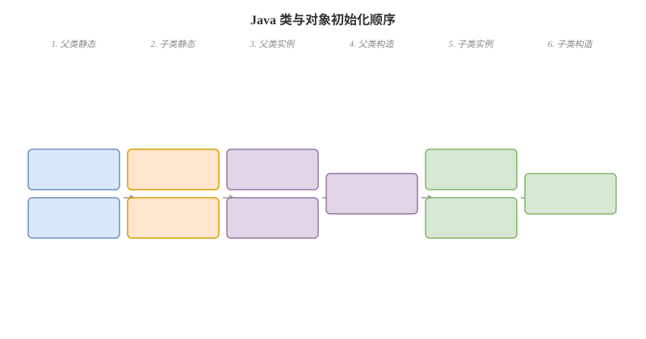

# final static 与初始化顺序

## final 卡
Q: final 修饰变量、方法、类分别表示什么？
A:
- final 变量：只能赋值一次；基本类型值不可变，引用类型引用不可变但对象内部状态可能可变
- final 方法：不能被子类重写，但可以被重载
- final 类：不能被继承，例如 String、Integer
- final 字段有安全发布语义：构造完成后，其他线程看到对象引用时更容易正确看到 final 字段初始化值
- 面试边界：final 不是线程安全万能药，多个可变字段的不变式仍需同步保护

## static 卡
Q: static 修饰成员的语义是什么？它和对象实例有什么关系？
A:
- static 字段属于类，被该 Class 对应的所有实例共享
- static 方法属于类方法，不能直接访问实例字段和实例方法，因为没有隐式 this
- static 初始化在类初始化阶段执行，而不是每次 new 对象执行
- static final 编译期常量可能被调用方内联，修改常量值后只重新编译定义类可能导致旧值残留
- 面试提醒：static 共享状态在并发下要特别小心，容易变成全局可变变量

## 初始化顺序卡
Q: Java 类和对象的初始化顺序是什么？
A:
- 类加载后，首次主动使用会触发类初始化，先初始化父类，再初始化子类
- 同一个类中，静态字段赋值和静态代码块按源码顺序执行
- 创建对象时，先分配内存并给字段默认零值，再执行父类实例初始化和构造器
- 子类实例字段赋值、实例代码块按源码顺序执行，最后执行子类构造器体
- 总顺序可记为：父类静态 -> 子类静态 -> 父类实例 -> 父类构造 -> 子类实例 -> 子类构造

## 内部类卡
Q: 成员内部类、静态内部类、匿名内部类有什么区别？
A:
- 成员内部类持有外部类实例引用，可以访问外部类实例成员，但也可能导致外部类无法释放
- 静态内部类不持有外部类实例引用，更像命名空间内的普通类
- 匿名内部类适合一次性实现接口或抽象类，但过长会降低可读性
- 局部内部类/匿名内部类访问局部变量时，变量必须是 final 或 effectively final
- 静态内部类常用于单例 holder 模式，依赖类加载初始化的线程安全

## Lambda 对比卡
Q: Lambda 和匿名内部类有什么关键区别？
A:
- Lambda 只能用于函数式接口，匿名内部类可以继承类或实现接口
- Lambda 不引入新的 this，Lambda 中的 this 指向外围实例；匿名内部类中的 this 指向匿名对象自身
- Lambda 更偏行为表达，编译实现通常通过 invokedynamic 和运行时生成策略完成
- 两者捕获局部变量都要求变量 final 或 effectively final
- 面试注意：Lambda 不是匿名内部类的简单语法糖，在 this、字节码实现和适用范围上都有差异

## 正确性审查卡
Q: final/static/初始化顺序有哪些常见坑？
A:
- “static 字段每个对象一份”：错误。static 属于类，实例共享
- “final 引用指向的对象不能变”：错误。引用不能换，对象内部状态仍可变
- “子类静态初始化先于父类”：错误。父类先初始化
- “构造器执行前字段没有值”：不准确。内存分配后字段先有默认零值，再执行显式初始化
- “Lambda 里的 this 指向 Lambda 对象”：错误。Lambda 不创建这种语义上的 this
