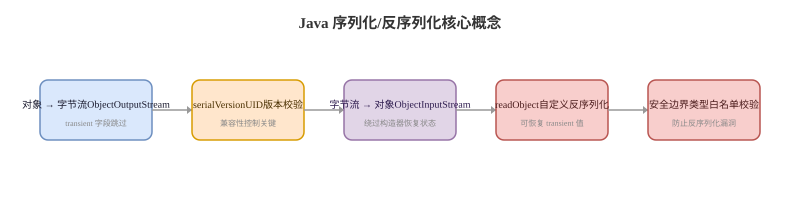

# 序列化与反序列化

## 概念卡
Q: 序列化解决什么问题？Java Serializable 的基本机制是什么？
A:
- 序列化把对象状态转换成字节流，便于网络传输、磁盘保存、缓存或深拷贝
- Java 原生 Serializable 是标记接口，对象图中可序列化字段会被写入流
- transient 字段不会参与默认序列化，static 字段属于类也不会作为对象状态序列化
- 反序列化会绕过普通构造流程恢复对象状态，因此要特别注意不变量和安全边界
- 面试表达：序列化是对象状态跨进程/跨时间传递的机制，不等于简单 JSON 转字符串

## serialVersionUID 卡
Q: serialVersionUID 有什么作用？不写会怎样？
A:
- serialVersionUID 用于校验序列化流和当前类版本是否兼容
- 如果不显式声明，JVM 会根据类结构计算默认值
- 类字段、方法、访问修饰符变化都可能导致默认值变化，旧数据反序列化失败
- 显式声明可以让兼容性由开发者控制
- 面试建议：需要长期存储或跨服务传输的 Serializable 类，应显式声明 serialVersionUID

## JSON 卡
Q: JSON 序列化和 Java 原生序列化有什么区别？
A:
- JSON 是文本格式，可读性和跨语言能力强，常用于 HTTP API、配置和日志
- Java 原生序列化是 Java 专属二进制格式，跨语言差，历史上安全问题较多
- JSON 反序列化依赖字段名、类型信息、构造器/setter/反射等机制
- 多态反序列化如果开启不当，可能引入安全风险
- 面试表达：服务间通信通常优先 JSON、Protobuf、Avro 等协议，而不是 Java 原生序列化

## 兼容性卡
Q: 序列化协议演进时要注意哪些兼容性问题？
A:
- 新增字段时要提供默认值，旧数据中没有该字段
- 删除字段时要确认旧版本是否还会发送或读取
- 字段改名通常等价于删除旧字段再新增新字段，需要别名或迁移策略
- 字段类型变化风险最大，可能导致反序列化失败或语义错误
- 跨服务协议要遵守向前/向后兼容，发布时考虑灰度期间新旧版本共存

## 安全卡
Q: 反序列化为什么可能有安全风险？
A:
- 反序列化会根据输入数据创建对象并触发某些类的特殊方法，例如 readObject
- 如果 classpath 中存在危险 gadget 链，攻击者可能构造字节流触发任意代码路径
- JSON 多态类型信息开启过宽也可能实例化非预期类型
- 不要反序列化不可信来源的数据；必须做类型白名单、签名校验、协议限制和依赖治理
- 面试边界：反序列化安全不是某个库的问题，而是“不可信数据驱动对象构造”的通用风险

## 正确性审查卡
Q: 序列化有哪些常见错误说法？
A:
- “实现 Serializable 就完全安全”：错误。它只表示可序列化，不保证兼容和安全
- “transient 字段永远没值”：不准确。反序列化后是默认值，也可以在 readObject 中恢复
- “serialVersionUID 不重要”：对临时本地对象可能影响小，但长期存储/跨版本传输很关键
- “JSON 没有反序列化漏洞”：错误。多态反序列化和类型绑定都可能有风险
- “序列化可以随便改字段”：错误。协议演进必须考虑新旧版本兼容
