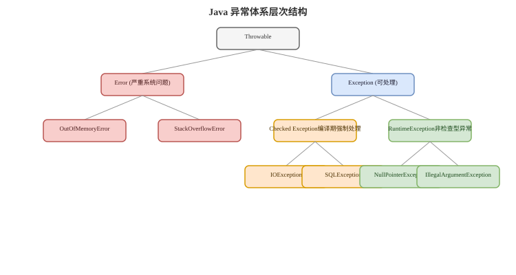

# 异常体系

## 概念卡
Q: Java 异常体系如何分类？Error、Exception、RuntimeException 有什么区别？
A:
- Throwable 是异常体系根类，下面主要分 Error 和 Exception
- Error 表示 JVM 或系统级严重问题，应用通常不应捕获后继续运行，例如 OutOfMemoryError、StackOverflowError
- Exception 表示程序可处理的问题，又分 checked exception 和 unchecked exception
- RuntimeException 及其子类是 unchecked exception，编译器不强制捕获或声明
- 面试表达：异常分类背后是“调用方是否被强制处理”和“程序是否有能力恢复”

## Checked 卡
Q: checked exception 和 unchecked exception 应该如何选择？
A:
- checked exception 适合调用方有明确恢复动作的场景，例如文件不存在后让用户重新选择
- unchecked exception 适合编程错误、参数非法、状态错误、业务运行时异常等
- 现代业务系统常用自定义 RuntimeException 表达业务异常，避免层层 throws 污染接口
- 但不能滥用 RuntimeException 吞掉语义，错误码、异常类型和日志上下文仍要清晰
- 面试重点：异常设计要服务调用方决策，而不是机械按“严重程度”分类

## finally 卡
Q: try-catch-finally 的执行顺序有哪些坑？
A:
- finally 通常一定执行，常用于释放资源
- try 或 catch 中 return 前，会先执行 finally，再返回结果
- 如果 finally 中也 return，会覆盖 try/catch 的返回值，这是严重坏味道
- finally 中抛异常会覆盖原始异常，导致根因丢失
- 资源释放优先使用 try-with-resources，让 suppressed exception 保留被覆盖的异常信息

## try-with-resources 卡
Q: try-with-resources 解决了什么问题？AutoCloseable 和 Closeable 有什么区别？
A:
- try-with-resources 自动关闭实现 AutoCloseable 的资源，避免手写 finally 关闭遗漏
- 多个资源按声明的逆序关闭
- 如果业务逻辑和 close 都抛异常，close 异常会作为 suppressed exception 挂在主异常上
- AutoCloseable 的 close 可以抛 Exception，Closeable 的 close 抛 IOException，Closeable 更偏 IO 资源
- 面试建议：数据库连接、流、Socket、锁式资源封装都要优先考虑自动释放语义

## 业务异常卡
Q: 业务系统中如何设计异常和日志，才能方便排查？
A:
- 区分参数错误、业务规则失败、下游依赖失败、系统内部错误，避免所有异常都叫 BusinessException
- 异常消息给人看，错误码给系统和前端处理，二者都要稳定
- 不要在每一层都打印同一个异常，通常在边界层统一记录，避免重复日志污染
- 保留 cause 链，不要 new 一个异常后丢掉原始异常
- 对外返回要脱敏，对内日志要保留 traceId、关键入参、下游响应和耗时

## 正确性审查卡
Q: Java 异常有哪些常见错误说法？
A:
- “finally 一定执行”：不绝对。JVM 退出、进程被杀、机器断电等情况下不会保证执行
- “catch Exception 最安全”：不对。它会掩盖错误边界，可能吞掉本该上抛的异常
- “RuntimeException 都不用管”：错误。不强制捕获不代表不用设计处理策略
- “finally 里 return 没问题”：严重不推荐，会覆盖返回值或异常
- “打印异常 message 就够了”：不够。排查需要堆栈和 cause 链
