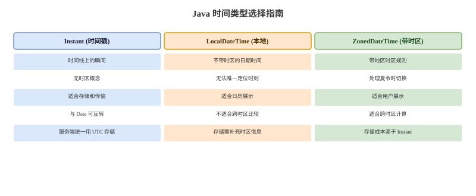

# 时间日期与金额精度

## java.time 卡
Q: 为什么推荐使用 java.time 替代 Date/Calendar？
A:
- Date 可变且 API 设计历史包袱重，年份/月等语义容易误用
- Calendar 同样可变，API 繁琐且线程安全和时区处理不够直观
- java.time 提供不可变、线程安全、语义清晰的类型
- LocalDate 表示日期，LocalTime 表示时间，LocalDateTime 不带时区，Instant 表示时间线上的瞬间
- ZonedDateTime/OffsetDateTime 用于明确时区或偏移量的时间表达

## 时区卡
Q: 时间戳、LocalDateTime、ZonedDateTime 在工程中如何选择？
A:
- Instant/时间戳适合存储统一时间线上的事件发生时刻
- LocalDateTime 不带时区，只表达本地日期时间，不适合直接表示全球唯一时刻
- ZonedDateTime 带地区时区规则，适合日历语义和跨时区展示
- 服务端存储通常统一 UTC 或时间戳，展示时按用户时区转换
- 面试坑：`2026-05-15 10:00` 如果不带时区，不同地区代表的真实瞬间不同

## 日期边界卡
Q: 处理日期范围查询时，为什么推荐左闭右开？
A:
- 左闭右开 `[start, end)` 可以自然表达连续时间段，避免边界重叠
- 查询某天数据可写成 `>= 当天零点` 且 `< 次日零点`
- 不需要拼 `23:59:59.999` 这种依赖精度的结束时间
- 数据库字段精度从秒到毫秒/微秒变化时，左闭右开更稳定
- 面试表达：时间范围的核心是边界无重叠、无遗漏、与存储精度解耦

## BigDecimal 卡
Q: 金额计算为什么要用 BigDecimal？它有哪些坑？
A:
- double/float 是二进制浮点数，无法精确表示很多十进制小数，例如 0.1
- BigDecimal 用十进制高精度表示，更适合金额、费率、结算
- 创建 BigDecimal 应优先使用字符串或 BigDecimal.valueOf(double)，避免直接 new BigDecimal(0.1)
- 除法要指定 scale 和 RoundingMode，否则遇到无限循环小数会抛 ArithmeticException
- 金额比较通常用 compareTo，不要只依赖 equals，因为 equals 会比较 scale

## 舍入卡
Q: BigDecimal 的 equals 和 compareTo 有什么区别？
A:
- equals 比较数值和 scale，例如 1.0 与 1.00 不相等
- compareTo 只比较数值大小，1.0 与 1.00 返回 0
- HashMap key 或 Set 去重使用 equals/hashCode，可能把 1.0 和 1.00 当作不同 key
- 金额大小比较应使用 compareTo
- 入库、展示和接口返回要统一 scale 和舍入规则，避免同一金额多种表示

## 正确性审查卡
Q: 时间和金额处理有哪些常见错误说法？
A:
- “LocalDateTime 就是时间戳”：错误。它不包含时区，不能唯一定位瞬间
- “一天结束就是 23:59:59”：不严谨。精度和夏令时都会带来边界问题
- “double 可以算钱，只要最后格式化”：错误。误差已经在计算过程中产生
- “BigDecimal equals 可以用于金额相等”：不推荐。金额数值比较应使用 compareTo
- “服务器都在国内就不用管时区”：不稳。跨地域、历史数据、第三方接口和容器环境都可能引入时区问题
