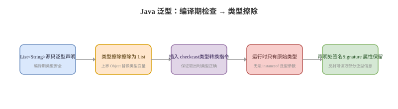

# 泛型与反射

## 泛型卡
Q: Java 泛型的本质是什么？什么是类型擦除？
A:
- Java 泛型主要是编译期类型检查机制，运行期大多数泛型信息会被擦除
- `List<String>` 和 `List<Integer>` 在运行时通常都是 List 类型，不能直接通过普通 instanceof 区分
- 类型变量会被擦除成上界类型，没有显式上界时擦除成 Object
- 编译器会在必要位置插入类型转换，保证源码层面的泛型语义
- 面试一句话：Java 泛型提升了编译期类型安全，但不是运行期模板实例化

## 通配符卡
Q: `? extends T` 和 `? super T` 应该怎么理解？
A:
- `? extends T` 表示某个 T 的子类型，适合作为生产者读取 T，不能安全写入具体 T 子类对象
- `? super T` 表示某个 T 的父类型，适合作为消费者写入 T 或 T 的子类，读取时只能安全当 Object
- 口诀 PECS：Producer Extends, Consumer Super
- 例如从集合读取 Number 用 `List<? extends Number>`，向集合写入 Integer 用 `List<? super Integer>`
- 面试重点不是背语法，而是说明编译器为什么限制读写安全性

## 反射卡
Q: Java 反射能做什么？代价和边界是什么？
A:
- 反射可以在运行期获取类、字段、方法、构造器、注解信息，并动态创建对象或调用方法
- 框架用反射实现依赖注入、对象映射、注解扫描、动态代理等能力
- 代价包括性能开销、编译期检查减少、封装性破坏、模块化访问限制
- setAccessible 可以绕过一部分访问检查，但在模块系统和安全策略下可能受限制
- 面试表达：反射换来框架通用性和动态能力，但需要缓存元数据并控制访问边界

## 泛型反射卡
Q: 类型擦除后，为什么有些泛型信息还能通过反射拿到？
A:
- 类型擦除是运行时对象实例不携带完整泛型实参，不代表 class 文件里完全没有泛型签名
- 字段、方法返回值、父类、接口上的泛型签名可能保存在 Signature 属性中
- 反射的 getGenericType、getGenericSuperclass、getGenericInterfaces 可以读取这些声明处信息
- 但运行时 new 出来的普通 `List<String>` 对象本身通常不知道自己的元素类型
- Spring 的 ResolvableType、Jackson 的 TypeReference 都是在利用声明处签名或匿名子类保留泛型信息

## 动态代理卡
Q: JDK 动态代理和反射是什么关系？
A:
- JDK 动态代理运行期生成实现目标接口的代理类
- 代理对象的方法调用会进入 InvocationHandler#invoke
- invoke 内部可以通过反射调用目标对象方法，也可以做事务、日志、权限等增强逻辑
- JDK 代理要求目标有接口；没有接口时，Spring 常用 CGLIB 基于子类代理
- 面试不要把“动态代理”等同于“反射调用”，代理是生成代理类，反射只是常见的调用手段之一

## 正确性审查卡
Q: 泛型和反射有哪些常见误区？
A:
- “泛型在运行期完全不存在”：不严谨。实例类型多被擦除，但声明处签名可能还在
- “`List<String>.class` 可以存在”：错误。由于擦除，只能写 List.class
- “反射一定很慢不能用”：不严谨。框架通常会缓存元数据，现代 JVM 也有优化；关键是不要在热点路径无缓存滥用
- “setAccessible 一定能突破所有限制”：不一定。模块化、运行参数和安全策略都可能限制深反射
- “CGLIB 能代理 final 方法”：错误。基于子类重写的方法无法增强 final 方法
