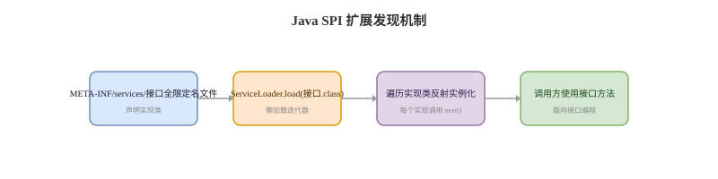

# 注解与 SPI

## 注解基础卡
Q: Java 注解的本质是什么？RetentionPolicy 有什么区别？
A:
- 注解是附加在类、方法、字段、参数等程序元素上的元数据
- SOURCE：只在源码阶段存在，编译后丢弃，例如一些检查类注解
- CLASS：写入 class 文件，但运行时反射默认不可见
- RUNTIME：运行时可通过反射读取，Spring、JUnit 等框架大量使用
- 面试表达：注解本身不执行逻辑，真正生效的是编译器、类加载器、反射或框架扫描处理它

## 元注解卡
Q: 常见元注解 Target、Retention、Inherited、Documented 分别做什么？
A:
- @Target 限定注解可以标在哪里，例如 TYPE、METHOD、FIELD、PARAMETER
- @Retention 限定注解保留到源码、class 文件还是运行时
- @Inherited 只对类继承有效，子类可以继承父类上的某些类级注解，对方法/字段无效
- @Documented 表示生成 Javadoc 时包含该注解信息
- 面试坑：注解能否被反射读到，关键看 Retention 是否是 RUNTIME

## 反射读取卡
Q: 框架如何读取运行时注解？为什么注解会影响启动性能？
A:
- 框架通常通过 ClassLoader 扫描 classpath，找到候选类
- 对 Class、Method、Field 调用反射 API 读取注解和属性
- 根据注解元数据注册 BeanDefinition、路由、事务切面、序列化规则等
- 大量 classpath 扫描和反射解析会增加启动成本，因此框架会做索引、缓存和条件过滤
- 面试表达：注解是声明式入口，框架把它翻译成运行时对象和拦截逻辑

## Java SPI 卡
Q: Java SPI 的 ServiceLoader 机制是什么？
A:
- SPI 用于面向接口发现实现类，常见于可插拔扩展
- 提供方在 `META-INF/services/接口全限定名` 文件中写入实现类全限定名
- 调用方通过 ServiceLoader.load(接口.class) 懒加载并遍历实现
- JDBC Driver、日志门面、部分序列化/编解码扩展都体现了 SPI 思路
- 面试边界：Java SPI 默认按配置发现所有实现，缺少按名称精准选择、依赖注入和包装增强等高级能力

## Java SPI 与 Spring 扩展机制对比卡
Q: Java SPI 与 Spring 扩展机制有什么区别？
A:
- Java SPI 简单通用，按接口发现实现，但功能较弱
- Spring 主要依赖 BeanFactory、条件装配、ImportSelector、SpringFactories/AutoConfiguration 等机制组织扩展
- Java SPI 的提供方由 `META-INF/services` 声明，`ServiceLoader` 不依赖 Spring 容器
- Spring 扩展可以参与依赖注入、生命周期、条件匹配和配置绑定，能力更完整但与容器耦合
- 面试表达：Java SPI 适合轻量接口实现发现，Spring 扩展适合应用级组件装配和治理

## 正确性审查卡
Q: 注解与 SPI 有哪些常见误区？
A:
- “加了注解就自动生效”：错误。必须有编译器或框架逻辑处理它
- “所有注解运行时都能反射读取”：错误。只有 RUNTIME 保留策略才默认可读
- “@Inherited 对方法注解也生效”：错误。它只影响类级注解继承
- “SPI 就是 Spring 自动装配”：不严谨。SPI 是接口扩展发现机制，Spring 自动装配有完整容器语义
- “ServiceLoader 会立刻实例化所有实现”：不准确。它是懒加载迭代，但遍历时会实例化
