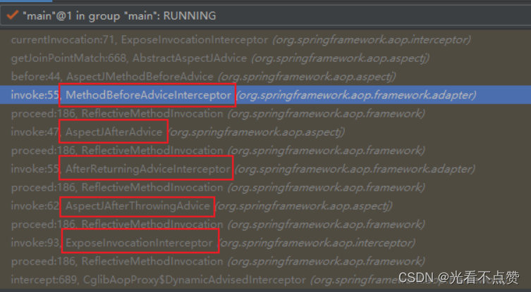
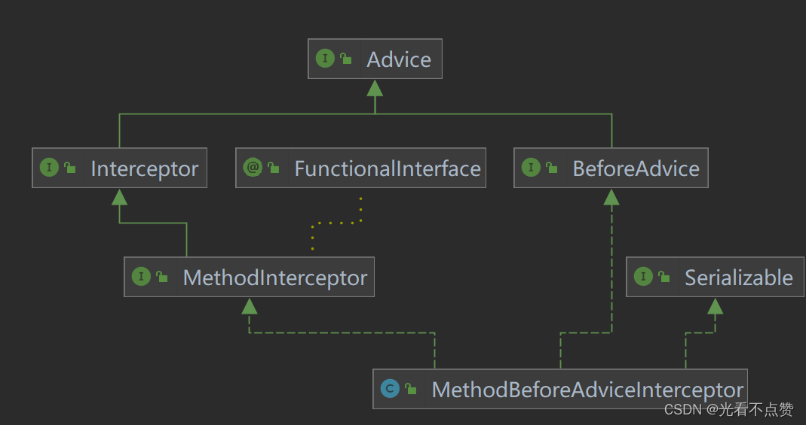
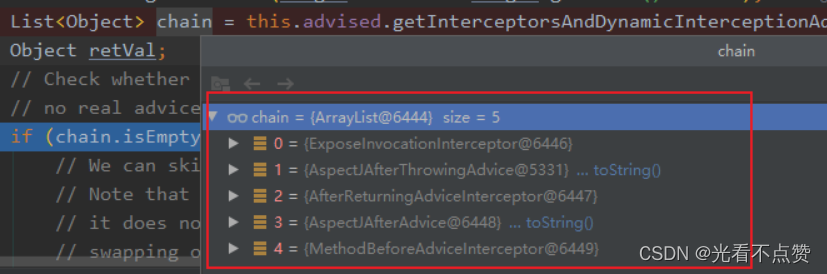

# Spring IoC与AOP核心

## 概念卡
Q: 为什么Spring要设计IoC容器，它解决了传统Java开发中的什么根本问题？

A:
- 传统方式的问题：程序员通过new关键字手动创建对象并管理依赖关系，对象之间的耦合在编译期就确定了，更换实现需要修改代码，单元测试困难（依赖无法替换为Mock）
- IoC的解决思路：将对象创建和依赖注入的控制权从程序员手中"反转"给Spring容器。程序员只需要声明依赖（配置/注解），容器负责创建对象并注入依赖
- 核心收益：
  - 解耦：具体实现类可以在配置中更换，业务代码不需要修改——面向接口编程的真正落地
  - 生命周期管理：容器统一管理Bean的创建、初始化、销毁，开发者不需要关注对象的完整生命周期
  - 单例管理：容器保证单例Bean的作用域正确性，避免了手动实现单例模式的复杂性
  - 依赖注入：构造器注入（强制依赖，保证对象创建即完整）、setter注入（可选依赖，可重新注入）、字段注入（@Autowired便捷但不利于测试）
- IoC容器的本质：一个Map<String, BeanDefinition> + Map<String, Object>（singletonObjects），通过BeanFactory接口提供统一的Bean获取入口，ApplicationContext在BeanFactory基础上扩展了事件、国际化、资源加载等能力

## 机制卡
Q: Spring Bean的完整生命周期是怎样的，每个阶段有哪些扩展点？

A:
- Bean的生命周期由AbstractApplicationContext#refresh方法的11步中的finishBeanFactoryInitialization驱动，通过AbstractAutowireCapableBeanFactory#doCreateBean完成
- 第一步：实例化（createBeanInstance）——通过反射调用构造器new对象，此时属性尚未赋值
- 第二步：属性注入（populateBean）——根据@Autowired、@Resource等注解或XML配置，将依赖Bean注入当前对象。如果依赖的Bean还未创建，则递归开始该Bean的创建流程
- 第三步：初始化（initializeBean）——执行aware接口回调、BeanPostProcessor前置处理、InitializingBean#afterPropertiesSet、自定义init-method、BeanPostProcessor后置处理
- 关键扩展点（按执行顺序）：
  - BeanPostProcessor#postProcessBeforeInitialization：初始化前回调，如@PostConstruct的方法在此触发
  - Aware系列接口：BeanNameAware → BeanClassLoaderAware → BeanFactoryAware → ApplicationContextAware，让Bean获取容器相关引用
  - InitializingBean#afterPropertiesSet：所有属性注入完成后的初始化回调
  - BeanPostProcessor#postProcessAfterInitialization：初始化后回调，AOP代理在此处生成——AnnotationAwareAspectJAutoProxyCreator检查Bean是否需要增强，如果是则创建代理对象。此后从容器获取的都是代理对象而非原始Bean
- 第四步：注册销毁回调——将DisposableBean#destroy和自定义destroy-method注册到容器

## 概念卡
Q: Spring AOP的实现原理是什么，JDK动态代理和CGLIB有什么区别？

A:
- Spring AOP通过代理模式实现：在目标对象外包裹一层代理，调用代理方法时先执行切面逻辑（Before/After/Around等），再通过反射或直接调用执行目标方法
- JDK动态代理：基于接口的代理。通过Proxy.newProxyInstance生成代理类（继承Proxy，实现目标接口），所有接口方法调用转发到InvocationHandler#invoke。优点是原生JDK支持无需额外依赖；缺点是被代理类必须实现接口。JDK 1.8后性能大幅优化，在调用次数较少时效率高于CGLIB
- CGLIB动态代理：基于继承的代理。通过Enhancer生成目标类的子类，使用ASM字节码技术重写目标方法，在方法中织入拦截逻辑（MethodInterceptor#intercept）。优点是不需要接口；缺点是final方法和final类无法代理，且由于生成子类的方式，构造器会被调用两次（第一次创建代理实例，第二次创建目标实例）
- Spring的选择策略：当Bean实现了接口时默认使用JDK动态代理，没有实现接口时使用CGLIB。可以通过proxy-target-class="true"强制使用CGLIB
- AspectJ与Spring AOP的区别：Spring AOP是运行时动态代理（只支持方法级织入），AspectJ支持编译时织入（支持字段、构造器等更多织入点），性能更好但更复杂。Spring AOP集成了AspectJ的注解体系（@Aspect、@Pointcut等）但底层仍是动态代理

## 机制卡
Q: Spring如何通过三级缓存解决循环依赖问题，为什么需要三级而不是两级？

A:
- 循环依赖场景：A依赖B，B依赖A，创建A时发现需要B → 创建B时发现需要A → 形成死循环
- Spring的解决条件：必须是单例Bean、依赖注入方式不能全是构造器注入（至少一方用setter注入）、beanName字母序在前的不能是构造器注入
- 为什么构造器注入无法解决：构造器注入在实例化阶段就需要依赖，此时对象尚未创建完成，无法提前暴露
- 三级缓存结构：
  - singletonObjects（一级）：存放完全初始化好的Bean，可以直接使用
  - earlySingletonObjects（二级）：存放已实例化但未完成属性注入的早期Bean引用
  - singletonFactories（三级）：存放ObjectFactory，可以生成Bean的早期引用（可能是代理对象）
- 解决流程（以A依赖B，B依赖A为例）：
  - 创建A → 实例化A（构造器） → 将A的ObjectFactory放入三级缓存（提前暴露） → 属性注入时发现需要B
  - 创建B → 实例化B → 将B的ObjectFactory放入三级缓存 → 属性注入时发现需要A → 从三级缓存获取A的ObjectFactory → 调用getObject获取A的早期引用 → 放入二级缓存并从三级缓存删除 → B拿到A的引用完成注入
  - B初始化完成 → 放入一级缓存 → 回到A的属性注入 → A从一级缓存获取完全的B → A完成初始化 → 放入一级缓存并从二级缓存删除
- 为什么需要三级：二级缓存只能存原始Bean，但A可能需要在B持有A时就得到A的代理对象（如果A有AOP增强）。三级缓存的ObjectFactory#getObject会调用getEarlyBeanReference，查询SmartInstantiationAwareBeanPostProcessor判断Bean是否需要动态代理——如果需要则返回代理对象。如果直接在二级缓存中存代理对象，则破坏了Bean的正常生命周期（代理本应在postProcessAfterInitialization阶段生成）。三级缓存实现了"延迟代理"：没发生循环依赖时工厂不会被调用，Bean按正常流程初始化；发生循环依赖时才提前触发生成代理对象

## 概念卡
Q: Spring事务的传播级别是如何设计的，REQUIRES_NEW和NESTED有什么区别？

A:
- 事务的本质是AOP的体现：通过@EnableTransactionManagement导入TransactionManagementConfigurationSelector，为@Transactional方法生成代理对象。TransactionInterceptor拦截调用，先设置事务非自动提交，执行业务方法，最后提交或回滚
- 七种传播级别：
  - REQUIRED（默认）：有事务则加入，没有则新建。最常用，保证所有数据库操作在同一个事务中
  - SUPPORTS：有事务则加入，没有则以非事务方式运行。适用于查询方法——有事务时享受一致性读，没事务时也不报错
  - MANDATORY：必须有事务，否则抛异常。用于强制调用方必须在事务内调用
  - REQUIRES_NEW：挂起当前事务，新建独立事务。即使外部事务回滚，内部事务也不受影响。用于需要独立提交的场景（如写审计日志——业务失败但日志必须记录）
  - NOT_SUPPORTED：以非事务方式运行，有事务则挂起。用于不需要事务的耗时操作，避免占用数据库连接
  - NEVER：不能有事务，有则抛异常。严格限制必须在非事务环境执行
  - NESTED：嵌套事务。与REQUIRES_NEW的区别——嵌套事务不是完全独立的，如果外部事务回滚，嵌套事务也回滚；但嵌套事务回滚不影响外部事务。底层依赖JDBC的Savepoint机制，可以回滚到保存点
- 自调用陷阱：同一个Service类中方法A（无@Transactional）调用方法B（有@Transactional），B的事务不会生效。因为调用绕过代理对象，直接是this.methodB()。解决方案：通过AopContext.currentProxy()获取代理对象调用，或将B方法移到另一个Service类中
