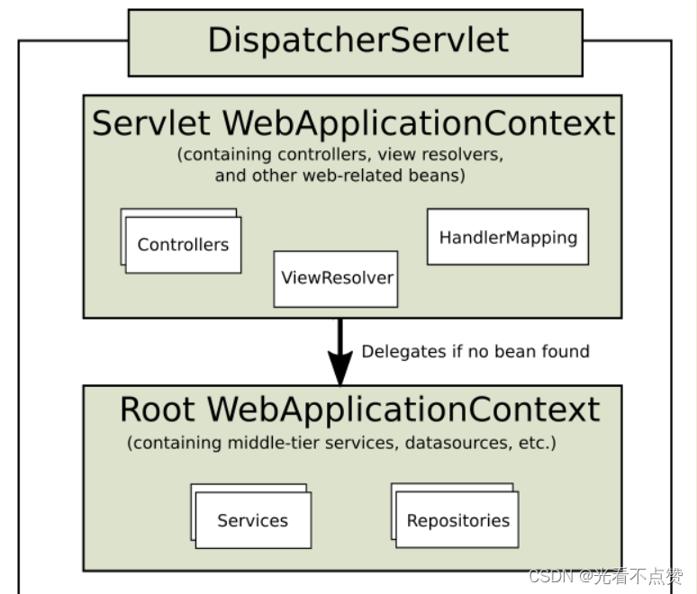
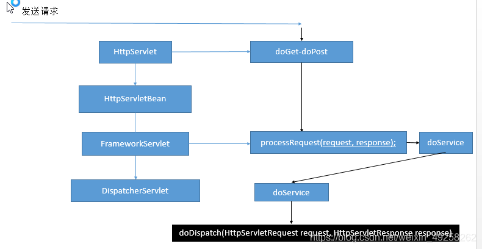

# SpringMVC核心流程

## 概念卡
Q: 为什么SpringMVC以DispatcherServlet作为核心，它解决了Servlet开发的什么痛点？

A:
- 传统Servlet开发痛点：每个请求需要编写一个Servlet，配置web.xml映射，请求处理的各个环节（参数解析、调用、视图渲染）耦合在一个Servlet中，代码重复严重
- DispatcherServlet的设计：作为前端控制器（Front Controller模式），统一接收所有请求，将请求处理分解为独立步骤委派给不同组件，实现了请求处理流程的标准化和各环节的解耦
- 九大组件（全部是接口，支持替换）：
  - HandlerMapping：处理器映射，保存每个Controller能处理哪些请求的映射关系。IoC容器创建Controller时扫描@RequestMapping注解建立映射
  - HandlerAdapter：处理器适配器，使用适配器模式屏蔽不同Controller类型的调用差异。RequestMappingHandlerAdapter负责解析注解方式的Controller方法调用
  - HandlerExceptionResolver：异常解析器，统一处理Controller抛出的异常
  - ViewResolver：视图解析器，将逻辑视图名解析为具体View对象（如JSP、Thymeleaf模板）
  - MultipartResolver：文件上传解析器
  - LocaleResolver：国际化区域信息解析器
  - ThemeResolver：主题解析器
  - FlashMapManager：重定向携带数据
  - RequestToViewNameTranslator：默认视图名转换

## 机制卡
Q: DispatcherServlet#doDispatch方法的完整执行流程是怎样的？

A:
- 第一步：getHandler(request)遍历所有HandlerMapping，调用mapping.getHandler(request)找到匹配的HandlerExecutionChain。HandlerExecutionChain包含目标Controller和所有拦截器（HandlerInterceptor）列表
- 第二步：getHandlerAdapter(handler)遍历所有HandlerAdapter，调用adapter.supports(handler)找到能处理该Controller的适配器。注解方式使用RequestMappingHandlerAdapter
- 第三步：mappedHandler.applyPreHandle执行所有拦截器的preHandle方法。如果任何一个返回false，请求终止
- 第四步：ha.handle(processedRequest, response, mappedHandler.getHandler())通过适配器执行目标Controller方法：
  - RequestMappingHandlerAdapter#handleInternal → invokeHandlerMethod
  - 创建ServletWebRequest包装request/response → 创建ModelAndViewContainer隐含模型 → 参数解析（标注解的参数通过对应的HandlerMethodArgumentResolver解析，未标注解的按类型判断） → 反射调用invocableMethod.invokeAndHandle
  - 目标方法执行完后的返回值封装成ModelAndView（无论原方法返回什么类型，最终都转为ModelAndView）
- 第五步：applyDefaultViewName如果没有视图名则设置默认值
- 第六步：mappedHandler.applyPostHandle执行所有拦截器的postHandle方法
- 第七步：processDispatchResult处理最终结果。如果正常则通过ViewResolver解析视图名 → View.render渲染（将Model数据填充到视图） → 返回Response。如果异常则通过HandlerExceptionResolver处理

## 概念卡
Q: SpringMVC的父子容器设计解决了什么问题，为什么要有两个容器？

A:
- 设计动机：职责分离。Web层的Bean（Controller、ViewResolver等）和Service/Dao层的Bean（数据库连接、事务管理等）属于不同抽象层次，放在不同容器中便于管理和隔离
- 父容器（Root WebApplicationContext）：由ContextLoaderListener创建，管理Service、Dao、数据源等通用Bean，不与任何Servlet绑定
- 子容器（Servlet WebApplicationContext）：由DispatcherServlet初始化时创建（onRefresh方法中），管理Web层Bean（Controller、HandlerMapping等），将父容器设置为自己的parent
- 依赖查找规则：子容器可以访问父容器的Bean（子容器找不到时向上查找），但父容器不能访问子容器的Bean。这保证了Controller可以注入Service，但Service不能注入Controller（避免Web层污染业务层）
- 实际意义：一个Web应用可以有多个DispatcherServlet（如前端API和后台管理各一个），每个有自己的子容器，但它们共享同一个父容器中的业务Service和DataSource，避免重复创建数据库连接池等重量级资源

## 机制卡
Q: SpringMVC方法的参数解析和目标方法调用是如何实现的？

A:
- 参数解析的入口：RequestMappingHandlerAdapter#invokeHandlerMethod → ServletInvocableHandlerMethod#invokeAndHandle
- 标注解的参数：通过HandlerMethodArgumentResolver接口解析。常见实现：
  - @RequestParam → RequestParamMethodArgumentResolver：从request.getParameter获取
  - @RequestBody → RequestResponseBodyMethodProcessor：通过HttpMessageConverter反序列化请求体（JSON→对象）
  - @PathVariable → PathVariableMethodArgumentResolver：从URI模板变量获取
  - @ModelAttribute → ModelAttributeMethodProcessor：使用WebDataBinder将请求参数绑定到对象属性
- 未标注解的参数：依次尝试判断是否为原生Servlet API（HttpServletRequest/HttpServletResponse等）、是否为Model/Map类型、是否为简单类型（基本类型+String）、是否为POJO（当作@ModelAttribute处理）。参数名通过ASM或Java 8的-parameters编译参数获取
- 方法调用：invocableMethod.invokeAndHandle → 反射调用Method#invoke，底层仍是反射机制。如果方法返回值不是ModelAndView类型，通过HandlerMethodReturnValueHandler处理（如@ResponseBody通过HttpMessageConverter序列化返回值写入Response）
- 拦截器链的配合：目标方法执行前后applyPreHandle/applyPostHandle，afterCompletion在finally中确保一定执行（即使异常也触发，用于资源清理）
