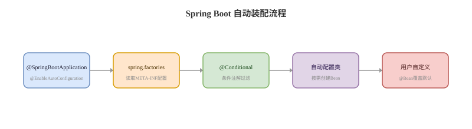

# Spring Boot 自动装配

## 概念卡
Q: Spring Boot 自动装配解决了什么问题？
A:
- 自动装配把常见框架整合的 Bean 注册逻辑封装到 starter 和 AutoConfiguration 中
- 开发者引入依赖后，Spring Boot 根据 classpath、配置属性、已有 Bean、Web 环境等条件决定是否创建默认 Bean
- 它减少了重复 XML/JavaConfig 配置，但仍允许用户通过自定义 Bean 覆盖默认行为
- 自动装配不是“自动扫描所有类”，而是加载候选自动配置类，再按条件过滤
- 面试一句话：Spring Boot 用约定和条件化配置，把通用集成成本从业务项目转移到 starter

## 启动入口卡
Q: @SpringBootApplication 包含哪些核心能力？
A:
- @SpringBootConfiguration：本质是 @Configuration，表示当前类提供 Bean 定义
- @ComponentScan：从启动类所在包向下扫描组件
- @EnableAutoConfiguration：开启自动装配，导入自动配置选择逻辑
- 启动类包路径很关键：如果启动类放得太深，兄弟包可能扫描不到
- 面试注意：组件扫描和自动装配是两条线，前者扫描业务组件，后者加载框架默认配置

## 自动配置加载卡
Q: 自动配置类是如何被 Spring Boot 找到并导入的？
A:
- Spring Boot 2.x 主要通过 spring.factories 声明 EnableAutoConfiguration 候选类
- Spring Boot 3.x 推荐使用 `META-INF/spring/org.springframework.boot.autoconfigure.AutoConfiguration.imports`
- AutoConfigurationImportSelector 读取候选配置类，再结合排除项和条件注解进行过滤
- 最终符合条件的自动配置类会作为普通 @Configuration 参与 BeanDefinition 注册
- 面试表达：自动装配入口是导入候选配置类，真正是否生效由条件注解决定

## 条件注解卡
Q: @ConditionalOnClass、@ConditionalOnMissingBean、@ConditionalOnProperty 分别控制什么？
A:
- @ConditionalOnClass：classpath 中存在某个类时才生效，常用于判断是否引入了某个三方库
- @ConditionalOnMissingBean：容器中没有某类型或某名称 Bean 时才注册默认 Bean，给用户覆盖默认实现留出口
- @ConditionalOnProperty：配置项满足指定值时才生效，常用于开关功能
- @ConditionalOnWebApplication：当前是 Web 应用时才生效
- 自动装配的精髓就是“默认给你配好，但你显式定义时尊重你的选择”

## Starter 卡
Q: starter 和 auto-configuration 的关系是什么？
A:
- starter 通常是依赖聚合包，负责把某功能需要的 jar 一次性引入项目
- auto-configuration 负责提供自动配置类和默认 Bean
- 一个成熟 starter 往往包含 starter 模块、autoconfigure 模块、配置属性类和条件化配置
- 引入 starter 后，类路径满足条件，自动配置才有机会生效
- 面试边界：starter 本身不等于自动装配逻辑，它更多是依赖入口；真正注册 Bean 的是自动配置类

## 排查卡
Q: 自动装配不生效时应该如何排查？
A:
- 看依赖是否引入，目标类是否真的在 classpath
- 看配置项是否满足 @ConditionalOnProperty
- 看是否已经存在同类型 Bean，导致 @ConditionalOnMissingBean 不再注册默认 Bean
- 看自动配置是否被 exclude 排除
- 打开 debug 或查看 ConditionEvaluationReport，定位具体条件为什么 matched 或 did not match

## 正确性审查卡
Q: Spring Boot 自动装配有哪些常见误区？
A:
- “引入 starter 就一定创建 Bean”：错误。还要满足条件注解
- “自动装配就是包扫描”：错误。它是导入候选 AutoConfiguration，再条件过滤
- “@ConditionalOnMissingBean 是多余的”：错误。它是用户自定义 Bean 覆盖默认实现的关键
- “Spring Boot 3 仍只看 spring.factories”：不严谨。Boot 3 推荐 AutoConfiguration.imports
- “自动装配不可控”：错误。可以通过 exclude、条件配置、自定义 Bean 和排序控制
