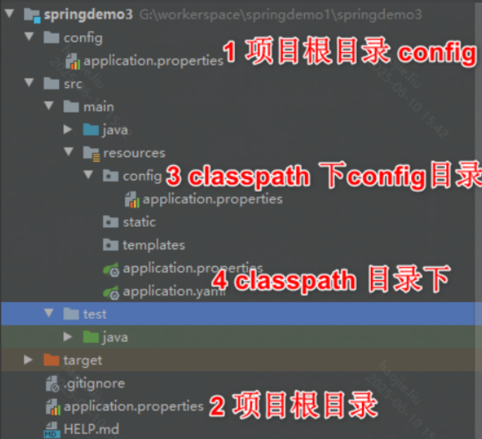
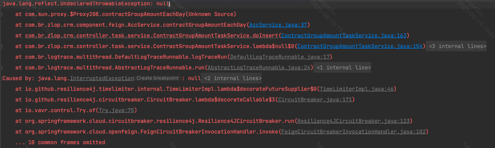

# Spring 事务与失效场景

## 概念卡
Q: Spring 声明式事务的本质是什么？
A:
- Spring 声明式事务基于 AOP 代理实现，@Transactional 方法被代理拦截后，由 TransactionInterceptor 控制事务边界
- 调用目标方法前获取事务属性，决定创建、加入、挂起或恢复事务
- 方法正常返回时提交，抛出符合回滚规则的异常时回滚
- 底层事务能力由 PlatformTransactionManager 抽象，不同数据源有 DataSourceTransactionManager、JpaTransactionManager 等实现
- 面试一句话：@Transactional 不是语法魔法，它是“代理拦截 + 事务管理器 + 数据库连接事务”的组合

## 传播行为卡
Q: REQUIRED、REQUIRES_NEW、NESTED 三种传播行为有什么区别？
A:
- REQUIRED：默认行为，有事务就加入，没有就新建，最常用于一条业务链路整体一致
- REQUIRES_NEW：挂起外部事务，开启一个独立新事务；内部提交后即使外部回滚，内部也不回滚
- NESTED：在外部事务中创建保存点，内部可回滚到保存点；外部事务最终回滚时，内部结果也会一起回滚
- REQUIRES_NEW 通常需要额外数据库连接，连接池不足时可能放大阻塞
- NESTED 依赖数据库和事务管理器对 Savepoint 的支持，不是所有场景都可用

## 回滚规则卡
Q: @Transactional 默认遇到哪些异常会回滚？如何定制？
A:
- 默认只对 RuntimeException 和 Error 回滚
- checked exception 默认不回滚，除非配置 rollbackFor
- noRollbackFor 可以指定某些异常不回滚
- 异常被 catch 后没有继续抛出，事务拦截器感知不到异常，通常不会回滚
- 面试建议：业务异常体系要和事务规则配套设计，不要靠“感觉”判断是否会回滚

## 失效卡
Q: @Transactional 常见失效场景有哪些？
A:
- 同类自调用：this.method() 绕过代理，事务增强不会生效
- 方法不是 public：基于代理的 Spring 事务通常只增强 public 方法
- Bean 没被 Spring 容器管理：手动 new 的对象没有代理
- 异常被内部捕获且没有重新抛出，事务拦截器认为方法正常完成
- 数据库引擎或连接不支持事务，例如 MySQL MyISAM，或操作不在同一个事务管理器管理范围内
- final 类/方法、private 方法等无法被常规代理有效增强

## 隔离级别卡
Q: 事务隔离级别解决哪些问题？Spring 中如何理解 DEFAULT？
A:
- READ_UNCOMMITTED 可能脏读、不可重复读、幻读都存在，实际生产少用
- READ_COMMITTED 避免脏读，是很多数据库常见默认选择
- REPEATABLE_READ 避免脏读和不可重复读，MySQL InnoDB 默认级别，并通过 MVCC/锁处理大量幻读场景
- SERIALIZABLE 最强隔离，但并发度最低
- Spring 的 Isolation.DEFAULT 表示使用数据库默认隔离级别，不是 Spring 自己定义一个级别

## 实战卡
Q: 生产中设计 Spring 事务边界时要注意什么？
A:
- 事务范围要尽量短，避免把 RPC、消息发送、文件 IO、长计算放在数据库事务内
- 事务内查询和更新要注意锁顺序，避免死锁
- 批量操作要控制批次大小，避免长事务占用 undo、锁和连接
- 多数据源事务要明确是否需要分布式事务，不要误以为多个 @Transactional 自动原子一致
- 事务提交后才能可靠发送外部副作用时，要考虑事务消息、outbox 或 afterCommit 回调

## 正确性审查卡
Q: Spring 事务有哪些常见错误说法？
A:
- “加了 @Transactional 一定生效”：错误。必须经过 Spring 代理且满足增强条件
- “所有异常都会回滚”：错误。默认 checked exception 不回滚
- “REQUIRES_NEW 是嵌套事务”：错误。它是挂起外部事务后开启独立事务
- “NESTED 提交后就完全独立”：错误。外部事务回滚时，嵌套结果也会回滚
- “事务越大越安全”：错误。长事务会带来锁等待、连接占用、死锁和回滚成本
