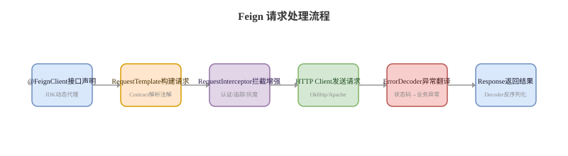

# Feign 调用要点


## 概念卡
Q: 为什么 Feign 客户端必须声明为接口而非类？这背后是什么技术机制？

A:
- 本质：Feign 使用 **JDK 动态代理**在运行时生成接口的实现类
  - JDK 动态代理（`java.lang.reflect.Proxy`）只能代理接口，不能直接代理类
  - 代理将方法调用翻译为 HTTP 请求：方法注解（@GetMapping/@PostMapping）-> 请求模板
- 设计原因：
  - **契约即接口**：接口天然定义了一组操作约定，方法与 HTTP 端点一一对应，语义清晰
  - **声明式编程**：开发者只需声明"我想要什么"，框架负责"怎么拿到"，符合面向接口编程
  - **无状态**：接口可以安全复用，不需要担心代理对象的状态管理
  - **可测试**：接口 Mock 远比具体类 Mock 简单
- Spring 集成流程：
  - `@EnableFeignClients` -> `FeignClientsRegistrar` 扫描 @FeignClient 接口
  - 注册 `FeignClientFactoryBean` -> 调用 `Feign.Builder.target()` -> 创建 JDK 代理 -> 注入 Spring 容器
- 如果必须代理类，需要用 CGLIB 生成子类，相比 JDK 动态代理更重且有限制（需要无参构造器、不能代理 final 方法）

## 概念卡
Q: Feign 的 timeout 配置涉及哪些层面？connectTimeout 和 readTimeout 分别解决什么问题？

A:
- 两个核心超时参数：
  - **connectTimeout**（连接超时）：TCP 连接建立的最长等待时间
    - 默认约 10 秒，建议设置为 2-5 秒
    - 过长：某个实例挂了，调用方长时间等待
    - 过短：网络抖动导致连接频繁失败
  - **readTimeout**（读取超时）：连接建立后等待响应数据的最长时间
    - 默认约 60 秒，建议按接口 SLA 设置为 3-10 秒
    - 过长：下游服务慢但没挂，上游线程资源耗尽
    - 过短：正常的长耗时接口被误杀
- 配置优先级（从高到低）：
  1. `feign.client.config.<name>.connectTimeout`（按客户端名指定）
  2. `feign.client.config.default.connectTimeout`（全局默认）
  3. `Request.Options` Bean（Java 配置）
- 注意：使用 OkHttp 作为底层 HTTP 客户端时，超时以 Feign 的配置为准
- 一般建议：connectTimeout 取 2s，readTimeout 取 3-5s，再配合重试/熔断兜底

## 概念卡
Q: Feign 的 ErrorDecoder 解决了什么问题？什么时候需要自定义它？

A:
- 默认行为：非 2xx 的 HTTP 响应都会被 Feign 封装为 FeignException，调用方只能捕获一个笼统的异常
- ErrorDecoder 的工作：将 HTTP 响应（状态码 + 响应体）翻译为**有意义的业务异常**
  ```java
  public Exception decode(String methodKey, Response response) {
      if (response.status() == 404) return new NotFoundException(...);
      if (response.status() == 429) return new RateLimitException(...);
      if (response.status() >= 500) return new ServerErrorException(...);
      return new RuntimeException(...);
  }
  ```
- 自定义 ErrorDecoder 的场景：
  - 下游服务在响应体中返回了业务错误码（如 `{"code":"USER_NOT_FOUND"}`）
  - 需要根据响应体内容解析出具体的错误信息，方便上游做差异化处理
  - 特殊的 HTTP 状态码映射（如将 404 映射为业务实体不存在，而非 URL 不存在）
- 配合 `@FeignClient` 的 `fallback/fallbackFactory` 实现降级时，ErrorDecoder 的异常会被 fallback 捕获

## 机制卡
Q: Feign 的 RequestInterceptor 在请求发送前做了什么？典型的拦截器应用有哪些？

A:
- RequestInterceptor 在**每个 Feign 请求发送前**自动调用 `apply(RequestTemplate template)` 方法
- 典型应用场景：
  - **链路追踪**：向请求头添加 Trace-Id，使调用链可在日志系统串联
    ```java
    template.header("X-Trace-Id", UUID.randomUUID().toString());
    ```
  - **认证透传**：从当前请求上下文获取 Token，添加到 Feign 请求头
    ```java
    template.header("Authorization", "Bearer " + tokenProvider.getCurrentToken());
    ```
  - **Gzip 压缩**：添加 Accept-Encoding 头，配合压缩配置减少传输数据量
  - **灰度标记**：向请求头添加灰度标签，供下游服务做路由判断
- 注意：
  - 每个 Feign 请求都会执行所有注册的拦截器，应保持轻量
  - 拦截器中的异常会导致请求失败，需要有兜底逻辑
  - 拦截器执行顺序按注册顺序

## 概念卡
Q: Feign 中的 Contract 是什么？SpringMvcContract 和 Feign 原生 Contract 有什么区别？

A:
- Contract 注解契约：负责将**接口方法上的注解翻译为 HTTP 请求模板**
  - 解析方法上的注解，提取 HTTP 方法、URL 路径、参数、请求头等
  - 生成 `RequestTemplate`，供 Encoder 填充请求体
- 两种 Contract：
  - Feign 原生 Contract：使用 `@RequestLine`、`@Param` 等 Feign 自定义注解
  - SpringMvcContract（常用）：支持 Spring MVC 注解 `@GetMapping`、`@PostMapping`、`@PathVariable`、`@RequestParam`、`@RequestBody` 等
- 实际使用：Spring Cloud OpenFeign 默认使用 SpringMvcContract，让 Feign 的注解风格与 Controller 保持一致，减少团队学习成本
