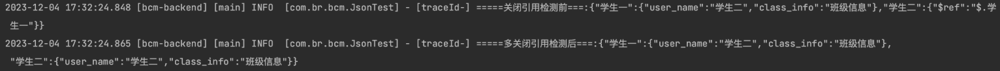
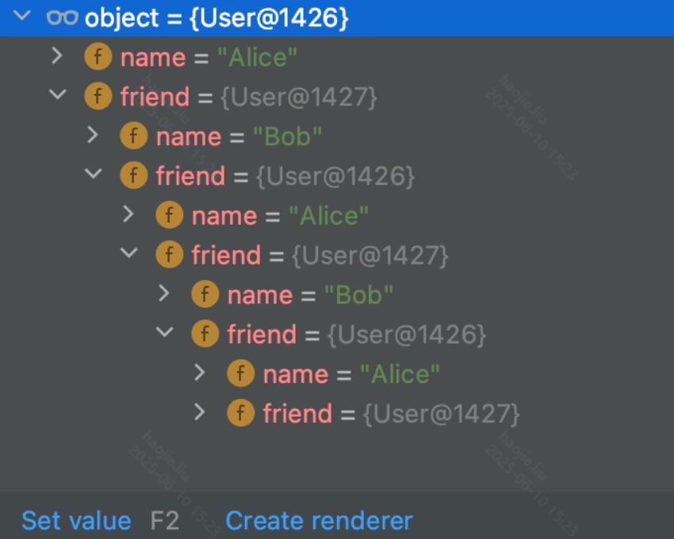

# JSON 序列化对比：FastJSON vs Jackson vs Gson



## 概念卡
Q: 为什么 Spring Boot 默认选择 Jackson 而非 FastJSON 作为 JSON 序列化器？

A:
- **安全记录**：FastJSON 历史上存在大量反序列化漏洞（CVE），攻击者可通过构造恶意 JSON 触发远程代码执行
  - 漏洞根源：FastJSON 的 `autoType` 功能允许在 JSON 中指定具体类名进行反序列化，绕过类型检查
  - 虽然通过黑名单不断修补，但"打补丁"模式的安全策略在框架级组件中不可接受
- **Spring 生态集成**：Jackson 是 Spring 的默认选择，`@RequestBody`/`@ResponseBody` 自动使用 Jackson
  - Jackson 支持 `@JsonIgnore`、`@JsonBackReference` 等注解精细控制序列化行为
- **API 稳定性**：Jackson 的 API 更遵循 Java 惯例，FastJSON 有些 API 设计较随意
- Gson 相对较少被企业级项目选用，主要优势在轻量和简单场景

## 机制卡
Q: FastJSON 的循环引用检测机制是如何工作的？`SerializerFeature.DisableCircularReferenceDetect` 关闭后会发生什么？

A:
- 循环引用问题：
  - 当对象 A 持有对象 B 的引用，B 又持有 A 的引用时，序列化会陷入死循环
  - FastJSON 默认开启循环引用检测，检测到重复引用时用 `$ref` 标记替换重复对象
  ```
  {"name":"Alice","friend":{"name":"Bob","friend":{"$ref":"$"}}}
  ```
- 检测原理：序列化过程中维护一个 IdentityHashMap，记录已序列化的对象
  - 遇到新的对象写入完整 JSON，同时记录路径
  - 再次遇到同一对象（通过引用比较 `==`）时，用 `$ref` 引用之前的路径
- `DisableCircularReferenceDetect` 关闭后：
  - 不再检测重复引用，JSON 结构完整
  - 但如果存在真正的循环引用，序列化会触发 StackOverflowError
- 实际使用时可能导致的问题：
  - 同一个对象多次出现时，默认检测会将其"压缩"为一个 `$ref`，丢失数据
  - 例如参数中有两个内容相同的子对象，默认序列化后只剩一个

## 概念卡
Q: Jackson 如何处理循环引用？与 FastJSON 的方案有何优劣？

A:
- Jackson 没有自动循环引用检测，默认遇到循环引用直接 StackOverflowError
- 处理方式：
  - `@JsonBackReference`：标记在反向引用的一端，序列化时忽略该属性
  - `@JsonManagedReference`：标记在正向引用的一端，正常序列化
  - `@JsonIgnore`：直接忽略该属性，简单粗暴但可能丢失需要的数据
- 与 FastJSON 方案对比：
  - FastJSON 方案：自动化，无需注解，但 `$ref` 格式非标准 JSON，下游解析可能出问题
  - Jackson 方案：需要显式注解标注关系，更安全可预期，但需要开发者理解对象关系
- 最佳实践：设计 DTO 时尽量使用基本类型和简单引用，避免对象间的循环引用

## 概念卡
Q: 在微服务架构中选择 JSON 序列化库时，除了性能还应考虑哪些因素？

A:
- **安全性**（权重最高）：
  - FastJSON：CVE 历史多，不建议新项目使用
  - Jackson：Spring 默认，社区活跃，安全响应及时
  - Gson：相对安全，但功能较少
- **Spring 生态兼容性**：
  - 使用 Jackson 时 Spring MVC 零配置，`@JsonIgnore`、`@JsonFormat` 等注解可直接使用
  - 使用其他库需要额外的 HttpMessageConverter 配置
- **功能完整性**：
  - Jackson 支持 JSON schema、JSON path（JsonPath）、YAML、XML 等多种格式
  - FastJSON 在中文 JSON 处理和自定义序列化方面曾经有优势
- **团队熟练度与迁移成本**：若项目已经大量使用 FastJSON 的自定义 Serializer/Deserializer，迁移代价需要评估

## 概念卡
Q: 在处理 JSON 字符串到 Map 的转换时，`JSONObject.parseObject` 和 `JSONArray.parseArray` 各自适用于什么 JSON 结构？

A:
- 两种常见的 JSON 结构及对应解析方法：
  - 键值对结构：`{"3001908":"星展银行","3001250":"大连银行"}`
    -> `JSONObject.parseObject(config)` 得到 JSONObject，再通过 keySet 遍历转为 Map
  - 数组对象结构：`[{"apicode":"3001908","name":"星展银行"}]`
    -> `JSONArray.parseArray(config, JSONObject.class)` 得到 `List<JSONObject>`，再通过 Stream 提取字段
- 第二种格式更规范，推荐在接口设计中采用数组对象格式
