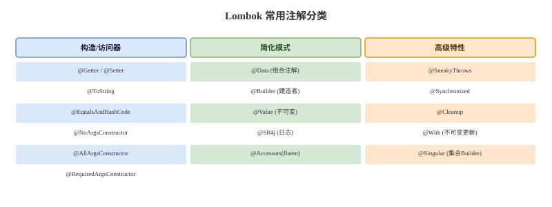

# Lombok 核心注解


## 概念卡
Q: 为什么 @SuperBuilder 存在？@Builder 在继承场景下有什么致命缺陷？

A:
- @Builder 在继承场景下的问题：
  - @Builder 生成的是当前类的静态内部 Builder 类，只包含当前类的字段
  - 子类使用 @Builder 时，无法通过 Builder 链式设置父类字段
  - 手写 Builder 解决继承需要复杂的泛型递归类型参数（Builder Pattern with Curiously Recurring Template）
- @SuperBuilder 的解决方案：
  - 父类和子类各自标注 @SuperBuilder
  - Lombok 生成的子类 Builder 会继承父类 Builder 的所有方法
  - 子类可以链式调用父类字段的设置方法：
    ```java
    Employee.builder()
        .name("张三")        // 父类字段
        .age(28)           // 父类字段
        .department("技术部") // 子类字段
        .build();
    ```
- 技术实现：生成的 Builder 类使用泛型 `Builder<C extends Parent, B extends ParentBuilder<C, B>>` 实现方法继承链

## 机制卡
Q: @SneakyThrows 如何绕过 Java 的检查型异常机制？它的原理是什么？什么时候绝对不该用？

A:
- 原理：@SneakyThrows 在编译时将被标注方法中的检查型异常包装为不需要声明的抛出
  - 利用泛型的类型擦除机制，将检查型异常伪装为非检查型异常抛出
  - JVM 层面不区分检查型/非检查型异常，这个区分只存在于编译器层面
  - 因此编译后的字节码可以正常抛出，调用方编译器不会强制要求捕获
- 正确用法：用于**技术性异常**，这些异常通常无法恢复且调用方也无法处理
  ```java
  @SneakyThrows(IOException.class)
  public String readConfig(String path) {
      return Files.readString(Paths.get(path));
  }
  ```
- 绝对不该用的场景：
  - **业务异常**：如 `IllegalArgumentException`、自定义业务异常，应该让调用方明确感知
  - **可恢复异常**：如重试场景下的临时性异常，调用方需要根据异常类型做不同处理
  - 不加参数全量绕过（`@SneakyThrows` 不指定异常类型）会导致代码意图模糊
- 设计权衡：简洁性 vs 异常可见性。过度使用会使异常处理路径不透明，增加调试难度

## 概念卡
Q: @RequiredArgsConstructor 选择哪些字段作为构造器参数的规则是什么？为什么这样设计？

A:
- 构造器参数规则：所有**未初始化**的 final 字段 + 所有标注 @NonNull 的非 final 字段
  ```java
  @RequiredArgsConstructor
  public class MyClass {
      private final String field1;    // 进入构造器参数
      private final int field2;       // 进入构造器参数
      private String field3;          // 不进入构造器参数（非final且无@NonNull）
      @NonNull private String field4; // 进入构造器参数（有@NonNull标记）
  }
  ```
- 设计动机：对应 Spring 的**构造器注入**最佳实践
  - Spring 4.3+ 对单构造器的类自动进行依赖注入，不需要 @Autowired
  - final 字段必须在构造器中初始化，正好对应不可变依赖
  - @NonNull 字段表示该字段"不应该为空"，构造器提供赋值入口并在运行时做 null 检查
- 与 @AllArgsConstructor 的区别：
  - @AllArgsConstructor 为**所有**字段生成构造器参数
  - @RequiredArgsConstructor 只为**必需**字段生成，更符合最小依赖原则

## 概念卡
Q: 什么场景下不应该使用 Lombok？它的引入有什么工程层面的代价？

A:
- 不应使用 Lombok 的场景：
  - **开源库或公共 API 模块**：Lombok 是编译时依赖，下游使用者需要安装 IDE 插件才能正确解析，增加使用门槛
  - **团队 Java 版本即将大幅升级**：Lombok 依赖 JDK 内部 API（如 com.sun.tools.javac），JDK 版本升级时 Lombok 版本兼容常有滞后
  - **需要精细控制 equals/hashCode 逻辑**：@Data 生成的 equals/hashCode 包含所有非静态字段，可能不符合业务需要
  - **代码审查或安全审计严格的项目**：编译后代码与源码差异大，审计工具可能需要特殊配置
- 工程代价：
  - IDE 插件依赖：团队每个成员必须安装 Lombok 插件
  - 编译透明度降低：编译器看到的代码与源码不一致，定位问题时增加一层间接
  - 与 Record 的互操作性限制：@Data 和 Record 语义冲突，不能混用

## 概念卡
Q: @Data 和 @Value 的核心区别是什么？分别适合什么场景？

A:
- @Data：生成可变的 POJO
  - 包含：@Getter、@Setter、@ToString、@EqualsAndHashCode、@RequiredArgsConstructor
  - 字段可变（有 setter）
  - 适合：JPA Entity、Form 对象、需要修改属性的 Bean
- @Value：生成不可变的值对象
  - 包含：@Getter（无 @Setter）、@ToString、@EqualsAndHashCode、@AllArgsConstructor
  - 所有字段为 private final，类本身为 final
  - 适合：DTO、配置对象、不需要修改的数据载体
- @Value + @Builder 是常见的不可变对象组合：
  ```java
  @Value
  @Builder
  public class UserDTO {
      String name;
      int age;
  }
  ```
- @Value 在语义上接近 JDK14+ 的 Record，但 Record 是语言原生特性且不能与 Lombok 部分注解混用
