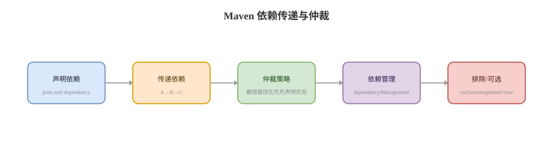

# Maven依赖管理

## 依赖传递卡
Q: Maven 的依赖传递和依赖调解规则是什么？
A:
- Maven 会把直接依赖的传递依赖一起引入项目
- 同一个依赖出现多个版本时，优先选择路径最近的版本
- 路径距离相同时，通常先声明的依赖优先
- 可以用 `mvn dependency:tree` 查看实际依赖树和冲突来源
- 面试表达：Maven 不是简单“取最新版本”，而是按依赖调解规则选择最终版本

## scope卡
Q: Maven 常见 scope 有哪些？分别影响什么？
A:
- `compile` 默认作用域，编译、测试、运行都可见，并参与传递
- `provided` 编译和测试可见，运行时由容器或环境提供，例如 Servlet API
- `runtime` 编译不需要，运行和测试需要，例如 JDBC 驱动
- `test` 只在测试编译和测试运行可见，不参与主程序打包
- `import` 常用于 `dependencyManagement` 中导入 BOM，统一一组依赖版本

## optional与exclusion卡
Q: Maven 中 optional 和 exclusion 的区别是什么？
A:
- `optional=true` 表示当前依赖对下游项目不自动传递
- 它适合可选功能依赖，避免使用方被迫引入不需要的包
- `exclusion` 是使用方主动排除某个传递依赖
- exclusion 适合解决冲突版本、重复实现或安全漏洞依赖
- 面试边界：optional 是发布方声明“可选”，exclusion 是使用方声明“不要”

## dependencyManagement卡
Q: dependencyManagement 的作用是什么？和 dependencies 有什么区别？
A:
- `dependencyManagement` 只管理版本和默认配置，不会主动引入依赖
- 子模块真正声明依赖时，如果没写版本，会使用管理区里的版本
- 它适合多模块项目统一版本，避免每个模块重复写版本号
- `dependencies` 会真正把依赖加入当前模块的依赖树
- 面试表达：dependencyManagement 管“版本约束”，dependencies 管“实际引入”

## 私服与快照卡
Q: Maven 私服、release、snapshot 在工程中怎么理解？
A:
- 私服用于缓存外部依赖、托管内部组件、隔离公网仓库不稳定性
- release 版本应不可变，发布后不应覆盖同一版本内容
- snapshot 表示开发中快照版本，可能随时间更新
- `repository` 用于下载依赖，`distributionManagement` 用于发布构件
- 工程实践中要避免业务长期依赖不稳定 snapshot，否则构建可复现性会变差

## 正确性审查卡
Q: Maven 依赖管理有哪些常见误区？
A:
- “版本范围会自动选最合适版本”：错误。版本范围可能带来不可复现构建
- “清空本地仓库就能根治依赖问题”：不完整。它只能修复本地缓存损坏，根因仍要看依赖树
- “dependencyManagement 会自动引入依赖”：错误。它只管理版本
- “optional 和 exclusion 一样”：错误。二者作用方向不同
- “所有依赖冲突都用排除解决”：不完整。更稳的是统一 BOM 或在父工程集中治理版本
