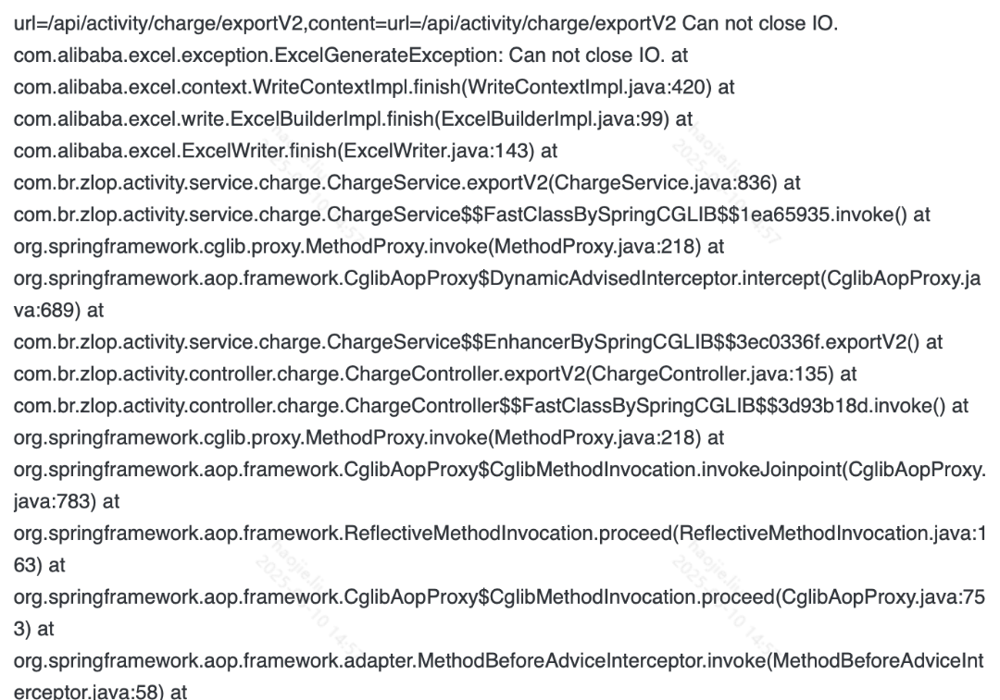

# 常用工具库要点（Hutool、Guava、EasyExcel）



## 概念卡
Q: Hutool 的 BeanUtil.copyProperties 与 Spring 的 BeanUtils.copyProperties 有什么区别？这会导致什么潜在 bug？

A:
- 核心差异：Hutool 在复制时会**自动进行类型转换**，Spring 不会
  - Spring：源字段为 String "1,2"，目标字段为 int，不会转换，目标字段保持默认值（0 或 null）
  - Hutool：源字段为 String "1,2"，目标字段为 int，会自动转换，但结果是 12（去掉了逗号）
- 潜在 bug：
  - 数值精度丢失：Hutool 的自动转换可能丢失小数部分
  - 非预期转换：带格式化的数字字符串被静默转换，未抛异常导致数据污染
  - 字段名映射：两者对下划线/驼峰转换的默认行为可能不同
- 使用建议：
  - 字段类型不一致时显式处理，不依赖自动转换
  - 数据一致性要求高的场景（如对账系统）不要用 copyProperties，手写转换逻辑
  - MapStruct 是更安全的选择（编译期生成转换代码，类型不匹配会编译报错）

## 概念卡
Q: Guava 的 Immutable 集合与 JDK 的 Collections.unmodifiableCollection 有何本质区别？什么场景下前者更优？

A:
- 本质区别：
  - **Immutable 集合**（Guava）：集合本身不可变，从创建那一刻就固定了所有元素
    - 创建时进行优化（更紧凑的内部结构、安全检测省略）
    - 序列化/反序列化后仍保持不可变性
    - 可以安全地跨线程共享
  - **unmodifiable 集合**（JDK）：只是可变集合的**只读视图**
    - 如果原集合被修改，unmodifiable 视图看到的数据也会变化
    - 每次操作都要检查是否允许修改，有额外开销
    - 反序列化后可能失去不可变性
- 注意事项（两者共同点）：
  - 两者都只保证集合本身不可变，不保证集合中元素不可变
  - 两者调用 add/remove 等方法都会抛 UnsupportedOperationException
  - 都不是线程安全方案（元素可变时需要额外同步）
- 选择建议：需要真正不可变的数据集（常量、缓存 key 集合） -> Guava Immutable；只需要防止调用方修改 -> JDK unmodifiable

## 机制卡
Q: 在项目中如何使用 MDC（Mapped Diagnostic Context）配合 TaskDecorator 实现线程池场景下的全链路日志追踪？

A:
- MDC 的原理：SLF4J 的 MDC 基于 ThreadLocal 存储上下文（如 traceId）
  - 主线程在处理请求时，拦截器/过滤器将 traceId 放入 MDC
  - 日志框架在输出时自动从 MDC 读取 traceId 并打印，实现链路串联
- 线程池的问题：线程池中的线程是复用的，线程切换后 MDC 值丢失
- TaskDecorator 的解决方案：
  ```java
  public class TaskDecoratorForMdc implements TaskDecorator {
      @Override
      public Runnable decorate(Runnable runnable) {
          Map<String, String> contextMap = MDC.getCopyOfContextMap();
          return () -> {
              try {
                  if (contextMap != null) MDC.setContextMap(contextMap);
                  runnable.run();
              } finally {
                  MDC.clear();  // 防止线程复用时污染
              }
          };
      }
  }
  ```
- 关键步骤：
  1. 提交任务时捕获主线程的 MDC 上下文（`getCopyOfContextMap`）
  2. 子线程执行前恢复 MDC 上下文（`setContextMap`）
  3. 子线程执行后清除 MDC（`finally` 块中 `MDC.clear()`）
- 配置方式：`threadPoolTaskExecutor.setTaskDecorator(new TaskDecoratorForMdc())`

## 概念卡
Q: Hutool 读取 Excel 时，为什么用 String 类型接收数字列比 BigDecimal 类型更安全？

A:
- 直接原因：Hutool 的 NumberConverter 在将空单元格转换为数值类型时的行为：
  - Excel 中某单元格手动删除内容或清除内容后，Hutool 解析时仍会产生一个"空"的对象
  - 当字段类型是 BigDecimal 时，空单元格会被自动转换为 BigDecimal.ZERO（0）
  - 当字段类型是 String 时，空单元格就是 null 或 " "（空白字符）
- 导致的问题：无法区分"金额为 0"和"金额未填写"，0 具有二义性
  - 在财务对账系统中，"未填写金额"和"金额确实为 0"是需要区别对待的
- 最佳实践：
  - 金额/数值列用 String 接收 -> 手动校验 -> 显式转换为 BigDecimal
  - Hutool 的 `readBySax` 对大 Excel 文件更友好，避免 OOM
- Excel 导入的其他常见坑：
  - 空行中某列有空格/符号会导致该行被解析为一个全 null 的对象
  - HSSF（.xls）和 XSSF（.xlsx）的 setColumnWidth 参数类型不同

## 概念卡
Q: 在生产环境中使用 Hutool 做 Excel 导出时，"Zip bomb detected" 错误是什么原因？如何解决？

A:
- 错误根源：POI 检测到 Excel 文件的压缩比异常高
  - Excel 本质是压缩文件（.xlsx 是 ZIP 格式），文本内容的压缩比可以很高
  - POI 有一个压缩炸弹检测机制：当解压后的数据量与压缩数据量比值超过阈值时，认为可能是恶意文件
  - 目的是防止 OOM 攻击：攻击者上传一个几 KB 的 ZIP，解压后膨胀到几 GB 撑爆服务器内存
- 业务中的常见原因：Excel 中隐藏的单元格格式过多
  - 即使没有实际数据，大量设置了格式（字体、边框、背景色等）的单元格也会增加解压后体积
- 解决方案：
  - 清理 Excel 模板中不必要的格式
  - 使用 POI 原生 API 创建 Excel 时可以控制格式数量
  - 设置更高的压缩比阈值（治标不治本）：`ZipSecureFile.setMinInflateRatio(x)`
- 导出大文件超时问题：
  - 不要直接将 Excel 写入 HTTP Response，应先存储到文件系统/DFS
  - 返回文件下载链接，让前端异步下载
