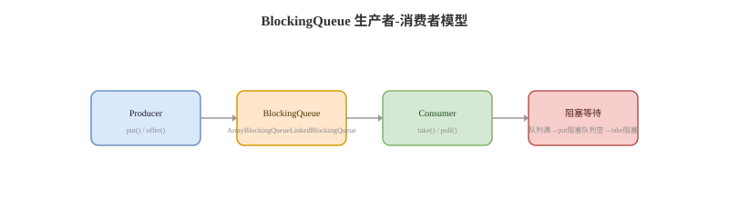

# BlockingQueue 与并发队列

## 概念卡
Q: BlockingQueue 解决了什么问题？它和普通 Queue 的核心差异是什么？
A:
- BlockingQueue 是生产者-消费者模型的基础组件，核心能力是“队列满时阻塞生产者，队列空时阻塞消费者”
- 普通 Queue 只表达入队/出队，不负责线程等待、唤醒、容量背压和中断响应
- BlockingQueue 的典型方法分四组：抛异常（add/remove/element）、返回特殊值（offer/poll/peek）、一直阻塞（put/take）、限时等待（offer(timeout)/poll(timeout)）
- 线程池里的 workQueue 本质就是用队列把“任务提交速度”和“工作线程消费速度”解耦
- 面试表达：BlockingQueue 不只是集合类，它是并发控制组件，关键价值是容量边界、等待唤醒和背压

## 对比卡
Q: ArrayBlockingQueue、LinkedBlockingQueue、SynchronousQueue 分别适合什么场景？
A:
- ArrayBlockingQueue：数组实现，有界队列，单锁加两个 Condition；容量固定，适合需要明确背压和稳定内存占用的线程池
- LinkedBlockingQueue：链表实现，默认容量是 Integer.MAX_VALUE，putLock/takeLock 分离，吞吐通常较好；无参构造容易导致任务堆积和 OOM
- SynchronousQueue：不存储元素，每个 put 必须等待一个 take，适合直接交接任务；CachedThreadPool 使用它，所以高峰期可能不断创建线程
- 线程池选型：想限制内存和任务延迟，用有界队列；想快速扩线程处理突发任务，用 SynchronousQueue 但必须限制 maximumPoolSize
- 面试陷阱：LinkedBlockingQueue 不是绝对“无界”，它可以传容量；但无参构造是近似无界，生产上要避免

## 机制卡
Q: ArrayBlockingQueue 是如何实现阻塞与唤醒的？
A:
- 内部维护一个定长数组、putIndex、takeIndex、count，以及一个 ReentrantLock
- notFull Condition 管理等待插入的生产者，notEmpty Condition 管理等待获取的消费者
- put 时先加锁，队列满则在 notFull 上 await；入队成功后 count++，signal notEmpty 唤醒消费者
- take 时先加锁，队列空则在 notEmpty 上 await；出队成功后 count--，signal notFull 唤醒生产者
- 使用 while 检查条件而不是 if，是为了处理虚假唤醒和被唤醒后条件又被其他线程抢先改变

## 机制卡
Q: LinkedBlockingQueue 为什么用两把锁？它的性能和风险分别是什么？
A:
- LinkedBlockingQueue 使用 putLock 管理入队、takeLock 管理出队，count 用 AtomicInteger 连接两端状态
- 入队和出队在多数情况下可以并行执行，比单锁队列减少竞争
- 当队列从空变为非空时，需要 signalNotEmpty；从满变为未满时，需要 signalNotFull，让另一端线程恢复
- 风险在容量：无参构造容量是 Integer.MAX_VALUE，线程池中任务生产快于消费时，会优先堆积任务而不是扩线程，最终可能 OOM
- 面试建议：生产线程池里 LinkedBlockingQueue 必须显式设置容量，并配合监控队列长度

## 机制卡
Q: SynchronousQueue 为什么说“没有容量”？它在线程池里会带来什么效果？
A:
- SynchronousQueue 不保存元素，put 和 take 必须配对完成，本质是线程之间的直接交接点
- 公平模式通常使用队列，非公平模式通常使用栈；非公平吞吐高，公平模式避免长期饥饿
- 在线程池中，如果没有空闲线程接收任务，任务无法入队，ThreadPoolExecutor 会尝试创建新线程
- CachedThreadPool 使用 SynchronousQueue 且 maximumPoolSize 接近无限，高并发下可能创建大量线程
- 面试结论：SynchronousQueue 能降低排队延迟，但如果最大线程数不受控，风险会从“队列堆积”转成“线程爆炸”

## 并发队列卡
Q: ConcurrentLinkedQueue 和 BlockingQueue 的核心区别是什么？
A:
- ConcurrentLinkedQueue 是非阻塞无界队列，基于 CAS 维护链表 head/tail，offer/poll 不会因为空或满而阻塞
- BlockingQueue 强调阻塞等待和容量背压，适合生产者-消费者协调
- ConcurrentLinkedQueue 的 tail 不保证永远指向最后一个节点，允许延迟更新 tail 来减少 CAS 成本
- poll 时通过 CAS 把节点 item 置空实现逻辑删除，再适时推进 head
- 选择标准：需要等待和背压用 BlockingQueue；需要高吞吐、允许调用方自行处理空队列和流控，用 ConcurrentLinkedQueue

## 正确性审查卡
Q: 复习 BlockingQueue 和并发队列时，哪些说法容易不严谨？
A:
- “LinkedBlockingQueue 是无界队列”：不严谨。它可以有界，只是无参构造容量非常大
- “SynchronousQueue 是容量为 1 的队列”：错误。它不存储元素，必须生产者和消费者直接配对
- “BlockingQueue 能防止 OOM”：不一定。只有有界队列才能形成明确背压，无界队列仍可能堆积到 OOM
- “ConcurrentLinkedQueue 的 size 很可靠”：不严谨。并发队列 size 需要遍历，且并发修改下只是瞬时估算
- “线程池队列越大越安全”：错误。过大的队列会隐藏过载，导致延迟升高和内存风险
