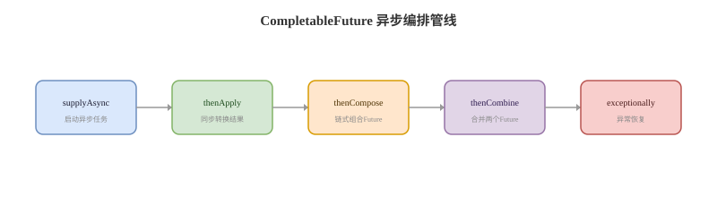

# CompletableFuture 异步编排

## 概念卡
Q: CompletableFuture 相比 Future 解决了哪些痛点？
A:
- Future 只能阻塞 get 获取结果，缺少回调、组合、异常编排和手动完成能力
- CompletableFuture 同时实现 Future 和 CompletionStage，支持任务完成后继续执行下一阶段
- 它可以表达串行依赖、并行合并、任一完成、异常恢复、超时控制等异步工作流
- complete/completeExceptionally 支持由外部线程手动完成结果
- 面试一句话：Future 是“异步结果句柄”，CompletableFuture 是“异步 DAG 编排工具”

## 编排卡
Q: thenApply、thenCompose、thenCombine、allOf/anyOf 分别适合什么场景？
A:
- thenApply：同步转换一个阶段的结果，返回普通值，例如 User -> UserDTO
- thenCompose：把一个异步结果展开成另一个异步任务，避免 `CompletableFuture<CompletableFuture<T>>`
- thenCombine：两个独立异步任务都完成后合并结果，例如用户信息和订单信息并行查询后组装
- allOf：等待一组任务全部完成，常用于并行批量查询后统一汇总
- anyOf：任意一个任务完成即可继续，常用于竞速请求、降级或多源读取

## 线程池卡
Q: CompletableFuture 的任务默认跑在哪个线程池？生产环境要注意什么？
A:
- supplyAsync/runAsync 不传 Executor 时，默认使用 ForkJoinPool.commonPool
- thenApply 这类非 Async 方法通常在触发当前阶段完成的线程中执行，可能是业务线程、回调线程或上游任务线程
- thenApplyAsync/thenComposeAsync 不传 Executor 时也会使用 commonPool
- 生产环境 IO 密集任务应显式传入业务隔离线程池，避免阻塞 commonPool 影响其他异步任务和并行流
- 面试亮点：CompletableFuture 的性能问题很多不是 API 本身，而是线程池隔离和阻塞控制没做好

## 异常卡
Q: CompletableFuture 的异常处理应该怎么设计？handle、exceptionally、whenComplete 有什么区别？
A:
- exceptionally：只在异常时执行，返回一个兜底值，相当于恢复流程
- handle：无论成功失败都会执行，可以同时看到 result 和 exception，并返回新结果
- whenComplete：无论成功失败都会执行，适合记录日志/埋点；它不负责把异常转换成正常结果
- join 会把异常包装成 CompletionException，get 会包装成 ExecutionException 且声明 checked exception
- 实战建议：在链路边界统一处理异常，中间阶段只处理能真正恢复的异常，避免吞掉根因

## 超时卡
Q: CompletableFuture 如何做超时控制和降级？有哪些坑？
A:
- Java 9 后可以使用 orTimeout 在超时后让 future 异常完成
- completeOnTimeout 可以在超时后给默认值，让流程继续走降级路径
- 超时完成不等于底层任务一定停止，正在执行的线程可能还在跑；如果需要取消真实任务，要结合任务自身中断响应或外部取消机制
- allOf 中任何子任务异常，汇总 future 也会异常完成；收集部分成功结果时要给每个子任务单独兜底
- 面试要点：超时是结果层面的控制，资源释放和任务取消要另行设计

## 实战卡
Q: 使用 CompletableFuture 做接口聚合时，怎样写才算生产可用？
A:
- 为不同下游配置独立线程池、超时、熔断和降级，避免慢服务拖垮公共线程池
- 明确每个阶段是 CPU 计算还是 IO 调用，IO 阶段不要占用 commonPool
- allOf 后逐个 join 前，最好每个子任务已经做异常兜底，否则一个失败会影响整体
- 对任务数量做限制，避免一次请求创建过多异步任务压垮线程池
- 记录 traceId、耗时和异常上下文，否则异步链路排查会很痛苦

## 正确性审查卡
Q: CompletableFuture 有哪些常见误区？
A:
- “用了 CompletableFuture 就一定并行”：错误。只有提交到异步执行器的任务才并行，普通 thenApply 可能在同一线程继续执行
- “Async 方法一定更好”：不一定。它会增加线程切换和排队成本，简单转换用非 Async 更合适
- “cancel 能强制杀死任务”：不严谨。取消通常只是让 future 进入取消状态，真实任务是否停止取决于执行器和任务中断响应
- “join 不会抛异常”：错误。join 会抛 CompletionException，只是不需要显式 catch checked exception
- “默认线程池够用”：生产上危险。IO 阻塞、长任务和高并发请求都应显式线程池隔离
