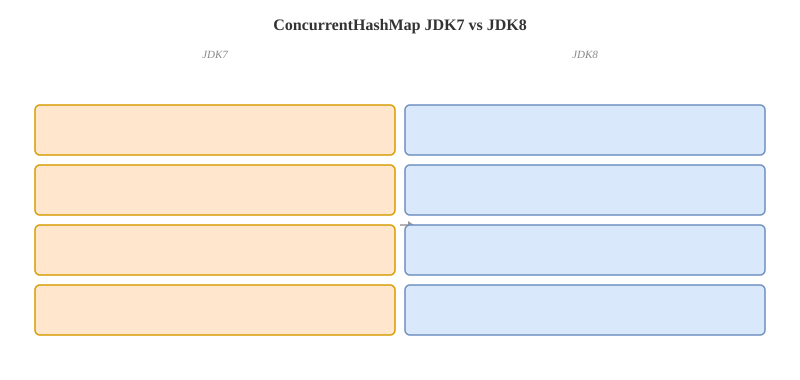

# ConcurrentHashMap 原理

## 概念卡
Q: 为什么需要 ConcurrentHashMap？它解决了 HashMap 和 Hashtable 的哪些并发问题？
A:
- HashMap 线程不安全：并发 put、resize、链表/树结构修改都可能导致数据丢失、覆盖、结构异常或 size 计数错误，不能用于多线程共享写场景
- Hashtable 线程安全但并发度低：主要方法整体 synchronized，同一时刻基本只有一个线程能访问整张表，读读之间也会互斥
- ConcurrentHashMap 的目标：保证单 key 操作线程安全，同时让读尽量无锁、写只锁局部桶位，避免整表互斥
- JDK8 核心结构：`Node[] table + 链表 + 红黑树`，配合 `CAS + synchronized + volatile + 分段计数 + 协作扩容`
- 面试一句话：ConcurrentHashMap 不是“完全无锁 Map”，而是“读路径高度无锁，写路径把锁粒度压到桶级，并让扩容和计数也能并发化”

## 版本演进卡
Q: ConcurrentHashMap 在 JDK7 和 JDK8 的实现有什么区别？为什么 JDK8 放弃 Segment 分段锁？
A:
- JDK7：`Segment[] + HashEntry[]`。Segment 继承 ReentrantLock，put 时先定位 Segment，再锁住该 Segment 内部的桶，锁粒度是 Segment 级别
- JDK8：取消 Segment 主体结构，直接在 `Node[] table` 上操作。空桶插入用 CAS，非空桶更新锁住桶头节点，锁粒度细化到单个 hash 桶
- 放弃原因：Segment 数量初始化后基本固定，热点 Segment 会限制并发度；桶级锁能让并发度随 table 扩容和 hash 分布继续提升
- JDK8 还引入红黑树、协作扩容、`baseCount + CounterCell` 分段计数，整体减少全局竞争热点
- 注意：JDK8 构造参数里的 `concurrencyLevel` 主要退化成容量估算提示，不再代表固定 Segment 数量

## 写入流程卡
Q: JDK8 ConcurrentHashMap 的 putVal 主流程是什么？面试如何按源码路径讲清楚？
A:
- 先校验 key/value 不能为 null，然后计算扰动 hash，降低高位 hash 信息丢失带来的碰撞
- 如果 table 还没初始化，调用 `initTable()`，通过 `sizeCtl` 和 CAS 保证只有一个线程真正初始化
- 如果目标桶为空，用 CAS 直接把新 Node 放入数组位置；成功则不加锁，这是最快路径
- 如果桶头 hash 是 `MOVED`，说明正在扩容，当前线程会进入 `helpTransfer()` 协助迁移
- 如果桶非空且未迁移，就 synchronized 锁住桶头节点；锁内再次确认桶头没变，再在链表或 TreeBin 中插入/更新
- 插入后如果链表长度达到阈值，会调用 `treeifyBin()`；但 table 长度小于 64 时优先扩容，而不是直接树化
- 最后调用 `addCount()` 更新元素个数，并根据阈值判断是否触发扩容

## 读取流程卡
Q: ConcurrentHashMap 的 get 为什么通常不加锁？它能保证读到“最新值”吗？
A:
- get 先根据 hash 定位桶位，读取 table 槽位、Node 的 `val` 和 `next` 依赖 volatile/原子读语义保证可见性
- 命中桶头时直接返回；桶头 hash 小于 0 时走特殊节点的 `find()`，例如 ForwardingNode 会跳到新 table，TreeBin 会按树查找
- 普通链表路径就是顺着 `next` 遍历比较 key，不需要 synchronized
- 它保证的是：对某个 key 已完成的更新，与后续成功读取该 key 之间有可见性关系；但不提供整张 Map 的一致性快照
- 面试不要说“get 一定读到全局最新状态”。并发场景下不同 key 的观察顺序、size、遍历结果都可能不是同一时刻的快照

## sizeCtl 卡
Q: sizeCtl 在 ConcurrentHashMap 里承担什么角色？几个典型取值分别代表什么？
A:
- `sizeCtl` 是 JDK8 ConcurrentHashMap 的核心控制字段，同时参与初始化、扩容阈值和扩容协作状态管理
- `sizeCtl = 0`：table 尚未初始化，使用默认容量
- `sizeCtl > 0`：未初始化时表示初始化容量提示；初始化后表示下一次扩容阈值，通常约等于 `capacity * 0.75`
- `sizeCtl = -1`：有线程正在初始化 table，其他线程让出或自旋等待
- `sizeCtl < -1`：正在扩容，值中编码 resize stamp 和参与扩容的线程数量
- 面试亮点：`sizeCtl` 不是单纯的 threshold，它是并发初始化和并发扩容的状态机入口

## 初始化卡
Q: ConcurrentHashMap 的 initTable 如何保证并发初始化安全？
A:
- table 懒加载，第一次 put 时才初始化，避免构造空 Map 时就分配数组
- 多线程同时初始化时，线程通过 CAS 把 `sizeCtl` 从非负数改成 -1，抢到资格的线程负责真正创建 Node 数组
- 没抢到的线程发现 `sizeCtl < 0`，会让出 CPU 或短暂自旋，等待初始化完成
- 初始化完成后，线程把 `sizeCtl` 设置为扩容阈值，例如容量的 0.75 倍左右
- 这个设计避免了构造阶段加锁，也避免多个线程重复创建 table

## 扩容触发卡
Q: ConcurrentHashMap 在什么情况下会触发扩容？树化和扩容的优先级是什么？
A:
- 新增节点后，`addCount()` 发现元素估算数量超过 `sizeCtl` 阈值，会触发扩容
- 链表长度达到树化阈值 8 时，不一定立刻转红黑树；如果 table 长度小于 64，会优先扩容
- 原因是小表里的长链表常常来自容量不足，扩容后 hash 重新分布就能缓解冲突，直接树化成本反而高
- 只有当链表长度达到 8 且 table 长度至少 64，才更倾向于树化
- 退化阈值通常是 6：树节点减少到较少时，可能退回链表，避免维护树结构的额外成本

## 协作扩容卡
Q: ConcurrentHashMap 的 transfer 如何实现多线程协作扩容？
A:
- 扩容时创建两倍大小的新数组 `nextTable`，旧 table 中的桶会被多个线程分段迁移
- `transferIndex` 从高位向低位分配迁移区间，每个线程领取一段桶范围处理，减少线程之间的写冲突
- 每个桶迁移时会锁住桶头节点，把原链表或树拆分到新数组的低位桶和高位桶
- 迁移完成后，旧 table 对应位置会放入 ForwardingNode，表示该桶已经迁移
- 最后一个完成迁移的线程负责把 `table` 指向 `nextTable`，并重新设置 `sizeCtl` 为新阈值
- 面试亮点：扩容不是让其他 put 全部阻塞等待；put 线程遇到迁移状态会帮忙搬数据，这就是 `helpTransfer()`

## ForwardingNode 卡
Q: ForwardingNode 在 ConcurrentHashMap 扩容中有什么作用？
A:
- ForwardingNode 的 hash 是特殊值 `MOVED = -1`，放在旧 table 的桶位上，表示这个桶已经迁移到新 table
- get 遇到 ForwardingNode，会通过它持有的 `nextTable` 去新数组继续查找，保证扩容过程中的读取正确
- put 遇到 ForwardingNode，通常会进入 `helpTransfer()`，先帮助扩容，再在新 table 上完成写入
- 它也是一个迁移完成标记：其他线程看到后不会重复迁移同一个桶
- 面试一句话：ForwardingNode 把“旧表桶位”变成“去新表查/帮忙迁移”的路标，是并发扩容能安全推进的关键

## 计数卡
Q: ConcurrentHashMap 的 size 计数为什么不用一个 AtomicLong？baseCount + CounterCell 是怎么工作的？
A:
- 如果所有写线程都 CAS 更新同一个 AtomicLong，高并发下会形成严重竞争热点
- JDK8 使用类似 LongAdder 的思路：低竞争时 CAS 更新 `baseCount`；竞争激烈时，把增量分散到 `CounterCell[]` 的不同槽位
- 统计总数时，把 `baseCount` 和所有 CounterCell 的 value 求和，得到当前估算数量
- `mappingCount()` 返回 long，更适合大 Map；`size()` 返回 int，超过 int 范围时会被截断到 `Integer.MAX_VALUE`
- 面试注意：并发更新中 size 不是强一致快照，官方也更建议把 size/isEmpty/containsValue 这类聚合结果用于监控估算，而不是并发控制条件

## 树化卡
Q: ConcurrentHashMap 的红黑树化机制和 HashMap 一样吗？TreeBin 有什么特殊点？
A:
- 触发条件类似：桶内链表长度达到 8 且 table 长度至少 64 时，链表可能转成红黑树
- ConcurrentHashMap 不能直接把桶头变成普通 TreeNode，因为并发读写需要额外协调，所以桶头会放 TreeBin
- TreeBin 内部维护红黑树根节点，并用 `lockState`、等待线程等机制协调树写操作；写入、删除、旋转需要串行化
- 查询遇到 TreeBin 时走树查找，复杂度从链表的 O(n) 降到 O(log n)
- 节点减少到较少时可能退化回链表，避免小规模数据还维护红黑树的成本

## 原子复合操作卡
Q: 为什么 ConcurrentHashMap 线程安全，但仍然不能用 get 后再 put 实现复合逻辑？
A:
- ConcurrentHashMap 保证的是单次方法调用的线程安全，不保证多次调用自动组成一个原子事务
- 错误例子：先 `get(key)` 判断不存在，再 `put(key, value)`，两个线程可能都判断不存在并互相覆盖
- 正确选择：只需要不存在才插入用 `putIfAbsent()`；需要基于旧值计算用 `compute()`、`computeIfAbsent()`、`merge()`
- `computeIfAbsent()` 对同一个 key 的计算是原子的，映射函数通常最多执行一次；执行期间其他对该 key 或相关桶的更新可能被阻塞
- 面试注意：映射函数应该短小、无阻塞、不要递归修改同一个 Map；递归更新可能触发 IllegalStateException 或造成性能问题

## null 限制卡
Q: 为什么 ConcurrentHashMap 不允许 null key 和 null value？
A:
- 并发场景下，null 需要作为“没有映射”的可靠返回标记
- 如果允许 value 为 null，`get(key) == null` 就无法区分 key 不存在，还是 key 存在但值就是 null
- 这个歧义会破坏 `putIfAbsent()`、`computeIfAbsent()`、`containsKey()` 与并发读写之间的判断语义
- HashMap 允许 null 是单线程普通集合语义；ConcurrentHashMap 更强调并发 API 的可判定性和可见性语义
- 面试回答要落到“避免并发下的歧义”，不要只说“源码里禁止了”

## 弱一致性卡
Q: ConcurrentHashMap 的迭代器、size、isEmpty、containsValue 是强一致的吗？
A:
- 迭代器是弱一致的：遍历期间可以并发修改，不会抛 ConcurrentModificationException
- 弱一致意味着它可能看见遍历开始后的部分更新，也可能看不见某些刚发生的更新，但不会因为并发修改直接失败
- `size()`、`isEmpty()`、`containsValue()` 这类聚合方法在并发更新中只能反映某个瞬间附近的估算状态，不适合作为严格流程控制条件
- 如果业务需要强一致视图，应该在外部做同步、复制快照，或换成更符合语义的数据结构/事务边界
- 面试亮点：ConcurrentHashMap 牺牲的是全局快照一致性，换来高并发读写吞吐

## 面试追问卡
Q: 如果面试官追问“ConcurrentHashMap 一定比 synchronized HashMap 快吗”，应该怎么回答？
A:
- 不一定。低并发、数据量很小、操作极短时，ConcurrentHashMap 的 CAS、volatile、树化、计数和扩容协作都有额外成本
- 高并发读多写少、key 分布均匀时，ConcurrentHashMap 通常明显优于整表锁，因为读基本不阻塞，写锁粒度也更细
- 如果大量线程竞争同一个 key 或同一个 hash 桶，ConcurrentHashMap 仍会在桶级别串行，性能可能下降
- 如果 value 是可变对象，ConcurrentHashMap 只保护 Map 结构，不自动保护 value 内部状态；value 的线程安全要业务自己保证
- 面试回答结构：先承认不是绝对更快，再按并发度、读写比例、hash 分布、value 是否可变、复合操作是否原子化来分析

## 正确性审查卡
Q: 复习 ConcurrentHashMap 时，哪些说法是常见但不严谨的？
A:
- “ConcurrentHashMap 完全无锁”：错误。JDK8 写入非空桶时会 synchronized 锁桶头，TreeBin 写操作也需要协调
- “get 一定读到最新值”：不严谨。它能看到已完成的单 key 更新的可见性效果，但不提供全 Map 快照
- “size 是精确实时值”：不严谨。并发更新时 size/mappingCount 是聚合估算，不适合作为强一致判断依据
- “JDK8 还有 Segment 分段锁”：不严谨。JDK8 为兼容序列化等保留了相关痕迹，但核心并发控制已经不是 Segment 锁
- “链表长度到 8 一定树化”：不严谨。table 长度小于 64 时优先扩容，达到容量条件后才更可能树化
- “ConcurrentHashMap 线程安全，所以 value 对象也线程安全”：错误。Map 结构安全不等于 value 内部状态安全
