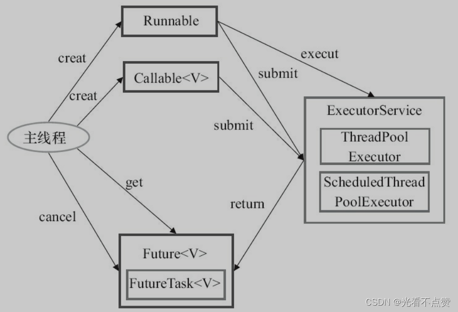
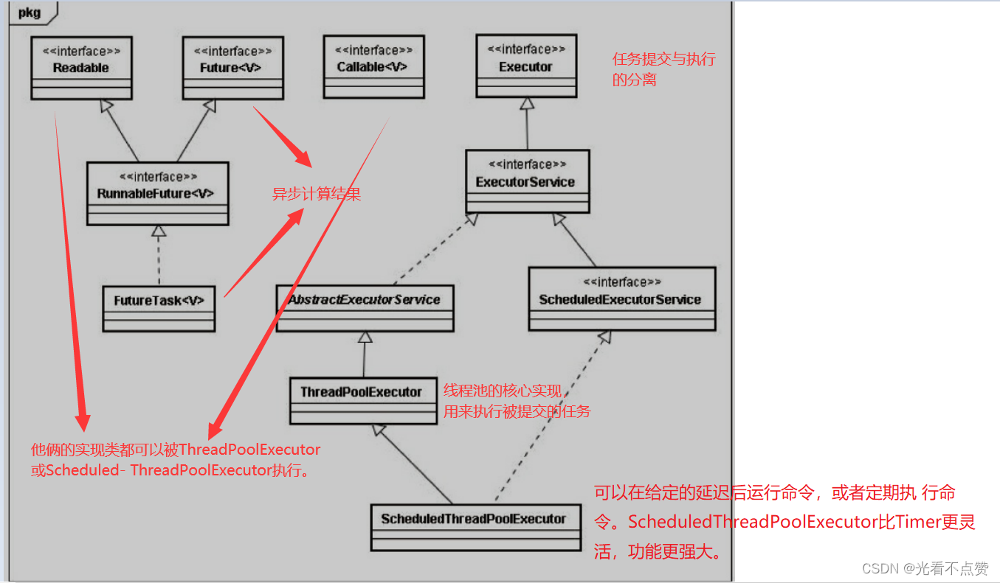
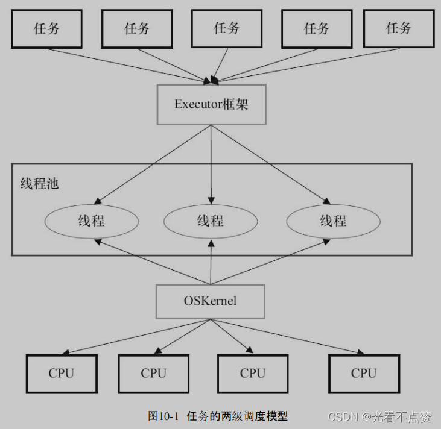

# Executor 框架

## 概念卡
Q: Executor 框架的设计思想是什么？为什么要把任务提交和任务执行解耦？
A:
- Executor 框架（JDK5）将工作单元（Runnable/Callable）与执行机制（线程池、调度策略）分离
- 两层调度模型：应用层将任务分解为多个子任务 → Executor 框架将任务映射到操作系统线程 → 操作系统将线程映射到 CPU
- 核心接口职责：Executor（执行任务）、ExecutorService（管理生命周期）、ScheduledExecutorService（定时调度）
- Future 接口：提供异步计算结果的获取（get() 阻塞等待、cancel() 取消、isDone() 检查完成状态）
- 设计优势：更换执行策略不影响任务代码；统一的任务提交和结果获取模式；便于测试（可用同步 Executor 替代线程池）

## 机制卡
Q: FutureTask 如何实现异步任务的结果获取？get() 方法内部如何阻塞和唤醒？
A:
- FutureTask 实现了 RunnableFuture（同时实现 Runnable 和 Future），任务的状态流转用 state 变量 + CAS 管理
- 状态：NEW → COMPLETING → NORMAL/EXCEPTIONAL/CANCELLED/INTERRUPTED
- get() 阻塞：如果任务未完成（state <= COMPLETING），调用线程在 FutureTask 的 WaitNode 链表（Treiber Stack）上排队，通过 LockSupport.park() 阻塞
- run() 完成：任务执行完毕后，调用 finishCompletion()，遍历 WaitNode 链表，逐一 LockSupport.unpark() 唤醒所有等待 get() 的线程
- 关键细节：如果在 get() 之前任务已完成，get() 直接返回结果不阻塞——这就是为什么 FutureTask 要有状态机
- 面试进阶：可以用 CompletionService（ExecutorCompletionService）来解决"多个异步任务按完成顺序获取结果"的需求，内部用 BlockingQueue 存放完成的 Future

## 对比追问卡
Q: Runnable 和 Callable 有什么区别？为什么需要 Callable？
A:
- Runnable：run() 方法无返回值，不抛 checked exception。Thread 和早期线程 API 使用
- Callable：call() 方法有返回值（泛型），可抛 checked exception。配合 Future/FutureTask 使用
- 为什么需要 Callable：异步任务结果返回是刚性需求。Runnable 时代需要外部共享变量来获取结果（复杂且线程不安全），Callable + Future 模式化了这个需求
- 适配关系：FutureTask 可以包装 Callable 或 Runnable（Runnable 通过 Executors.callable() 适配）；Thread 只能接受 Runnable，需要用 FutureTask 作为适配器
- Lambda 时代注意：`() -> { return 42; }` 可能是 Callable（有返回值）或 Runnable（无返回值），取决于上下文推断

## 边界卡
Q: ExecutorService 的生命周期管理有哪些注意事项？
A:
- shutdown()：平滑关闭，不再接受新任务，但等待已提交任务执行完毕
- shutdownNow()：立即关闭，尝试中断正在执行的任务，返回未执行的任务列表。注意：不能保证一定能中断成功（取决于任务是否响应中断）
- 两者都不阻塞等待，需要配合 awaitTermination() 限时等待
- 推荐关闭模式：shutdown() → awaitTermination(timeout) → 超时则 shutdownNow() → 再 awaitTermination() → 仍然超时则记录异常
- 生产环境陷阱：@PreDestroy 中只调了 shutdown() 就以为线程池关闭了。正确做法是完整的三段式关闭，确保资源释放
