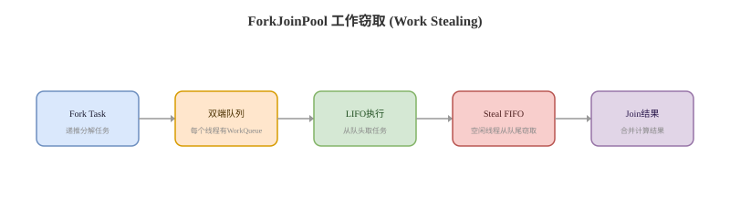

# ForkJoinPool 与工作窃取

## 概念卡
Q: Fork/Join 框架解决什么问题？它适合哪些任务？
A:
- Fork/Join 用于把一个大任务递归拆成小任务并行执行，再把结果合并
- 核心类：ForkJoinPool 负责调度，ForkJoinTask 表示任务，RecursiveTask 有返回值，RecursiveAction 无返回值
- 适合 CPU 密集、可递归拆分、子任务相对独立、合并成本低的任务
- 不适合大量阻塞 IO 或强依赖串行任务，否则工作线程会被阻塞，窃取也救不了吞吐
- 面试关键词：分治、工作窃取、双端队列、commonPool、避免阻塞

## 工作窃取卡
Q: ForkJoinPool 的工作窃取算法是怎么降低竞争的？
A:
- 每个工作线程维护自己的双端队列，自己通常从队尾 push/pop 本地任务
- 当某个线程没任务时，会从其他线程队列的队头 steal 任务
- 本地线程和窃取线程操作队列两端，减少对同一端的竞争
- 小任务递归拆分后分散在多个工作队列中，空闲线程可以主动找活干
- 代价是实现复杂，且任务太细会导致调度开销超过并行收益

## fork/join 卡
Q: 写 ForkJoinTask 时 fork 和 join 的顺序有什么讲究？
A:
- 常见写法是 fork 一个子任务，当前线程直接 compute 另一个子任务，最后 join fork 出去的任务
- 这样可以避免当前线程只负责提交任务而不干活，减少任务排队和线程切换
- 阈值要合理：太大并行度不足，太小任务数量爆炸，调度开销变高
- join 会等待子任务完成，如果在任务内等待外部阻塞操作，可能拖慢整个池
- 面试亮点：ForkJoinPool 的性能关键不是“拆得越细越好”，而是拆分粒度和计算成本匹配

## commonPool 卡
Q: commonPool 有什么风险？它和 parallelStream、CompletableFuture 有什么关系？
A:
- ForkJoinPool.commonPool 是 JVM 进程内共享的公共池
- parallelStream 默认使用 commonPool，CompletableFuture 的 Async 方法不传 Executor 时也常用 commonPool
- 如果把阻塞 IO、长耗时任务放到 commonPool，可能影响同进程其他并行流和异步任务
- commonPool 的并行度通常与 CPU 核心数相关，更适合 CPU 密集任务
- 生产建议：业务异步任务显式传入独立 Executor，不要让所有异步能力挤在 commonPool

## ManagedBlocker 卡
Q: ForkJoinPool 中必须阻塞时，ManagedBlocker 有什么作用？
A:
- ForkJoinPool 假设任务以计算为主，不希望工作线程长期阻塞
- 如果任务必须等待锁、IO 或外部资源，可以用 ManagedBlocker 告诉池当前线程即将阻塞
- 池可以在必要时补偿创建或激活其他线程，减少并行度被阻塞吞掉
- 但 ManagedBlocker 不是让阻塞任务变快，只是降低阻塞对整个池的影响
- 面试表达：ForkJoinPool 可以处理有限阻塞，但设计目标仍不是通用 IO 线程池

## 正确性审查卡
Q: ForkJoinPool 面试中哪些说法要修正？
A:
- “ForkJoin 适合所有并发任务”：错误。它主要适合可拆分的 CPU 密集任务
- “parallelStream 一定更快”：错误。小数据量、阻塞操作、有共享状态副作用时可能更慢或更危险
- “commonPool 是业务线程池”：不严谨。它是进程公共资源，生产业务最好显式隔离
- “任务越小越好”：错误。任务太细会被调度和窃取开销吞掉收益
- “工作窃取没有竞争”：不严谨。它是减少竞争，不是消除竞争
