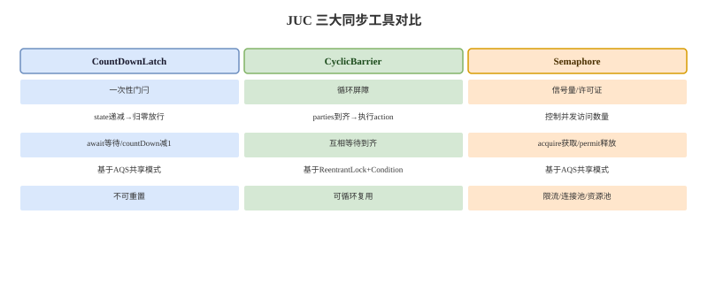

# JUC 同步工具类

## 概念卡
Q: CountDownLatch、CyclicBarrier、Semaphore 分别解决什么问题？
A:
- CountDownLatch：一个或多个线程等待一组事件完成，计数器只能递减，归零后永久放行，不能复用
- CyclicBarrier：一组线程互相等待到达同一个屏障点，所有线程到齐后一起继续，可以复用
- Semaphore：用许可证控制同时访问某资源的线程数量，常用于限流、连接池、资源池
- 三者底层思路不同：CountDownLatch 和 Semaphore 基于 AQS，共享模式；CyclicBarrier 基于 ReentrantLock + Condition
- 面试一句话：Latch 等别人完成，Barrier 等大家集合，Semaphore 控制并发名额

## CountDownLatch 卡
Q: CountDownLatch 的 await/countDown 流程是什么？为什么它不能重置？
A:
- 初始化时 state 等于计数值，await 线程在 state 不为 0 时进入 AQS 共享模式等待队列
- countDown 本质是 CAS 递减 state，直到 state 变成 0
- state 归零后，AQS 会以共享模式传播唤醒等待线程，之后新的 await 也会直接通过
- 它不能重置，因为设计目标是一次性门闩；如果要多轮复用，应使用 CyclicBarrier 或 Phaser
- 典型场景：主线程等待多个初始化任务完成、压测中让多个工作线程同时起跑

## CyclicBarrier 卡
Q: CyclicBarrier 的工作机制是什么？它和 CountDownLatch 的本质区别是什么？
A:
- CyclicBarrier 维护 parties、count 和 generation，一批线程调用 await 后 count 递减
- 最后一个到达的线程会执行 barrierAction，然后唤醒本 generation 的所有等待线程
- 唤醒后进入下一代 generation，count 重置为 parties，因此可以循环复用
- 如果等待线程被中断、超时或 barrierAction 抛异常，当前 barrier 会 broken，其他等待线程收到 BrokenBarrierException
- 本质区别：CountDownLatch 是“事件完成通知”，CyclicBarrier 是“线程互相会合”

## Semaphore 卡
Q: Semaphore 如何实现限流？公平模式和非公平模式有什么区别？
A:
- Semaphore 的 state 表示可用许可证数量，acquire 成功则扣减许可证，release 则归还许可证
- 当许可证不足时，线程进入 AQS 共享队列等待
- 非公平模式允许新来的线程直接抢许可证，吞吐更高，但可能让队列中老线程等待更久
- 公平模式按队列顺序获取许可证，减少饥饿，但吞吐通常低一些
- 典型场景：限制同时访问数据库连接、第三方接口、文件句柄或 GPU 等稀缺资源的线程数

## Phaser 卡
Q: Phaser 相比 CountDownLatch 和 CyclicBarrier 多了什么能力？
A:
- Phaser 支持动态注册和注销参与者，适合任务数量分阶段变化的并发流程
- 它有 phase 概念，每一轮所有参与者到达后进入下一阶段
- arrive 表示到达但不等待，arriveAndAwaitAdvance 表示到达并等待其他参与者
- arriveAndDeregister 可以在某阶段后退出，避免后续阶段继续等待该参与者
- 面试定位：CountDownLatch 和 CyclicBarrier 是常见固定场景工具，Phaser 是更灵活的多阶段协调器

## 选择卡
Q: 面试中如何快速选择 CountDownLatch、CyclicBarrier、Semaphore、Phaser？
A:
- 等多个任务完成一次：CountDownLatch
- 多个线程每轮都要互相等齐：CyclicBarrier
- 限制同时执行数量：Semaphore
- 多阶段、参与者数量动态变化：Phaser
- 只需要保护临界区互斥：不要用这些工具，直接考虑 synchronized 或 Lock
- 需要线程间传递数据：考虑 BlockingQueue、CompletableFuture 或消息队列，不要把同步工具当数据通道

## 正确性审查卡
Q: 这些同步工具类有哪些常见使用坑？
A:
- CountDownLatch 的 countDown 应放在 finally 中，否则任务异常可能导致 await 永久等待
- CyclicBarrier 的 barrierAction 不要做长耗时或高风险逻辑，因为最后到达的线程会执行它并影响整批线程
- Semaphore 的 acquire/release 必须成对，release 通常放 finally；否则许可证泄漏会导致永久阻塞
- 公平模式不是“更好”，只是更强调顺序；吞吐敏感场景要评估非公平模式
- await/acquire 等阻塞方法要考虑超时和中断处理，否则线上故障时线程可能长期挂住
